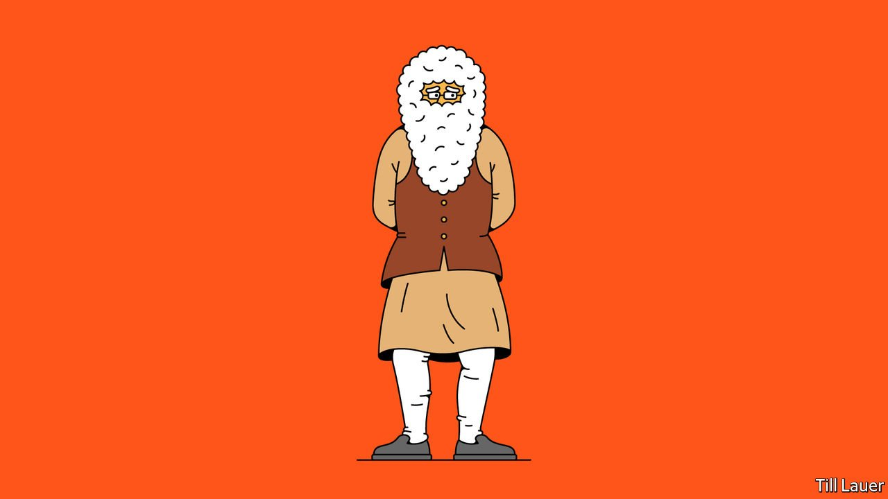

###### Banyan

# As a second wave devastates India, Narendra Modi vanishes 

##### Quick to claim credit, the prime minister is nowhere to seen when things go wrong 

 

> May 20th 2021 

OVER THE past seven years Indians have watched Narendra Modi’s neat hair and trim beard grow whiter and longer. There was no way to miss the change, because there was no escaping the prime minister’s face. He was on television snipping ribbons, waving to adoring crowds and grappling foreign leaders; on posters doling out subsidised cooking gas or cheerleading for pilgrimages to Hindu holy sites; and even, in recent months, gazing benignly out of vaccination certificates next to the words “Together, India will defeat covid-19”.

Yet, as covid casualties rocketed up in mid-April, the omnipresent Mr Modi started fading like the Cheshire Cat. For weeks he scarcely appeared at all, and now that his handlers are producing more of what they call “interactions”, these tend to take the form of stilted Zoom calls with panels of officials, or, more recently, a helicopter tour over his own storm-battered state of Gujarat.


With , and many more failing to find life-giving oxygen or simply a dignified funeral for their loved ones, one might have expected a man with such a showman’s talent to rise to the occasion, to signal solace or hope to a wounded nation. But the most powerful leader in a generation seems unable to do more than deliver finger-wagging homilies. “When we needed a warrior we see instead a Himalayan sage,” muses Karan Thapar, one of India’s most seasoned television interviewers.

The prime minister’s absence should come as no surprise. In other moments of turmoil he has similarly chosen to step back rather than forward. When anti-Muslim pogroms roiled the state of Gujarat in 2002, soon after he had become its chief minister, Mr Modi vanished into “top-level” conclaves. As prime minister, Mr Modi was absent for months as lynch mobs rampaged in the name of “cow protection”. When nationwide protests against new citizenship laws broke out in 2019, when sectarian riots exploded in Delhi a few months later and when more massive protests erupted again last autumn over new farm laws, the prime minister was nowhere to be seen.

In fact, the tendency to shy away from bad news has become a trademark not just of Mr Modi, but of his government. The prime minister himself has never held a press conference, and typically reserves interviews for servile reporters. His lesser ministers, too, have over time grown less accessible and less amenable to questioning, even in parliament: covid has provided an excuse to shorten sessions and cancel committee meetings.

When a stage empties, other actors step in. Cartoonists, an increasingly harried profession under Mr Modi, are now on the offensive, picturing the prime minister hiding in his closet with his multicoloured “Modi jackets”, or playing a fiddle surrounded by funeral pyres. Many have attacked his government’s tone-deaf insistence on pursuing a $2.6bn vanity remake of the government complex in central Delhi in the midst of a pandemic. “And here is the secret bunker where you can hide from any national crisis,” says an architect in one cartoon, pointing at what others have derided as the “coffin-shaped” design of India’s planned new parliament building. Another cartoon inserts long white beards into a snakes-and-ladders board where the goal is to get vaccinated. Land on a wrong square and you slide back down the beard.

Nor is it just professional funsters who are weighing in. On May 12th one of India’s biggest student unions filed a missing-person report for Amit Shah, the home minister, on the grounds that Mr Modi’s closest henchman, who is also the most feared person in India, has not been sighted for weeks. Around the same time, posters appeared in Delhi questioning the government’s decision to send millions of vaccine doses abroad before securing them for “our children”.

But perhaps the hardest blow to Mr Modi’s image may be one from a less expected quarter. Writing in the prime minister’s native tongue, Gujarati, Parul Khakkar, a housewife-turned-poet whose verse is much admired in the prime minister’s own Hindu-nationalist circles, penned a short, bleak poem addressing a king. Your promised “Ram rajya” or heavenly kingdom, she concludes every stanza, has made of the sacred Ganges a corpse-carrying hearse. And the king, his people now see, is naked. After receiving more than 25,000 abusive messages, Ms Khakkar had to turn her Facebook page private. But her bitter diatribe has gone, for want of a better word, viral.

Dig deeper

All our stories relating to the pandemic and the vaccines can be found on our . You can also listen to , our podcast on the race between injections and infections, and find trackers showing ,  and the virus’s spread across  and .

A version of this article was published online on May 17th, 2021

