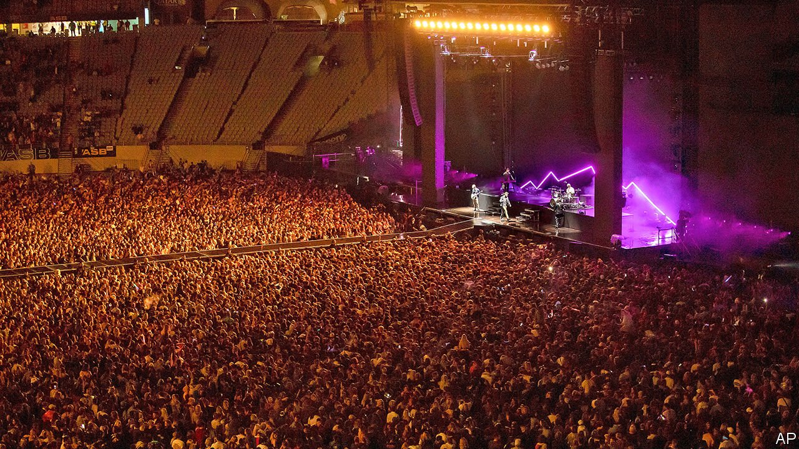

###### Tall border

# Australia and New Zealand cannot hide from covid-19 forever 

##### The countries need a plan for reopening to the world 

 

> May 22nd 2021 

LAST MONTH Six60, a mystifyingly popular Kiwi band, played a gig for a real, flesh-and-blood audience of 50,000 people. “Next time they tell you it’s impossible,” the band wrote online, “Show them this.” Alongside was a photo of the sort of crowds unseen in most of the world since early 2020.

Kiwis and Australians can enjoy what used to be known as normal life because they have almost eliminated the novel coronavirus. Neither country has had many local transmissions this year. Restaurants and bars are busy. Provincial towns bustle with domestic tourists.


The secret to their success is simple: both countries, already hard to reach, simply cut themselves off from the rest of the world. They pulled up the drawbridge in March 2020, allowing only citizens and permanent residents to return. Neither plans to lower it again soon. Australia’s international borders will stay closed until at least mid-2022, its government announced on May 11th. “We have to be careful not to exchange [our] way of life for what everyone else has,” the prime minister, Scott Morrison, told a local newspaper.

This goes down well with voters on both sides of the Tasman Sea, who have got used to living without risk. Yet covid-19 will circulate globally for years to come, even with vaccines. Antipodeans cannot keep it out forever, “unless they want to be isolated from the world until the end of time”, says Alexander Downer, a former Australian foreign minister.

Some have started asking what happens next. A group of business leaders in New Zealand has called for “a path towards sustainable virus management”. Australia cannot ride out the pandemic in an “eliminationist bunker”, Nick Coatsworth, Australia’s former deputy chief medical officer, told a room of doctors this month. “There will come a point where we have to change the way we measure our success against covid,” says Gladys Berejiklian, the Liberal (ie, conservative) premier of New South Wales—though not until locals are vaccinated.

Yet vaccine roll-outs in both countries are proceeding slowly. Only 7.5% of adults in New Zealand have received a first dose, fewer than in Zimbabwe or Palestine, according to The Economist’s tracker. Australia has jabbed 16% of adults once, but many Australians are hesitant about having a shot. The federal government hopes it can immunise all adults by the end of 2021, which would mean working twice as fast.

There are ways to loosen restrictions before that. One is to impose less onerous quarantines on vaccinated travellers, who must spend two weeks in isolation in a guarded hotel, just like unvaccinated ones. Australia’s government says it is thinking about allowing them to quarantine at home. That could help reunite separated families, of which there are many.

Another is to start travel corridors with countries with low rates of transmission. Australia is in talks with Singapore, but a fresh outbreak in the city-state has shown how hard these will be to launch. Nervy Kiwis balked even at a bubble with Australia, which started in April, notes Oliver Hartwich of the New Zealand Initiative, a think-tank. That, he says, is about as ambitious as Jacinda Ardern, New Zealand’s prime minister, will get for now.

Neither she nor Mr Morrison has much reason to push hard. Their economies are faring well. And they can easily brush away criticism as callous disregard for life. When the boss of Virgin Australia, an airline, suggested recently that “covid will become part of the community” and “some people may die”, Mr Morrison berated her for being “insensitive”. An election is expected soon. He is well ahead in the polls.

About 35,000 Australians are still stuck overseas, unable to snag a spot in quarantine hotels or on unpredictable flights. When a new wave of covid-19 washed over India last month, Mr Morrison barred Australians in India from returning or risk fines and jail time. No other country has threatened its own people thus. He later reversed the policy, but three Australian citizens have since died in India. “Going down the hermit route,” says Tim Soutphommasane of the University of Sydney, is “a rejection of our modern transformation into a confident, multicultural country.”■

Dig deeper

All our stories relating to the pandemic and the vaccines can be found on our . You can also listen to , our podcast on the race between injections and infections, and find trackers showing ,  and the virus’s spread across  and .

