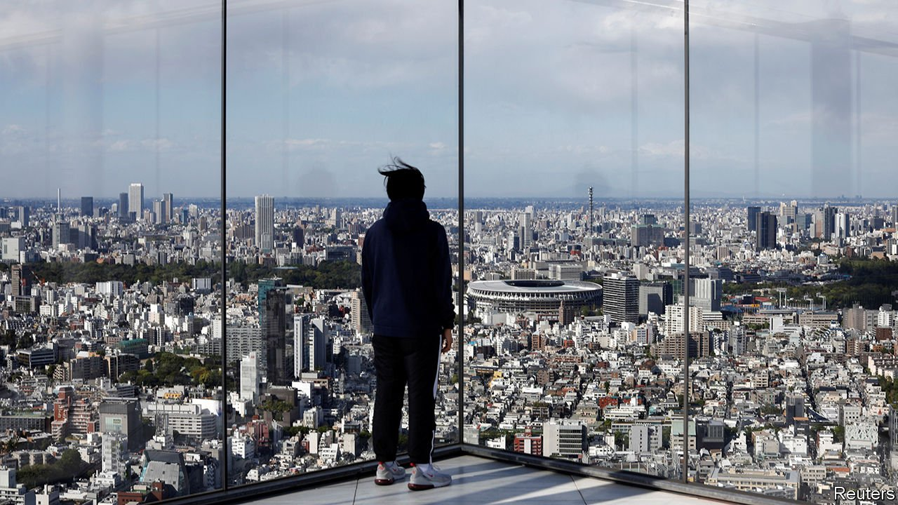

###### Faster, stronger, superspreader?

# Opposition to the Tokyo Olympics is intensifying in Japan 

##### Vaccinations are proceeding slowly. But organisers insist the games will be “safe and secure” 

 

> May 20th 2021 

AS THE OLYMPIC torch passed through Hiroshima this week, organisers kept the relay away from the streets. A torch-lighting ceremony took place without spectators. Thomas Bach, the president of the International Olympic Committee (IOC), cancelled a planned visit. Hiroshima, along with Tokyo, the host city, and seven other prefectures, is under a state of emergency amid a fourth wave of covid-19.

The event underlined the contortions required to host a global sporting extravaganza during a pandemic. Japan has so far avoided explosive outbreaks of the virus, with fewer than 12,000 deaths since the start of the pandemic, thanks in part to stringent border controls in place since last spring. But more than two-thirds of those fatalities have come this year. The latest wave, fuelled by more infectious variants of the virus, has strained regional health systems, while vaccinations have been slow to flow. The Olympics are scheduled to kick off in two months. About 15,000 athletes and perhaps 90,000 hangers-on from some 200 countries are set to enter Japan. Many Japanese worry that they will be the losers: 60% would rather not hold the games at all.


Organisers insist the Tokyo Olympics can be held safely. They point to recent virus-free sporting events, such as the Masters, an American golf tournament. They aim to create bubbles around the Olympic village and competition sites, to isolate participants from locals. Though vaccination will not be mandatory for athletes, Mr Bach claims that 80% of those in the Olympic village will be vaccinated by the start of the games. Foreign spectators will not be allowed to attend. A decision on local spectators is expected in June.

Many doctors and public-health experts remain unconvinced. Resources that could be used for testing, treating or vaccinating the local population may be diverted to the games. Increased movement of people within Japan, such as during public holidays in early May, has tended to beget rises in cases. With events planned in nine prefectures including Tokyo, training camps across the country, and volunteers coming from all over, more movement is inevitable—and with it, more cases, argues Taniguchi Kiyosu, the head of a big hospital in Mie prefecture and a co-author of an editorial in the British Medical Journal calling for the games to be cancelled. Dozens of towns have scrapped their plans to be bases for foreign teams to train.


New viral variants complicate things even more. The more infectious B.1.1.7 strain already circulates widely. The convergence of people from across the world could allow yet more to enter and mutations to form. “Japan will become a mixing vessel,” says Mr Taniguchi. Participants could bring the virus back to their home countries, many of which have less robust health systems, says Oshitani Hitoshi, a virologist who sits on an expert panel advising the government. “Just one imported case can trigger a large outbreak,” he says.

Japanese people might feel safer if they had as much protection from the virus as Olympic athletes. According to , just 4.5% of Japan’s adult population has received at least one dose of the vaccine, a shade behind . Suga Yoshihide, Japan’s prime minister, wants to finish vaccinating the elderly by the end of July. But only two-thirds of Tokyo’s wards reckon they will be able to. Supply is not the problem. Nikkei, a business daily, recently estimated that at least 10m doses remain unused in freezers.

Nor, at this stage, is the problem demand. Although Japanese tend to express a high degree of hesitancy about vaccines in general, that reluctance does not appear to extend to the covid-19 vaccine, says Shimoaraiso Makoto of Japan’s covid-19 task force. When reservations for a mass-vaccination centre in Osaka opened this week, the 25,000 slots on offer were booked up in around 25 minutes.

Instead, logistical tangles and bureaucratic risk-aversion have slowed the roll-out. Booking websites and call centres have suffered technical glitches. The health ministry stuck to rules requiring local clinical trials for foreign vaccines. Only the Pfizer-BioNTech shot has been approved for use so far. Japan also lacks staff to administer vaccines, in part because Japanese law allows only registered doctors or nurses to do so. An exception has been made for dentists; officials are now wringing their hands over whether to let pharmacists give jabs too. A mistake by an inexperienced practitioner could have fatal knock-on effects, given Japan’s history of , argues Mr Oshitani: “We are very, very sensitive to any adverse event in Japan. One single such event may halt the whole vaccination process.”

Nonetheless, the pace of vaccination is accelerating and likely to quicken more in the coming weeks. Japanese officials were expected to approve the Moderna and AstraZeneca vaccines as The Economist went to press. The defence ministry plans more mass-vaccination centres. That will please citizens unhappy with the government’s dawdling. More than 80% of Japanese believe the vaccine roll-out is moving too slowly. Approval of Mr Suga’s cabinet has in turn slid to record lows.

Cancelling the Olympics might help allay many voters’ suspicions that he is giving priority to the games over their health. But it is not as simple as it seems. Olympic host-city contracts give the IOC the exclusive right to call off the games. It remains eager to move forward. If the Japanese government were to cancel unilaterally, the IOC would have the right to seek damages in court, says Matsumoto Taisuke, a sports-law expert at Waseda University in Tokyo. Japanese officials also dread the impression they would create if Japan bailed out, while China, its regional rival, pulls off the Winter Olympics in Beijing early next year. Instead, Mr Suga has taken to repeating a single phrase like a mantra: Japan, he says, will put on a “safe and secure games”. Much, from the fate of his premiership to the course of the pandemic around the world, rides on that promise.■

A version of this article was published online on May 19th, 2021

