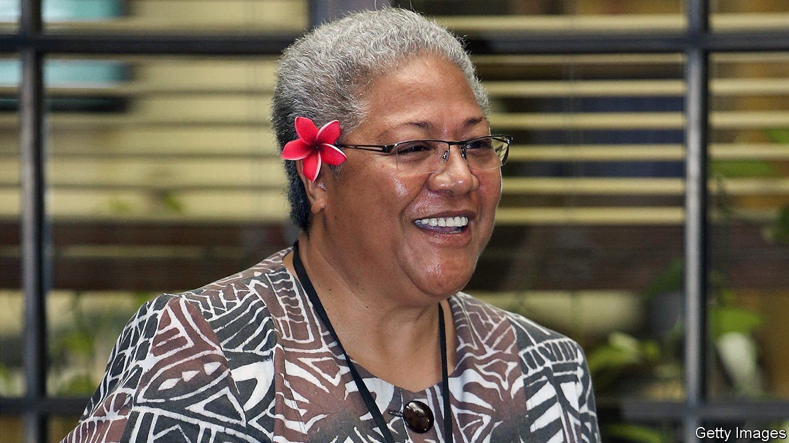

###### Play FAST and lose

# Samoa’s long-serving prime minister is struggling to cling to power 

##### The Pacific island is poised to appoint its first female head of government 

 

> May 20th 2021 

“I AM APPOINTED by God,” to lead Samoa, said Tuilaepa Sailele Malielegaoi, the world’s second-longest-serving prime minister (after Cambodia’s Hun Sen), in response to protests this month demanding that he step down. “They should go to a church and pray instead of protesting in front of the courthouse. The judiciary has no authority over my appointment as prime minister.”

The judiciary, it turned out, disagrees. It is one of the few institutions Mr Tuilaepa has not managed to dominate during his over 22-year-long tenure. On May 17th Samoa’s Supreme Court ruled unlawful moves by the country’s electoral commission and the O le Ao o le Malo, or head of state, which would have allowed Mr Tuilaepa a shot at a sixth term. That clears the way for Fiame Naomi Mata’afa, of the FAST party, to become the country’s first female prime minister.


Such political turmoil is unusual for Samoa, an island of stability in a region where most governments struggle to survive a single term. Things like a shift in its timezone to the Asian side of the international dateline and a switch in the side of the road on which Samoans drive count as big changes there. The recent drama started after elections on April 9th, when the prime minister’s Human Rights Protection Party (HRPP) won just 25 of the 51 seats in parliament. FAST and a single independent won the rest. On April 20th the electoral commission invoked the gender quota for parliament to manufacture an extra MP for HRPP, on the basis that only five of the new lawmakers were women, 0.2% short of the 10% required.

With parliament now split down the middle, the O le Ao o le Malo accepted the advice of his prime minister, one Mr Tuilaepa, that fresh elections should be held to break the deadlock and allow a new government to get on with the crucial business of passing a budget before the current one expires at the end of June. On May 17th, four days before the new election, the Supreme Court passed down its verdict on both moves. The HRPP lost its additional female MP. The election result was upheld. And the writ for fresh polls was cancelled. Mr Tuilaepa, newly converted to the justice of mere mortals, declared his intention to fight the ruling on the extra MP at the Court of Appeal. He insisted that parliament cannot sit until the 28 challenges to the election in April have been heard by judges. If Mr Tuilaepa is not giving up just yet, it is because he is a master at playing this game.

The chapter may bring to a close 33 years of HRPP rule, 22 of them under Mr Tuilaepa. Over that period the party acquired a reputation for competent economic management, along with one for using its control of state bodies to squash the opposition. Laws changing the rules of the system—such as by requiring MPs who switch parties to vacate their seats, or denying official recognition to small parties, thereby depriving them of public funds—have long been deployed to weaken the HRPP’s rivals. After the previous election, in 2016, the main opposition party at the time, Tautua Samoa, was reduced to just two seats in parliament.

The rise of a viable opposition in this election is thanks to a split in the ruling party. Last year several HRPP members, including Ms Mata’afa, formerly Mr Tuilaepa’s deputy, broke away to form FAST. The cause was a set of laws that removed the Supreme Court’s jurisdiction over appeals from the Land and Titles Court, mostly concerning disputes about land ownership and chiefly titles. The intent may have been to appeal to voters tired of long delays in the land court, but the effect was to divide the judicial apparatus into parallel systems, one dealing with criminal matters and the other with customary law.

Ms Mata’afa called the move an “erosion of the rule of law”. Mr Tuilaepa accused the FAST leadership of “treason” and launched an investigation into their activities on the last day before the dissolution of parliament. That probe may go nowhere. But if Mr Tuilaepa insists on doing the same, the judges’ job may not yet be over.■

