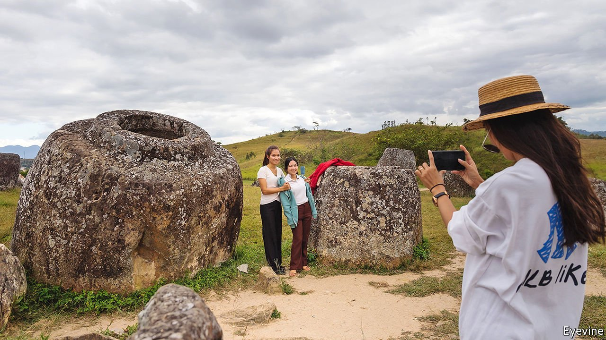

###### A load of crocks

# Why are hundreds of huge stone jars scattered across north-east Laos? 

##### Scientists come one step closer to finding an answer 

 

> May 20th 2021 

ASK LAO elders, and many will tell you that their lands were once ruled by giants. The greatest was a warrior king named Khun Jeuang whose armies, the story goes, celebrated their conquests in modern-day Xieng Khouang province in north-east Laos, with whisky served from enormous stone urns. Today more than 2,000 of these vessels, standing up to three metres high and weighing as much as 30 tonnes, can be found scattered across the prosaically named Plain of Jars. Generations of Lao grandchildren have heard the tale. But the details can be fuzzy. Asked when the events took place, Champa, a 60ish local, estimates it was “looong ago”.

Ask archaeologists working in Laos and their answers are not much more precise. The first systematic study of the Plain of Jars was done in the 1930s by Madeleine Colani, a French geologist, who found dozens of sites and a puzzling array of objects: stone pendants, glass beads, human bones, children’s teeth. She reckoned the sites functioned as a necropolis during South-East Asia’s Iron Age, which was roughly between 500BC and 500AD.


Events thwarted further research. The second world war, Japanese occupation, French retreat and civil war did not offer conditions conducive to archaeology. During the war in Vietnam, many American bombs fell on the area. A third of them failed to detonate. For decades the landscape was littered with unexploded ordnance, much of which remains. Researchers pursued easier targets, leaving Laos, in the words of one Lao archaeologist, “terra incognita”.

Recent bomb clearance has opened the door for renewed study. Colani knew of 26 jar sites. Today over 100 and counting have been catalogued. Technology has also advanced since her time. Scientists have used carbon dating on organic objects associated with the jars, such as bones, teeth and charcoal. Most were found to be from within the Iron Age window. But the jars themselves are made of stone, which is difficult to date. So an international team of scientists devised a workaround. Over the past few years, using a technique called optically stimulated luminescence, they have tried to measure when the earth beneath the jars was last exposed to light.

In peer-reviewed research in March, the team concluded that samples beneath two jars at one site probably date from between 1350BC and 350BC, much older than thought. Taken with the dates of the other objects, that could help clarify if the jars were always associated with burial or had other purposes too, like storing grain or water. Analysis on two other samples is pending. Other mysteries remain to be solved, too, such as how prehistoric people moved the 30-tonne jars.

Newfangled research has not dampened the spirits of storytellers. Indeed, it may help them spin more yarns. The Lao government hopes to attract foreign tourists to the Plain of Jars, which earned UNESCO’s “World Heritage Site” label in 2019. Meanwhile, Lao families and teenage lovebirds have become frequent visitors. And tour guides have elegant ways of answering questions that still elude science. Vong, a 47-year-old tour guide, explains what his grandfather once told him. If the jars belonged to giants, young Vong had asked, why are there human bones near them? Unflustered, the elder replied, “When the giants drank whisky, don’t you think they had barbecue too?”■

