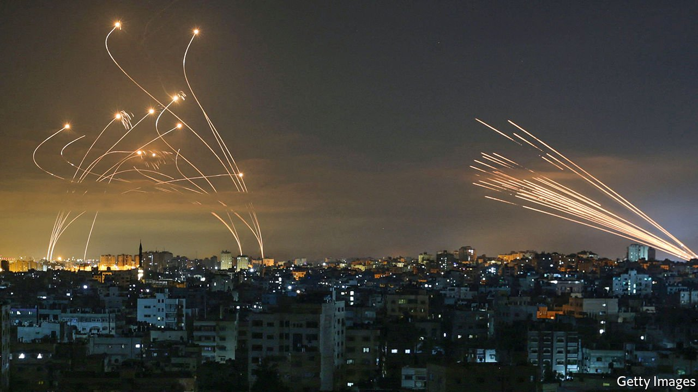
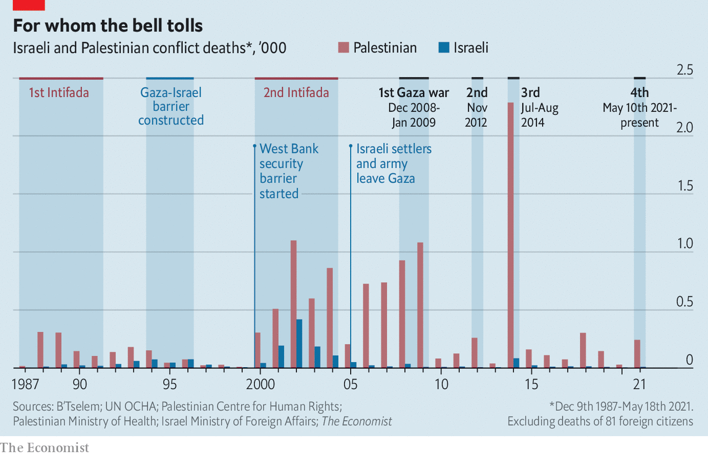
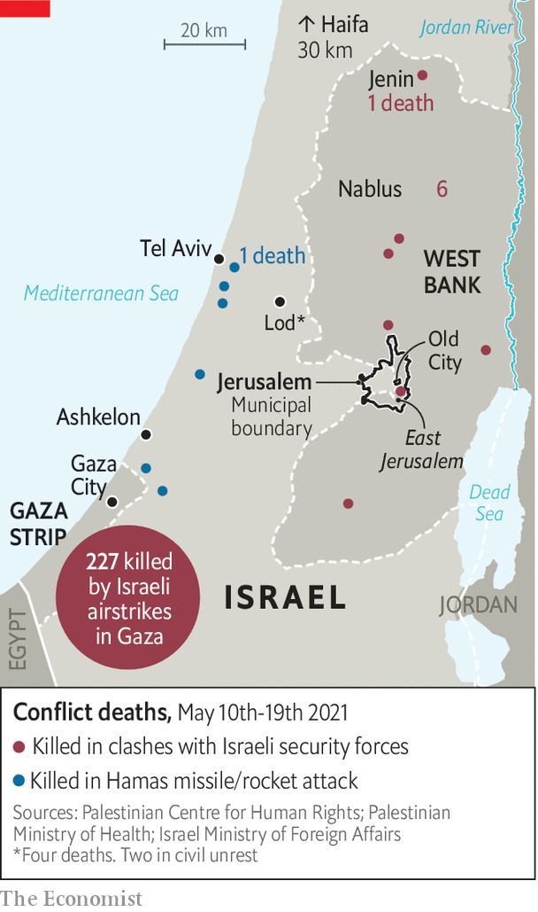
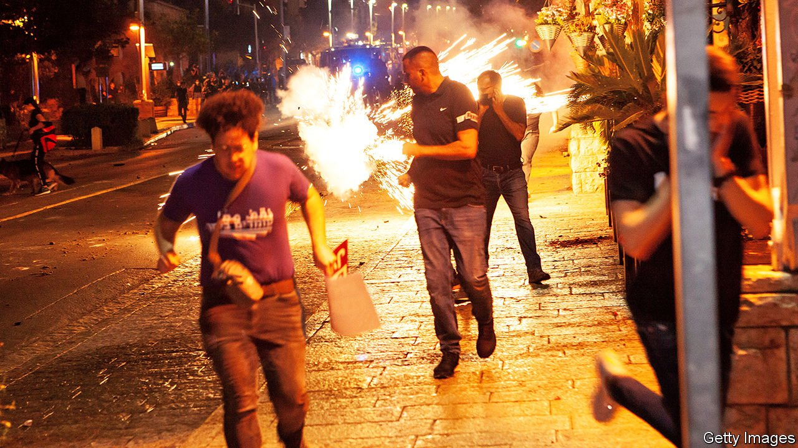

###### The cycle of violence

# How Israel and Hamas returned to armed conflict 

##### Events in Jerusalem were the spark, but the recrudescence was all but inevitable 

 

> May 20th 2021 

JERUSALEM DAY, an Israeli national holiday, fell on May 10th this year. The annual commemoration of Israel’s victory in 1967 was marked not just by a provocative nationalist march through the Old City, as it usually is, but also by a salvo of rockets fired towards the city by Hamas, the Islamist organisation that rules the Palestinian enclave of Gaza.


The bombardment triggered the fourth major round of fighting between Israel and Hamas since 2008. Hamas launched rockets at Israeli cities and towns at an unprecedented rate, killing a dozen people, while Israeli jets and helicopters pummelled already decrepit Gaza, killing over 200. On May 20th the violence began to ebb and after nightfall an official ceasefire was agreed on by both sides. It was to take effect in the early hours of the following day.

Tensions had been rising in Jerusalem for weeks as a result of restrictions imposed on Palestinians by Israeli police during the holy month of Ramadan and the possible expulsion of Palestinian families from their homes because of a contentious lawsuit. Protests around the city led to two days of violence at al-Aqsa mosque, with 90 Palestinians injured by police the day before the first rockets were launched. Hamas called its bombardment Saif al-Quds, “Sword of Jerusalem”. Israel gave its response a similarly city-specific name: Shomer Hahomot, “Guardian of the Walls”. If the trigger had not been Jerusalem, though, it would eventually have been something else; another iteration of the cycle of violence was all but inevitable.

As ever, the consequences have fallen most heavily on the 2m Palestinians trapped inside Gaza (see chart). Israel claims that since May 10th it has killed more than 150 fighters from Hamas and Islamic Jihad, another militant group. By the morning of May 20th, according to Gaza’s health ministry, at least 227 Gazans had been killed by Israeli strikes, among them 64 children and 38 women.

 


Residents describe the bombardment as the heaviest they have yet endured in the absence of a ground offensive. Israeli jets have blown up four high-rise towers, a scale of destruction it has been more hesitant to unleash in the past. The Galaa tower, brought down on May 15th, housed the bureaus of the Associated Press and Al Jazeera along with other offices and several floors of apartments. Israel asserts that one of those offices housed a branch of Hamas’s military intelligence division. Residents were warned of the attack and given an hour to flee; the building’s collapse was broadcast live on television.

There was no such warning on al-Wahda street, a busy thoroughfare in central Gaza City, early the next morning. An attack on a tunnel system—which Israel says hit targets some distance away—nevertheless saw a number of buildings collapse. More than 40 people were killed, among them 17 members of the same family. On May 15th Bob Menendez, the chairman of the American Senate’s foreign-relations committee—probably the most hawkish Democrat in the chamber—said the strike on the Galaa tower and the level of civilian deaths had left him “deeply troubled”.


All of this has pulverised the infrastructure of a place barely fit for human life to begin with. Israel and Egypt have kept Gaza under a blockade since 2007, with the movement of goods and people tightly restricted. With border crossings closed, the territory’s lone power plant is running short on diesel. Five of the ten power lines that supply Gaza with electricity from Israel have been damaged. In Beit Lahiya, in eastern Gaza, broken pipes sent sewage spilling into streets.

The blockade was originally meant to dislodge Hamas from power. But an isolated, impoverished territory in which 47% of the population is unemployed and most rely on foreign aid to survive has not had the wherewithal to kick it out; nor has Israel used its military might to do so. Binyamin Netanyahu, who has been prime minister for 12 of the 14 years since the blockade began, has insisted in private that Hamas’s control of the decrepit territory works in Israel’s favour. It weakens an already divided Palestinian leadership and reduces the prospect of a Palestinian state.

For all its pretensions as a resistance movement, Hamas has become an organisation focused on preserving its power and with little interest in alleviating misery. Many Gazans chafe under its authoritarian hand. According to a Palestinian pollster, a survey carried out in March found that 72% think Hamas is corrupt and 58% say they cannot criticise it without fear.

To the extent that Hamas still enjoys support, it is largely in comparison with the ageing, quiescent leadership of the Palestinian Authority (PA) which governs the West Bank. A forthcoming parliamentary election—the first since 2006—would have offered a way to change that, at least in theory. But Mahmoud Abbas, the president of the PA, found a pretext for cancelling the vote. Polls suggested that his party, Fatah, would fare poorly against Hamas and two splinter factions founded by disaffected Fatah members.

In the 17th year of what should have been a four-year term, Mr Abbas, 85, lacks both legitimacy and popularity. His PA has come to be seen as little more than a subcontractor for Israel’s occupation. He has reinforced that perception by cracking down on protests in the West Bank meant to show solidarity with Jerusalem and Gaza (protests in which 11 people have been killed). Even before that, the pollster says, 68% of Palestinians wanted him to resign.

If Hamas’s rockets are meant to show up Mr Abbas, though, they are not doing so through military effectiveness. Attacks from Gaza have killed just 12 people in Israel since May 10th, despite the furious tempo at which missiles have streaked across the sky. The 51 days of conflict in 2014 saw 4,400 rockets from Gaza strike Israel. As of May 19th this year some 4,000 had been launched, with perhaps 600 falling short within Gaza. Salvos of dozens of rockets at a time have been used in an attempt to overwhelm Iron Dome, Israel’s missile-defence system.

Under the dome

The defensive system’s sophistication has been scrawled across the sky. As seen from Ashkelon, 10km north of Gaza, the unguided missiles launched into Israel leave smoothly arcing lines of exhaust across the sky. Those from the Iron Dome batteries which oppose them rise like cobras, their paths swaying and twirling through the sky before ending in puffs of white smoke. At night the same story is told in glowing pyrotechnics.

The sinuous paths are testimony to what makes the system so formidable; not the interceptors themselves, but the battle-management system which puts them on constantly updated paths that maximise their chances of eventually taking out missiles heading for built-up areas.

 


Ten years since it was first deployed, the engineers at Rafael, one of Israel’s main defence contractors, are still tinkering with the system’s algorithms to improve its performance against large salvos. They seem to be doing well. On May 11th Hamas tried to saturate the system by launching a barrage of some 130 rockets towards greater Tel Aviv. Only a handful got through.

Besides saving lives, Israeli generals talk of the Iron Dome giving their politicians a “strategic advantage”; fewer casualties mean more room for manoeuvre when it comes to embarking on or ending military operations. But its success has drawbacks. The discrepancy between the death tolls on the protected Israeli and defenceless Palestinian sides increases the tenor of the international condemnation of Israel’s actions and throws into question whether its response has been proportionate. It also creates a possibly self-defeating sense of security among some Israeli citizens. Bomb shelters are not used as much as they were; more people remain vulnerable to the rockets that do get through.

If Iron Dome serves to protect Israel at home, President Joe Biden has filled a similar role abroad, refusing to place any . America repeatedly blocked efforts at the UN to issue a Security Council statement on the violence. It was a full week before Mr Biden used the word “ceasefire”, and when he did he was simply expressing his “support” for one, rather than demanding it. He dispatched an envoy, Hady Amr. But Mr Amr is hardly the sort of high-ranking emissary one dispatches to put about a bit of stick. The greatest international cost to Israel will probably be to see the process which led to the Abraham accords with Bahrain and the UAE go no further. “It will make people who wanted to open up to Israel even more wary,” says Ali Shihabi, a Saudi commentator close to senior officials.

If Mr Biden does change his tone and demand a truce, it may well be moot. By the morning of May 20th barrages from Gaza had lessened, and were no longer aimed at Tel Aviv. The intensity of Israeli operations had also eased.

But if Israel still benefits from technology and American support, as it has for decades, the latest conflict has thrown up a new danger. The confrontations in Jerusalem brought about a wave of violence between the country’s Jews and Arabs.

Unlike Palestinians living in Gaza, the West Bank and Jerusalem, the 2m Arabs living in Israel (21% of the population) have full citizenship and, in principle, full social benefits. They have the most to lose by resorting to violence and the highest expectations of the status quo; they rarely take part in violent protest. Yet in 2018 those expectations were dashed when the Knesset, Israel’s parliament, passed a “nation-state law” stating that “the right to exercise national self-determination” in Israel is “unique to the Jewish people”.

The dead zone

On May 10th Arabs attacked Jewish homes and synagogues in the city of Lod, near Tel Aviv. As with the attacks by Hamas, events in Jerusalem were not the sole driving force. “It’s only about 20% al-Aqsa and 80% poverty and inequality here in Lod,” said one local Arab resident. “It’s about how the local authority demolishes homes they claim were built illegally and about how the police don’t investigate murders within the Arab community. So much pressure has been building and now it’s burst.”

 


The violence quickly spread to other parts of the country. With the police caught napping, groups of far-right Jewish vigilantes joined the fray, launching attacks of their own on Arab drivers and businesses. After a few days of chaos the police clamped down. In Haifa, Israel’s third-largest city, a major riot was prevented on May 13th when police kept Jewish and Arab gangs apart. But the resentment will remain for years on both sides. “Normally I abhor these far-right vigilantes,” said a Jewish resident of Lod. “But they were here to protect my home when the mob came.”

This violence has coincided with, and probably derailed, what might have been a breakthrough in political engagement between the two communities. In the run-up to the most recent of the four general elections to have taken place in the past two years Ra’am, a conservative Muslim party, said that it was willing to support either Mr Netanyahu or his opponents under certain conditions. Having split away from the Joint List, an Arab electoral grouping which emphasises Palestinian nationalism, it won four seats in the Knesset. That exceeded expectations and demonstrated that a significant number of Arab-Israelis were prepared to trade their Palestinian identity off against their desire to integrate into Israeli society, at least to some extent.

Five days before hostilities broke out, Yair Lapid, the leader of the opposition, received a 28-day mandate to try to form a government. Mr Lapid and the other prospective leader of the new government, Naftali Bennett, who were planning to rotate the prime minister’s job between them, were to negotiate a coalition deal with Mansour Abbas, the head of Ra’am, on May 10th. That meeting was overtaken by events. Three days later Mr Bennett told Mr Lapid that he did not see a government being formed with Arab parties.

Mr Netanyahu, who has failed to secure a majority for his bloc of right-wing and religious parties at all four of the recent elections, has long used tensions between Jews and Arabs for political gain. In 2020, the last time a potential coalition with Arab parties was on the agenda, he branded their members as “terror supporters”. Now the riots, for all that they are in part a result of his politics, and for all that a breakdown in law and order reflects badly on a governing party, have made matters more difficult for his opponents. Hitting Hamas, meanwhile, goes down well with his base. He now looks likely to continue as caretaker prime minister until another set of elections in a few months.

Perhaps it seems odd that Hamas should give Mr Netanyahu a new lease of political life—but the group has long had a complicated relationship with Israel. It emerged in the 1980s from a network of religious charities across the occupied territories, and as such was permitted to operate with Israel’s blessing. Back then its brand of Islamism was seen as placid, more interested in preaching than fighting, and thus a useful counterweight to the secular militants who were the core of the Palestinian national movement. That logic proved faulty when in 1994, after the first intifada, or Palestinian uprising, Hamas adopted suicide-bombing as a tactic. Its militants would play a central role in the second intifada in the early 2000s.

Today, classified as a terrorist group by America, the EU and many of their allies, Hamas serves as a useful foil for Mr Netanyahu. He sees the periodic rounds of violence as a price worth paying for a divided and dysfunctional set of adversaries who share the blame for the squalor and despair in which their people live. Each new outbreak of indiscriminate rocket fire allows him to insist Israel has no partner for peace among the Palestinians.

Misery

And each time that, after counter-attacks, the rockets fall quiet, Hamas can claim a hollow victory from the mere fact of its survival. Some old Israeli generals grumble that a more “decisive” blow on Hamas could be landed if the Israeli forces invaded, rather than being content to protect the public with Iron Dome and bomb Gaza from the air. But though armoured and infantry units have been prepared in staging areas, Israel is not seriously considering a ground offensive this time around.

Since the ground incursions in 2009 and 2014 ended in thousands of casualties and massive devastation of civilian buildings and infrastructure, holding back would seem to be a good thing. For Israelis, however, it also means that, despite Mr Netanyahu’s past boasts, Hamas will stay in place, an issue only the Palestinians can resolve.

The Palestinians who are trapped in Gaza have a median age of 18. A generation which encompasses half the population has grown up knowing only blockade and war, with little chance of a decent life and little hope for escape. This round of fighting will end, just like the ones that came before. But for Gazans that will mean only a respite in which to try to rebuild—and the agonising certainty that it will all come crashing down again. ■ 

This article has been updated since publication following the ceasefire agreed on by Israel and Hamas

