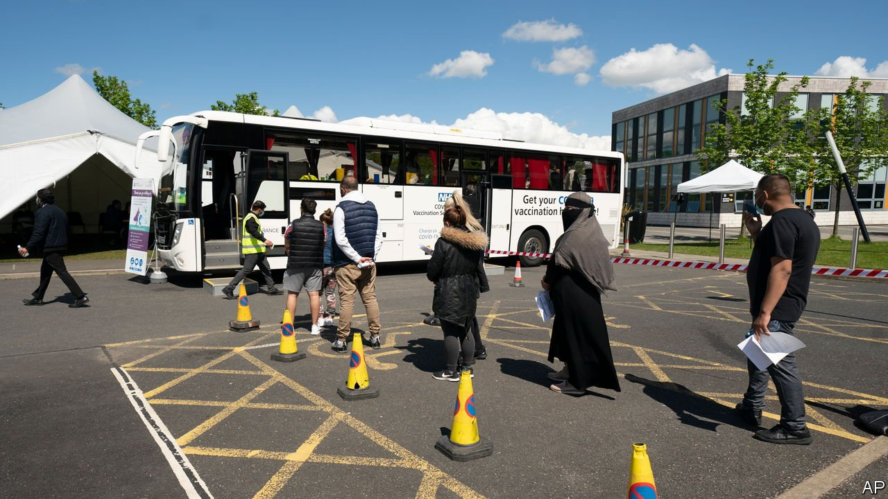
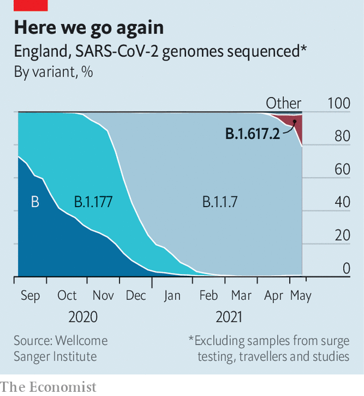

###### The Indian variant

# A covid variant is spreading in Britain—but this time is different 

##### Mass vaccination means the damage will be limited 

 

> May 22nd 2021 

B OLTON’S VACCINE bus plies the town’s southern neighbourhoods. On social media the doctors who run it advertise the fact that there is “Pfizer on the bus!” That vaccine is more popular locally than one made by AstraZeneca, which has been dogged by reports of extremely rare blood clots. Queues form as the bus rolls up to car parks outside mosques, schools and community centres.

A new variant of coronavirus was detected in India last year and arrived in Britain this spring. Cases have grown quickly in recent weeks, particularly in Bolton. The viral geneticists call it B.1.617.2. The media call it the “Indian variant”. The government’s scientific advisers believe that 617.2 is more infectious than the “Kent variant”, B.1.1.7, which drove Britain’s deadly second wave through January. Indeed, 617.2 has started to outcompete 1.1.7 (see chart).


It is doing so in a very different environment. Most Britons have received a first dose of coronavirus vaccine. Twenty million, most of them old or otherwise highly vulnerable, have had two. Any infection a vaccinated person does get is likely to be milder, meaning they are less likely to distribute the virus. So 617.2 will spread in a different manner to 1.1.7.

 


The majority of new cases being found in Britain are in teenagers. In the seven-day period to May 13th just four people per 100,000 aged between 85 and 89 tested positive in England. The equivalent number for 10-14 year olds was 46. Even though cases of 617.2 are growing proportionally, cases of coronavirus overall are flat. So are measures of hospitalisation and death. Whereas last week saw cases surge in Bolton and other places with clusters of infection, growth rates slowed through the beginning of this week and even declined in some areas.

The health service will struggle to deal with another covid-19 surge even if it comes with a lower rate of serious illness and death. Waiting lists for other conditions have grown long and staff morale is low. A surge would also pose risks to children’s education. Some schools in Bolton have already moved entire year groups back to online classes.

If the number of cases climbs, the government will face pressure to delay the relaxation of restrictions, and perhaps to implement local lockdowns. In the meantime Bolton’s vaccine bus has the right idea. It is focusing on getting jabs to areas of the city like Deane, Rumsworth and Great Lever. Data on vaccinations from Public Health England shows that those areas have far lower vaccine coverage than the average for Bolton or Britain. As of May 9th only 42% of people in Rumsworth aged 16 or older had taken a first dose of vaccine. The average across Britain is almost 70%. On May 15th Lynn Donkin, Bolton’s assistant director of public health, told the Bolton Hindu Forum that new cases are concentrated in those areas too.

Some blame vaccine hesitancy among ethnic minorities in south Bolton for this low uptake. There may be some truth to that, but those areas are also poorer than their surroundings, with shabbier public transport. Yasmin Qureshi, the Labour MP for Bolton south-east, has said that the only place for her constituents to get vaccinated until recently was a health centre in the city centre. That the bus now brings the vaccine to them is good.

The world should keep an eye on Britain’s struggle with 617.2. The outbreak in Bolton has already shown that uneven vaccine coverage can offer new variants a foothold. For as long as understanding of the virus and its variants remains murky, a risk remains that any foothold can become a platform for exponential growth. That threatens everyone.■

