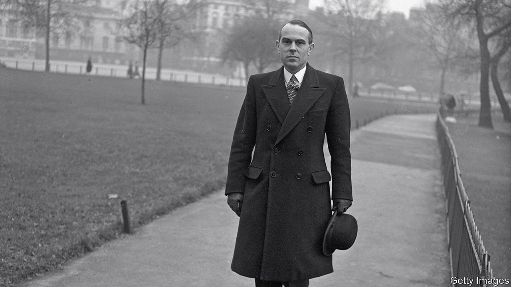

###### The civil service

# Britain’s civil service remains upper-middle class 

##### Not so much has changed since the 1960s, a new report says 

 

> May 20th 2021 

THE KEY, thought John Fulton, was to do away with the dominance of Oxbridge-educated generalists and promote officials with technical skills. It was 1968, and Harold Wilson, the Labour prime minister, worried that Whitehall was too institutionally conservative. He had commissioned the Fulton report with the aim of forging Britain into a science-fuelled meritocracy. One enraged traditionalist declared his preference to be ruled by men who had read Plato and Shakespeare rather than by nuclear scientists.

Boris Johnson also wants to turn Britain into a science superpower, and to make its government sound more like his new northern voters. The upper ranks of civil service have changed little, according to a report published on May 20th by the Social Mobility Commission ( SMC), an advisory body. In 1967 some two-thirds of the senior civil service—the officials at the very top—came from what the authors call a “high socioeconomic background”, meaning their parents worked in fields like accountancy and engineering. Today the figure is 72%. The share whose parents did working-class jobs has changed only from 19% to 18%.


Direct comparisons with 1967 are tricky. There are many more women and ethnic minorities in top jobs, even though they face additional barriers. Britain’s working class has shrunk, so the potential recruiting pool for mandarins with blue-collar origins has too.

Still, the report speaks ministers’ language. Michael Gove, the minister for the cabinet, wants a civil service that is less southern, less middle-class, more open to scientists and more attuned to Brexit voters’ sensibilities. Efforts to move top jobs to cheaper cities might make it more socially diverse, since London’s high costs can deter those from poor families. The risk is that moving to mostly white towns will reduce ethnic diversity.

Culture may be trickier to shift than officials. The route to the top is a “velvet drainpipe” of plum jobs along which civil servants are guided by mentors who often promote in their own image, the report found. “The unwritten rules aren’t just hard to navigate; they’re narrow,” says Kate Josephs, the daughter of social workers from a mining town, who served as the director general of the Cabinet Office’s covid-19 task force. She felt conscious of her accent until she worked in America.

The SMC proposes targets to improve class representation, as has been done for women and ethnic minorities. It also suggests making class discrimination illegal. Mr Gove has another idea: to close the status gap between policy officials, who draw up programmes like benefit reforms, and those who deliver them, like IT engineers.

“Currently, the white-collar Whitehall mandarinate tends to treat more blue-collar operations officials like oily rags to be kept out of sight,” says Francis Maude, an ex-minister who has advised Mr Gove. Changing that could open new routes to the top of the civil service. Policy-focused departments like the Treasury are the poshest. Ones with lots of front-line staff such as the Department for Work and Pensions are the least so. ■

