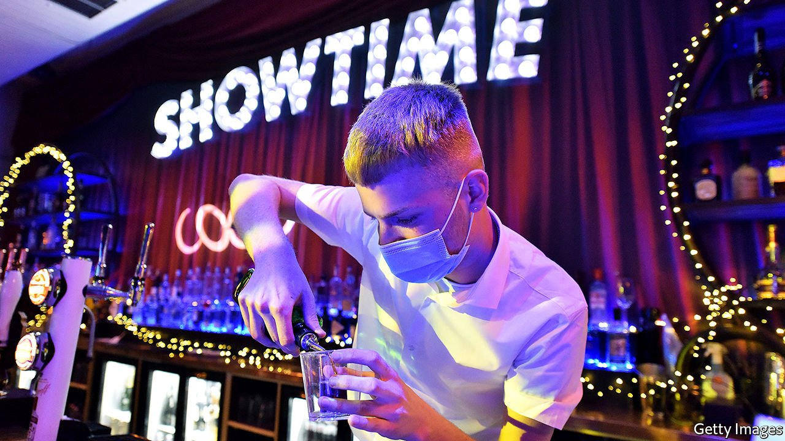
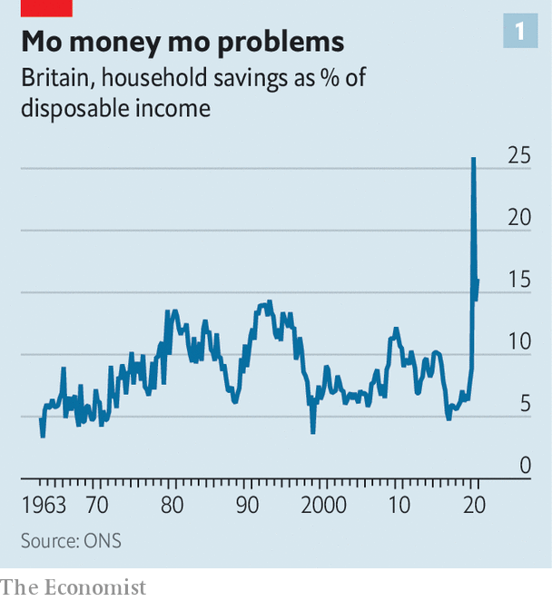
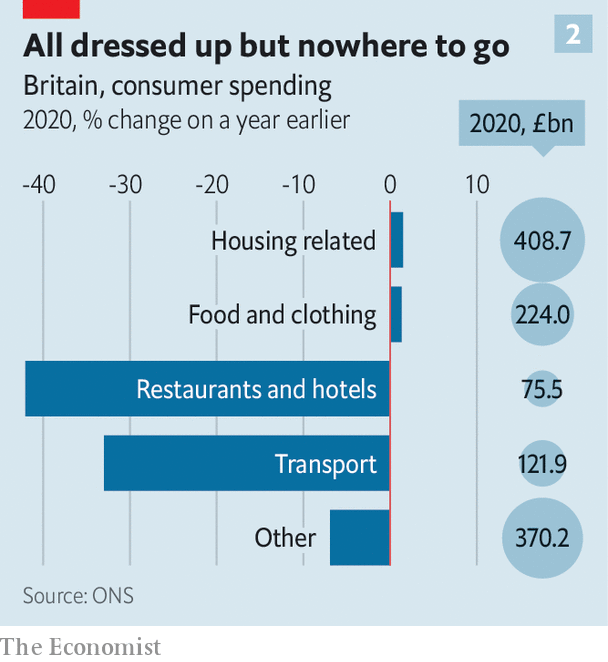

###### Consumer spending and the economy

# Britain’s economy is hot but not overheating 

##### Consumers bought a lot of goods last year. Now it’s the turn of services 

 

> May 22nd 2021 

THE GRAND reopening of Nando’s, a chicken-oriented restaurant, in Stevenage’s Leisure Park on May 17th was a sedate affair. There was no ribbon-cutting and no long queue. But the youngish crowd was happy to be eating indoors for the first time since December, when the government ordered restaurants to close. Around a third of the indoor tables were occupied, more than would normally be expected on a Monday lunchtime. The staff do not think the restaurant will be full again until the multiplex cinema and bowling alley reopen later in the summer. But a busier than normal chain restaurant in a leisure park which currently has no leisure activities suggests that Britons are willing to go out and spend.

If the restaurant trade was having a good day, the pubs were having an excellent one. By mid-afternoon every table in the cavernous local branch of Wetherspoons, a pub chain, was occupied. At one table the manager interviewed a teenage student in further education who was looking for kitchen work. Among the questions was: “when can you start?”


The British economy is quickly recovering from its steepest drop in three centuries—so quickly, indeed, that some people are beginning to worry about the risk of overheating. Labour-market statistics released on May 18th showed a fall in unemployment and a pickup in wage growth. Inflation figures the following day revealed the largest monthly rise in the annual rate of consumer price inflation (CPI) in over a decade. Headline inflation rose from 0.7% in March to 1.5% in May.

But talk of overheating is premature. Global energy costs rather than domestic developments drove most of the rise in consumer prices. There is so far no sign of “a post-reopening surge in services inflation” according to Samuel Tombs of Pantheon Macroeconomics, a consultancy.

The stronger-than-expected wage numbers included in the labour-market statistics are also less startling than they seem. The Office for National Statistics (ONS) reported that average regular pay growth was 4.6% in the three months to March. But the statisticians caution that the average is affected by a fall in the number of low-paid jobs compared with the pre-pandemic norm. Stripping out this compositional effect suggests that wages are growing by an underlying rate of 3%. Indeed, a recruitment website, reports little in the way of advertised wage growth for low-paid jobs.

Many hospitality bosses are fretting over a shortage of workers, but that industry is not typical. It has been especially hard hit by the departure of European immigrants and by the shifting economic geography caused by the rise in home working. Many potential hospitality workers are now in the wrong parts of the country. Modestly higher wage rates should help the market to readjust. A worker shortage seems unlikely to derail the recovery.

The recession of 2020 was not only the steepest for centuries but one of the oddest. The government absorbed much more of the economic hit than in a typical downturn through its furlough scheme, tax cuts and soft loans. Despite a fall of around 10% in GDP, unemployment never rose above 5.1%. Business insolvencies were rarer than in 2019.

Household balance sheets have seldom been healthier. Last year the household savings ratio—the percentage of disposable income that people save rather than consume—leapt to its highest level on record (see chart 1). Office workers found themselves saving a tidy sum on commuting costs and sandwich lunches, and had fewer opportunities to spend the extra money. Around £145bn (6.9% of GDP) was added to household bank accounts in 2020, although the Bank of England estimates that this rise was driven mostly by the highest earners.

 


How quickly the economy recovers will depend on what households choose to do with this hoard. Although overall consumption fell sharply in 2020 (see chart 2), transport and recreation activities accounted for most of the drop. Households are unlikely to make up for lost trips to the hairdresser in 2020 by getting their hair restyled more often in 2021, but they might pop out to the pub and restaurants a bit more than they did in 2019. Measures of consumer confidence point to a large bounce in spending. Services are likely to benefit from that.

 


Healthier bank balances should support higher spending this year even if the cash is not withdrawn. Consumers with higher than usual deposit levels ought to feel less compelled to put aside as much of their income as normal, reducing their flow of new savings and increasing their consumption. The National Institute for Economic and Social Affairs, a think-tank, forecasts GDP growth of 5.7% for 2021, assuming that the savings ratio falls to more normal levels. If households choose to spend the accumulated cash balances, NIESR estimates that GDP growth could be around three percentage points higher.

Like a coiled spring, the British economy is bouncing as the government loosens restrictions. Pub and restaurant bosses in Stevenage, and across the country, are preparing for a summer of fun as people make up for lost opportunities. But for all the optimism, most analysts still expect the economy to be smaller at the end of the year than it was on the eve of the pandemic. That suggests there is still enough slack in the system to absorb rebounding demand. Britain’s economic summer looks likely to be typical of British summers in general: good fun, but accompanied by no great risk of overheating.■

