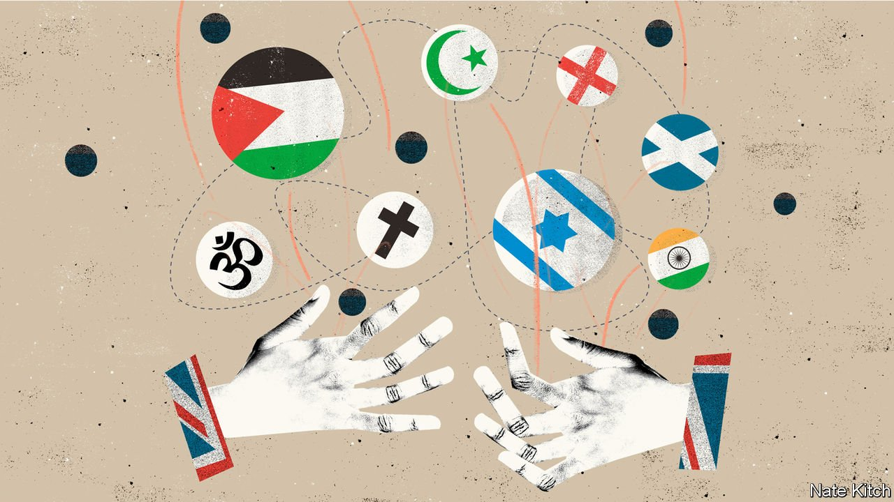

###### Bagehot

# How to do foreign policy in a multi-ethnic society 

##### It is more complicated, but not necessarily worse 

 

> May 22nd 2021 

HERE ARE a few vignettes from Britain over the past week. Tens of thousands of protesters marched on the Israeli embassy, some shouting “Israel is a terror state”. A convoy of vehicles festooned with Palestinian flags drove into a heavily Jewish part of north London while a thug bellowed “fuck the Jews and rape their daughters”. Two Leicester City football players celebrated their victory in the FA Cup by unveiling a Palestinian flag. Many of these protesters belonged to Britain’s large Muslim population.

The fact that Britain is now a multi-ethnic society means that events abroad resonate more loudly than they used to. The invasion of Iraq under a Labour government infuriated many British Muslims. The fate of Kashmir is such a hot issue in Wycombe, in rural Buckinghamshire, that the local Tory MP has started the Conservative Friends of Kashmir. Classical statesmen did their best to protect foreign policy from democratic pressures in order to keep their eye, like Plato’s guardians, on the state’s long-term interests. Today foreign policy is buffeted not just by democratic pressures but by ethnic forces.


Political parties compete to win the votes of ethnic minorities, with foreign policy thrown into the bidding wars. The Conservative Party is mounting a challenge to Labour’s traditional hold over minorities, particularly in non-Muslim populations from the Indian subcontinent. Indian-origin voters favoured Labour over the Conservatives by only about five to four in the 2019 general election, compared with three to one among ethnic minorities as a whole. The government therefore has an interest in forging close relations with India even if that strains relations with Pakistan. It also means that party activists have an incentive to tell Indian-origin voters, sotto voce, that the Labour Party is a plaything of Muslims in general and Pakistan in particular.

Ethnic pressure-groups are multiplying. There are now 40 to 50 “friends” groups on the Tory side of the aisle and about the same number on the Labour side. The Conservative Friends of Israel has helped to turn the Tories from an instinctively pro-Arab party into a broadly pro-Israeli one. Now a second CFI, the Conservative Friends of India, is on the rise. It points to the growing number of Hindu faces in the upper ranks of the party such as the chancellor, Rishi Sunak, and the home secretary, Priti Patel. It also hinted in 2019 that it could deliver 40 seats for the party.

There is much to fear in this. One is the balkanisation of foreign policy: designing policies to suit particular domestic interest groups. Another is raw emotion. The problems of Israel and Kashmir are complicated enough before they become intertwined with the local politics of north London or Bolton. A third is what Samuel Huntington called “the clash of civilisations”. The more Labour becomes identified with Muslims, and the Conservatives with Hindu and Israeli nationalism, the more wrenching conflicts will be reproduced in Britain’s constituencies.

How can policymakers avoid such disasters while acknowledging that Britain has been transformed by mass immigration? It is easy to say that politicians must pursue the national interest rather than the sectional interests of ethnic groups. But what is the national interest but the sum of the interests of all the country’s citizens? If the composition of those citizens changes then so does that interest. Ethnic groups have a perfect right to organise and agitate. And Britain’s regional interest in India and Pakistan (and Kashmir) is surely shaped by the fact that millions of British citizens have strong family connections there.

It is also easy enough to say that policymakers should avoid seeing policy through the eyes of particular groups. But another danger comes from doing the opposite: seeing all foreign policy as an extension of domestic struggles. Jeremy Corbyn, Labour’s former leader, who appeared on the national stage this week standing next to an inflatable figure with a hooked nose, is a leading offender. He sees groups such as Palestinians and Kashmiris as the global equivalents of the British working classes, a homogeneous mass of the oppressed rather than particular peoples operating in particular contexts. Some Brexiteers make the same mistake by positing a global struggle between the forces of rising nationalism on the one hand and a retreating globalism on the other.

Farewell, dear friends

Foreign-policymakers need to update their skills for a new age: for example, they need to be more sensitive to the importance of cultural ties and the power of religion. But they also need to make vigorous use of some of the oldest tools in the diplomatic box, notably objectivity and scepticism. They should pour cold water on ethnic passions even while recognising the power of those passions. They also need to cut self-proclaimed community leaders and “friends” organisations down to size, for neither is truly representative. Most ethnic communities are divided about foreign policy: many British Jews oppose Israel’s policy in the West Bank while many young Muslims ignore the elderly imams who claim to speak on behalf of their faith. Some friends organisations are controlled by factions with a very particular take on the domestic policies of the countries they claim to represent. Others are little more than a handful of lobbyists and a letterhead.

There is also reason for cautious optimism. The country’s ethnic minorities ought to be important resources for “global Britain” as it turns from Europe to Asia. Who better to forge closer trading ties than people who can speak the local language and who have family ties with local trading groups? Norman Tebbit, a Conservative cabinet minister in the 1980s, coined his “cricket test” in the name of division: he wanted to see where people’s loyalties lay. But cricket also provides an example of the opposite. A game that was invented by an imperial nation is played by Hindus, Muslims and dozens of other ethnic and religious groups who put aside their differences and observe a common set of rules. ■

