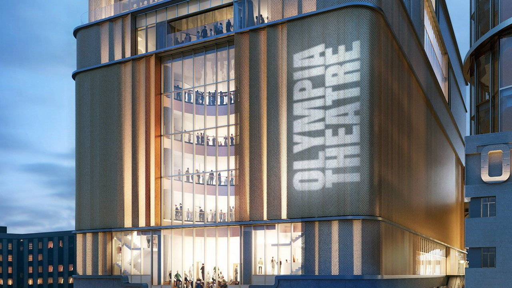

###### Theatre architecture

# London is likely to get a swanky new theatre 

##### Out with the hard benches; in with the bars, VIP suites and boxes 

 

> May 22nd 2021 

BUILT INTO the bricks of British theatres are the aims and ideals of the ages that made them. “Social class,” says Rohan McWilliam, a historian at Anglia Ruskin University and author of a book on the West End, “was etched into the architecture of theatre.” From the gilded social stratification of Victorian theatres to the dourly democratic National Theatre (“a mixture of Gatwick airport and Brent Cross shopping centre”, as the director Jonathan Miller had it) British theatres are mirrors to their makers.

Now London is to get a new one, due to open in 2025. With 1,575 seats, the Olympia Theatre in Kensington will be the largest permanent theatre to be built in the capital since the National opened in 1976. It reflects a very different era. The National was an austerely egalitarian place, with brutalist architecture and an opening season that offered Hamlet and a strong sense of cultural purpose. This was theatre less as entertainment and more as medicine to dose an occasionally nonplussed nation. “Do the English people want a national theatre?” asked the playwright George Bernard Shaw before it was built. “Of course they do not. They never want anything.”


Sir Howard Panter, impresario and boss of Trafalgar Entertainment, the theatre operator that has leased the Olympia, would beg to differ. He knows precisely what the British people want because his company has taken the novel approach of asking them. It turns out that British theatregoers want many things, most of them swishy. On the outside, the Olympia will resemble a fancy new office block or hotel; inside it will have six high-speed lifts, six bars, luxury hospitality suites, 70 premium seats and 17 boxes. In a striking change to the usual plumbing of theatreland, it will also have 70 toilets.

Boxes are a bellwether of social trends. Their heyday was the Regency era, when aristocrats forked out vast sums to rent a box for a season and to enjoy what Mr McWilliam calls “conspicuous consumption” and Sir Howard calls “jollification”. The Victorian era dampened enthusiasm for such fripperies, as it tended to; the second world war and the dreary post-war period all but put paid to boxes. The National was built with none; many theatres preferred austere benches.

The Olympia Theatre is betting that the national mood has changed, particularly since the coronavirus pandemic. “I don’t think we’re going to spend our lives watching Netflix,” speculates Sir Howard. “We’re going to want to go out... But when we go out, we want it to be worth it.” Hence all those boxes, suites, premium seats and bars. After a year of covid-19, thinks Sir Howard, people are not only ready for fun but ready to spend money on it. “They don’t want to sit on a wooden bench and feel worthy,” he says.■

