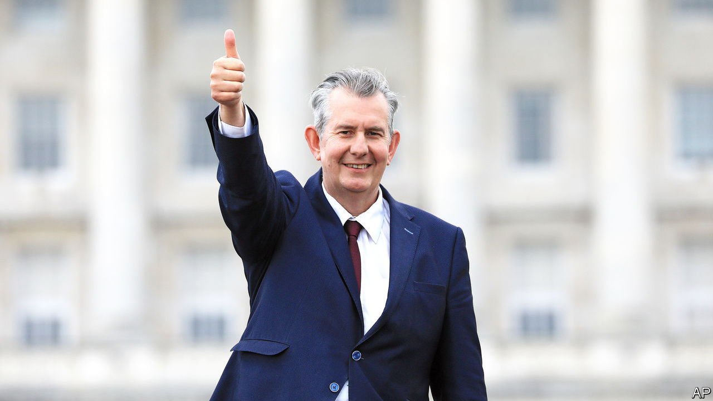

###### Politics in Northern Ireland

# Two unionist parties are under new management 

##### It might not be enough to save them 

 

> May 20th 2021 

THE FOUNDER of the Democratic Unionist Party (DUP), Ian Paisley, led it for 36 years. The party’s second leader, Peter Robinson, lasted for seven and a half years; the third, Arlene Foster, was thrown out after five and a half. Edwin Poots, who was elected to the top job on May 14th, must hope this is not a trend.

The DUP overtook the previously dominant Ulster Unionist Party two decades ago, by exploiting unionist unease at compromises following the Good Friday Agreement which ended the Troubles. The party then showed its pragmatic side by agreeing to govern with Sinn Fein, its ideological adversary. But it has become complacent and scandal-prone.


Mrs Foster was weakened by “cash for ash”—a bungled green scheme that paid businesses so much to heat buildings with wood pellets that they made money by burning them. Colleagues had become exasperated by her arrogance and resented her coterie of powerful advisers. Despite wielding unprecedented influence over a British government between 2017 and 2019, Mrs Foster’s tenure saw Northern Ireland’s place in the union weakened. Mr Poots was among those who brought her down.

The new leader is a fervent Brexiteer, a fundamentalist Christian and a creationist. In 2005 he described gay civil partnerships as “unnatural” and “abominable”. As a young man at a hot-tempered public meeting in the 1990s he challenged a heckler to come at him with the words: “Come on, big fella.” His election might suggest a party lurching back to a more uncompromising position.

But on the same day the DUP chose Mr Poots as leader, it elected as deputy leader Paula Bradley, the party’s most liberal legislator. Mr Poots had backed her over an old-school DUP man because both want to reform the party. He quickly announced that he would not become first minister. That suggests a willingness to break with tradition and to make a highly centralised party somewhat less so.

He now faces some difficult choices. He must decide whether to honour a DUP agreement with Sinn Fein to support legislation to enhance the Irish language—a measure that is unpopular with unionists but is probably necessary if devolved government is to continue. Then there is the Irish Sea border, which has divided the United Kingdom as part of the Brexit deal agreed with the EU. Mr Poots loathes it, although he has allowed civil servants to build border posts and conduct checks.

Unionists hope to win a majority in the Stormont Assembly elections next year and vote down the Irish Sea border. Professor Jon Tonge, an expert on the DUP, calls that prospect “entirely unrealistic”. In January a poll showed that the party was losing voters both to the hardline Traditional Unionist Voice and to the centrist Alliance Party. It is even possible to imagine Sinn Fein displacing the DUP as the largest party in Northern Ireland.

It is also possible that the Ulster Unionist Party, which the DUP vanquished in the early 2000s, could become more competitive again. It also has a new leader—a former soldier named Doug Beattie. Working-class, secular, instinctive and straight-talking, Mr Beattie’s courage has been proven on Afghan battlefields where he won the Military Cross.

Both men are fighting to save more than their parties. In 1997 unionism took 50.5% of the vote. By 2019 the share had fallen to 43.1% as the Catholic population grew and some voters rejected the old tribal identities in favour of parties focused on other issues. With increasing calls for a referendum on Irish unity, unionists are desperate for a leader who can turn the tide.■

