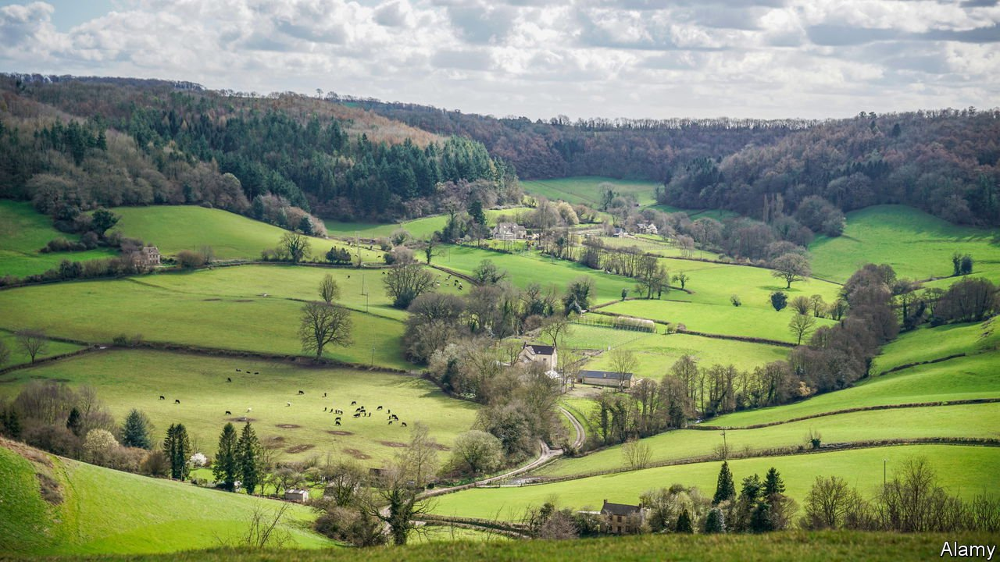
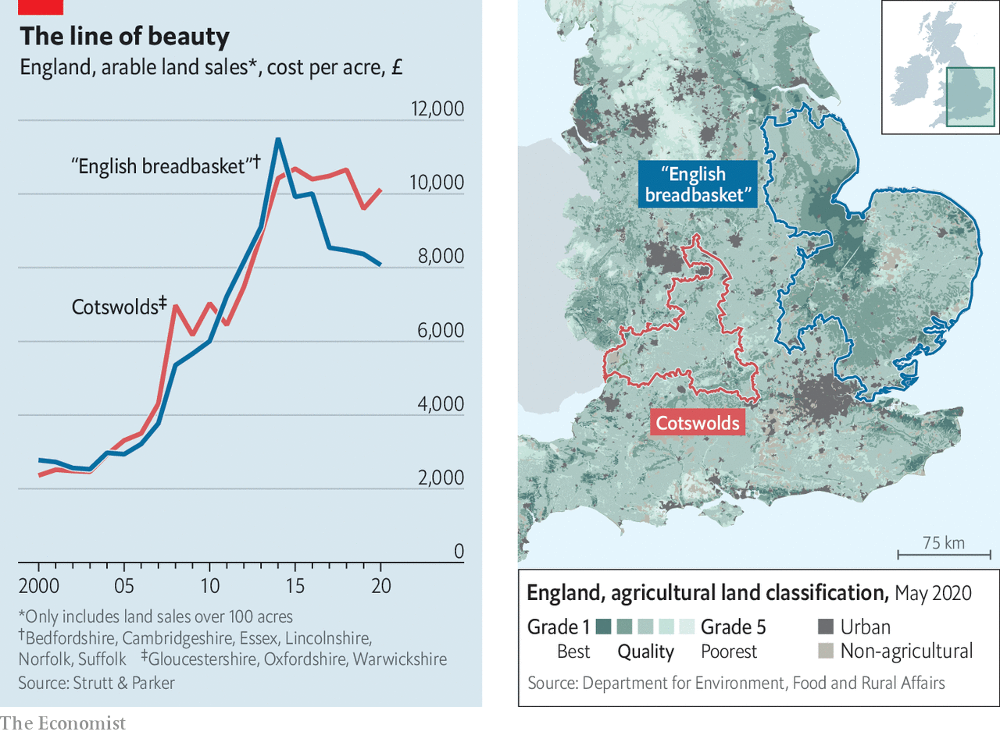

###### Land prices

# Why the best farmland in Britain has become cheap 

##### The most expensive land is bumpy and stony 

 

> May 22nd 2021 

BY THE MIDDLE of the 19th century East Anglia had become the breadbasket of Britain. Steam-powered water pumps and men with shovels had drained the land, leaving a rich, stoneless soil that was almost black in places. “What were once fens and sandbanks, bear now a luxuriant sea of corn and the highest of rents,” wrote Karl Marx of Lincolnshire. The soil thereabouts is still excellent. But Britain’s priciest farmland is elsewhere.

Before 2015 arable land was rising in price almost everywhere. Then came a slump in commodity prices, followed by the Brexit vote. Although many farmers supported the Leave campaign, they soon began to worry that the government would cut per-acre subsidies after departing the EU’s common agricultural policy. It proceeded to do just that in England; Northern Ireland, Scotland and Wales are not far behind. At which point the land market began to diverge, with the best farming areas performing worst (see chart).


Strutt &amp; Parker, an estate agent, has analysed arable farmland prices in two regions for The Economist. The first consists of Bedfordshire, Cambridgeshire, Essex, Lincolnshire, Norfolk and Suffolk—a flattish area with lots of land designated grade one or two (the highest grades on a five-point scale). The second area is the Cotswolds, defined as Gloucestershire, Oxfordshire and Warwickshire. Strutt &amp; Parker only counts sales of more than 100 acres (40 hectares) to get rid of pony paddocks and such like. It also strips out the value of buildings. The frequently hilly, mostly grade three land of the Cotswolds costs more than the fertile stuff.

 


Some purchasers in that region plan to plant trees, for which they may be rewarded by companies seeking to offset their carbon emissions. A few others are “rewilders” who hope to return the land to nature. That modish group is more common in Scotland, where land parcels are larger—the bigger the area of land, the more it can be left to manage itself.

Above all, though, the farmland market in the Cotswolds is driven by “lifestyle” buyers who seek a quiet place to live. They are mostly interested in the farmhouse, and view the fields around it (which are likely to be planted and harvested by a contract farmer) as a kind of verdant moat. Covid-19 has persuaded so many people of the virtues of isolation that lifestyle farm buyers are spilling well beyond the borders of the Cotswolds, where they have been present for years.

Their priorities are quite different from the yield-focused growers of eastern England. “The commercial farmer doesn’t care if the land is next to a motorway,” says Clive Hopkins of Knight Frank, another estate agent. Lifestyle farmers do. They also mind electricity pylons and footpaths running close to the farmhouse. Above all they seek beauty, which is where the breadbasket region often falls short. The great drainage projects of eastern England, which turned rude fens into a grid of neatly rectangular fields, aimed to make the land much more valuable. It does not look that way now.■

