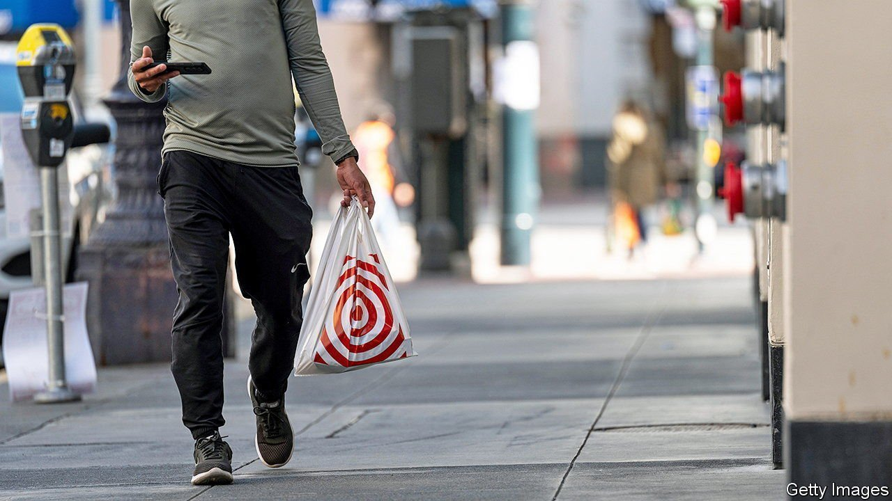
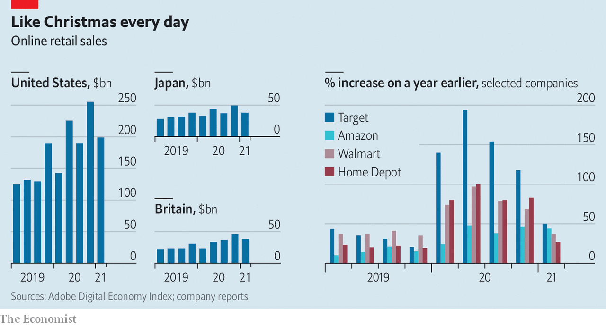

###### From self-isolation to self-service aisles

# After the pandemic boom online retail sales are slowing 

##### But shoppers are still in splurging mood 

 

> May 22nd 2021 

 


ON MAY 19TH Target reported that digital sales rose by 50% in its latest quarter, year on year. That is a blistering pace—but not nearly as blistering as earlier in the pandemic. Walmart, Home Depot and other retailers have also recorded slowing e-commerce growth. But as shoppers emerge from self-isolation they are in a splurging mood. Target’s overall quarterly revenue of $24bn beat forecasts. Clothes in particular are flying off the racks, and not just sweatpants; the firm’s apparel sales jumped by over 60%.

