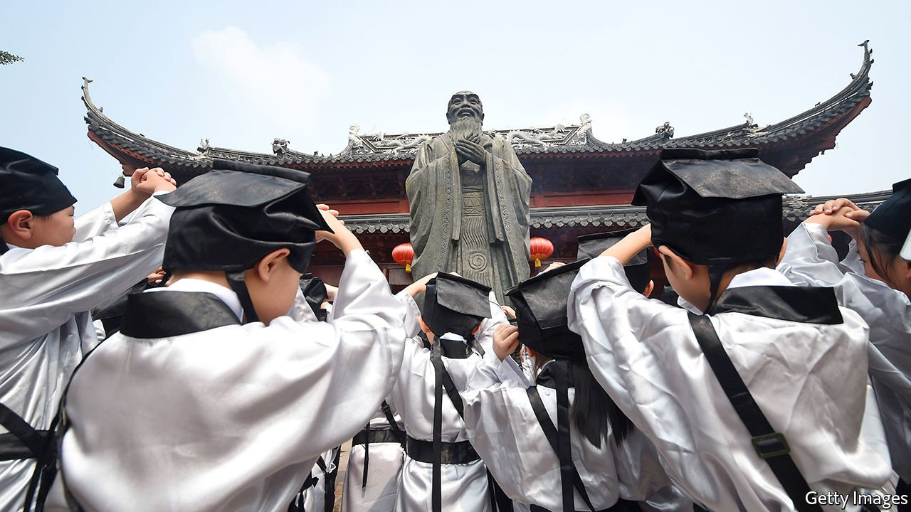

###### Reversing the cultural revolution

# Chinese parents are keen on a more Confucian education 

##### So is the government, hoping it will boost patriotism and fill a moral vacuum 

 

> May 22nd 2021 

AT FIRST GLANCE, Huaguoshan kindergarten in Zhuzhou, a city in the southern province of Hunan, looks much like any other nursery. Four brightly painted playrooms have buckets of building bricks and soft, coloured mats. But on higher floors, the classrooms are more spartan. Rice-paper lanterns and a row of black roof tiles running along the top of the walls evoke ancient Chinese architecture. Children wear powder-blue fleeces with the mandarin collars and frog fasteners of traditional jackets. Large portraits of Confucius hang on otherwise bare walls.

The kindergarten opened in September but already has a year-long waiting list. It taps into a growing nationwide demand for guoxue, or “national studies”. This usually involves learning classical Chinese thought, texts and morals, especially those associated with Confucius. Children at Huaguoshan are taught how to bow, how to greet each other politely in the street and how to sit attentively, with back straight and hands placed carefully in their laps. In one room they noisily stamp leaves onto muslin bags to learn an ancient dyeing technique. In others they recite poems, practise calligraphy, perform tea ceremonies and play Chinese chess. But, say teachers, mastering skills is secondary to building character. A child learns to “respect her rival and accept defeat” in chess; in the tea room, to “value what is fragile as you would a porcelain cup”.


After decades of worshipping foreign trends, many people are now interested in such traditions. Television shows include “Chinese Poetry Conference”, in which members of the public are quizzed on classical stanzas. Young people don traditional robes in public. At the heart of the trend is education. Frost &amp; Sullivan, a data firm, estimated that the market for children’s guoxue education was worth 466bn yuan ($73bn) in 2018, almost double its value in 2014. Schools charge hefty fees. The organisation that runs Huaguoshan, a non-profit, also relies on donations. It promotes its educational philosophy on social media, with clips of its pre-schoolers reciting poems in traditional garb.

Revered for 2,500 years, Confucius was vilified during the 20th century. Guoxue fans speak of “a hundred-year gap”. In 1905 the failing Qing dynasty abolished imperial civil-service examinations based on the sishu, the four Confucian texts. Modernisers saw the beliefs as blocking progress.

The worst assaults were after the Communists came to power in 1949. During the Cultural Revolution, Mao exhorted people to smash anything old. Gangs of Red Guards swarmed Qufu, the sage’s hometown, and blew up his tomb. It was only in the mid-1980s, nearly a decade after Mao’s death, that the anniversary of Confucius’s birth could be marked once again.

Top down, bottom up

China’s return to tradition is driven in part by a sense of cultural loss. Many Chinese people are eager to rediscover their heritage, stripped away by decades of Communist rule. But it is also flourishing because it now meshes with official objectives. President Xi Jinping has done more than any other modern leader to elevate Confucian ideas. Soon after coming to power in 2013, Mr Xi visited Qufu, as emperors had done before him. He called for “new and positive roles” for Confucianism.

The ancient system of thought emphasises respect for authority, reverence for ancestors and deference to elders. Confucius taught that such values were essential to achieve moral excellence as an individual. Such upstanding citizens would form the basis for wider social harmony and political stability. Emperors used the philosophy to instil obedience. Mr Xi wants to do the same. Party leaders also approve of Confucianism because, unlike socialism, it is home-grown. It appeals to young nationalists who cheer the party’s call for wenhua zixin, or cultural self-confidence.

Strictly speaking, all primary and secondary students should be at state-regulated schools, though most kindergartens are private. Guoxue content, such as classical poems, has long been part of the state secondary-school curriculum. In 2014 more of it was added to the university-entrance exam. The number of classical texts to be taught in schools increased from 14 to 72. In 2017 the government put out guidelines for having a comprehensive guoxue syllabus in primary and secondary schools by 2025. In May the education ministry confirmed the plans, saying it was important for young people “to be formed into upright Chinese” with the patriotism “to serve the country”. State-approved guoxue classes would “enhance a sense of belonging to and pride in the Chinese nation”.

For many Chinese, the sage’s musings hold a different appeal. In neglected Confucian morals, educators see a set of values that may be a solution to modern social ills, just as some in the West turn to traditional Christian values. Jia Hong, who set up Huaguoshan and two other guoxue pre-schools, says, “Nowadays we hear about so much bullying and brattish behaviour.” Many think a lack of good manners is to blame. Three-quarters of the 200 children at Ms Jia’s kindergartens used to attend regular ones. She says parents remark on how Confucian rituals have calmed their children and helped them focus.

Many young parents believe that the national obsession with exams has distracted them from other forms of edification, says Cao Shenggao of Shaanxi Normal University. Some do consider the discipline instilled by guoxue, or mastery of the zither, say, as one more way to set their child apart in the educational rat race. Guoxue institutes often hint that their after-school classes can help boost test scores.

But many others see guoxue kindergartens, which are legal, and guoxue primary and secondary schools, which operate in a legal grey area, as a way to shield children from relentless competition, at least early on. Scandals have spurred the government to crack down on the shadier end of such schooling. In 2019 a boy died after teachers at his boarding school refused to take him to a hospital, insisting on using traditional medicine. Last year the founder of a guoxue camp that claimed to cure internet addiction was sentenced to three years in prison, after pupils were found to have been abused. The government has also banned the teaching of “feudal dregs”, such as Confucian texts extolling female submission.

Educators such as Ms Jia support the crackdown. But many popular guoxue schools for older children are keen to stay self-sufficient if they can, declining offers to work with local education boards. Tian Yu, a scholar of Chinese education based in America, finds that the schools appeal to certain parents as a way to avoid the political indoctrination of the state system. Guoxue educators say quietly that the revival of forgotten culture should come from the bottom up. But in a contest to define what counts as tradition, the party will always want to have a say. ■

