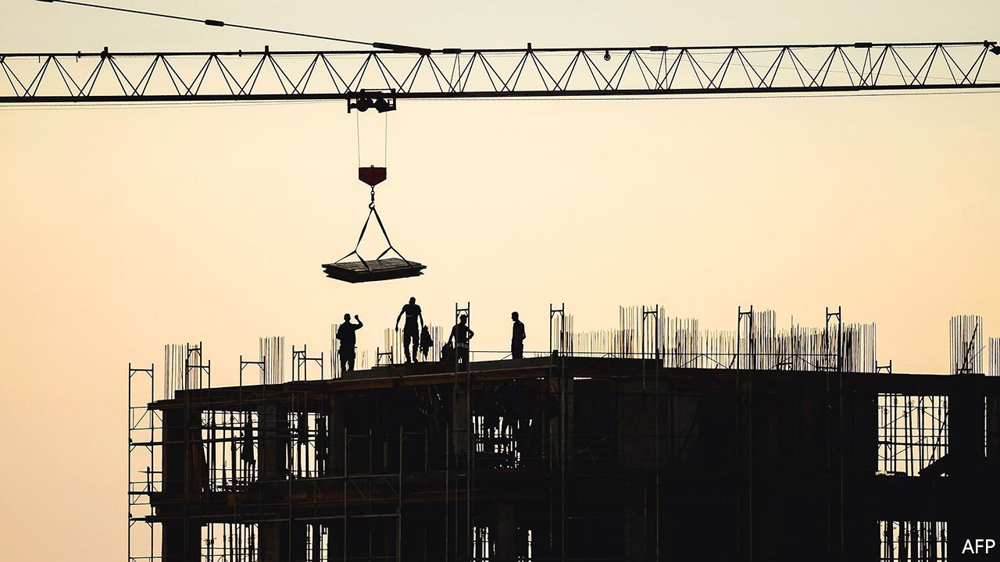

###### Hide and seek

# Balkan money-laundering is booming 

##### The property market makes a good place to hide ill-gotten gains 

 

> May 22nd 2021 

ON MAY 12TH prosecutors in North Macedonia charged Nikola Gruevski, the country’s former prime minister, with money-laundering. It is alleged that he funnelled cash donated to his party through Belize to buy property illegally and conceal its ownership. He says the case is politically motivated. Meanwhile in Jahorina, a popular Bosnian ski resort, gangsters, plus the officials they have corrupted, have been investing in hotels. All kinds of corruption are rife. An expatriate, who has half-built a block of flats near his home in Vlora in south Albania, rails that building has stalled because he refuses to pay bribes to secure the necessary permits.

Across the Balkans dirty money is being laundered through property, distorting the market and inflating prices—much to the rage of ordinary house-hunters. Swanky new towers are rising in Tirana, Pristina and Belgrade. Although Balkan economies have been hit hard by covid-19, property prices in parts of the region have defied gravity. In Tirana they have more than doubled since 2017. Across Albania, the value of real-estate transactions rose by 6.7% in 2020.


The laundering of drug money, especially from cocaine trafficking, which has boomed in the past few years, is one reason why prices are rising, finds a new report by the Global Initiative Against Transnational Organised Crime, an international network of crime specialists. Another is that crooked officials need to invest their cash. All Balkan countries have sound money-laundering laws, but enforcement is patchy.

In the past decade Balkan crime syndicates have outgrown their small home countries. They now make much of their money abroad. Hence, says the report, a hefty share of their profits is invested abroad, too. But they still invest at home. Fatjona Mejdini, who helped research the report, says that Balkan governments are ambivalent about money-laundering. They want to crack down on it but simultaneously welcome the jobs and investment it can bring. As for the gangsters, murderous in making money, they are conservative when it comes to investing it. They “lack imagination” says Ms Mejdini, which is why they prefer bricks and mortar to the many other types of business they could use to launder their loot.

