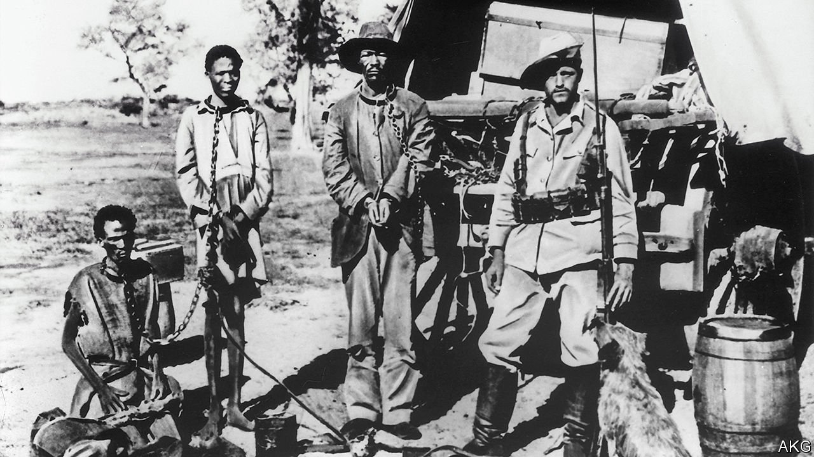

###### Blood money

# Germany is apologising for crimes a century ago in Namibia 

##### The slaughter of the Herero was genocide, says Berlin 

 

> May 22nd 2021 

T UCKED AWAY in a military cemetery in the Berlin suburb of Neukölln you eventually find it: a small plaque dedicated to “the victims of German colonial rule in Namibia…in particular the colonial war”. Berlin has no shortage of memorials to the crimes of Germans. Yet this is the country’s only commemoration of the genocide it inflicted in 1904-08 on the Herero and Nama peoples in what was then German South-West Africa. The plaque was laid in 2009 by locals anxious to counter the symbolism of the Hererostein that looms behind it: a rock bearing a memorial dating from 1907 to seven German soldiers in the imperial Schutztruppe force who died in the Herero uprising that triggered the killings. The rock is scarred with rivulets of dried red paint, having been defaced last year during Berlin’s Black Lives Matter protests.

This scene sums up Germany’s complicated attitude to the killings, in which at least 75,000 Herero and Nama were slain in battle, executed, starved in the Oma heke desert or worked to death in labour camps. It was not until 2015, after years of tongue-twisting, that the German government accepted the term genocide and embarked on negotiations with its Namibian counterpart over how to acknowledge and compensate for the actions of its forebears.


The talks, led by specially appointed envoys and conducted in high secrecy, have been difficult, punctuated with bitter rows and briefing wars. Aggrieved Herero pursued a parallel lawsuit in American courts. Yet on May 15th Deutschlandfunk radio reported that the two sides had at last reached agreement. Once consent is secured in the respective parliaments, a signing ceremony in Windhoek, the Namibian capital, could quickly follow.

As yet there is no public acknowledgement of a deal. However, its main elements have long been clear. Germany will formally acknowledge its culpability for genocide. Frank-Walter Steinmeier, the president, will reportedly issue a state apology in the Namibian parliament later this year. A thornier point is money, the main reason the talks dragged on for so long. Perhaps quietly supported by other former colonial powers, the German government has been leery of inviting further claims from its other former African possessions, such as Tanzania or Burundi, or from European descendants of the victims of Nazi atrocities. Officials argue that the Genocide Convention of 1948 cannot be applied retroactively, and therefore that Germany’s culpability is “moral-political” rather than legal.

That implies that the millions Germany will hand over will count not as “reparations” but, in effect, an extension of its development aid to Namibia. Funds will go to education, infrastructure and health care. Negotiators have been especially keen to have Germany finance land reform, too; a sore point in a country that is mostly too dry to grow much in the way of crops, and where most commercial farms are owned and run by whites. Germany could help pay for the redistribution of farmland from willing sellers to the Herero and Nama, many of whom are poor. “However you label it, the important thing is to support those parts of the Namibian population still affected,” says Wolfgang Kaleck, head of the European Centre for Constitutional and Human Rights, a legal NGO in Berlin.

That could be trickier than it sounds. The Herero and Nama are divided. Prominent figures in both groups have long felt shut out from talks led by a government dominated by the ethnic Ovambo, who were not affected by the German massacres (though its lead negotiator, Zed Ngavirue, is Herero). Most Herero people “will never accept this decision so long as they are excluded,” says Israel Kaunatjike, a Herero activist in Berlin. Some fear the Namibian government will be an untrustworthy custodian of whatever funds it receives. Reinhart Kößler of the University of Freiburg says the agreement could intensify existing conflicts.

As for the Germans, they have “to a modest extent” begun to wake up to their country’s imperial past in Africa, says Mr Kößler. This has been spurred partly by the opening of the Humboldt Forum, a new museum in the heart of Berlin that has inspired a debate over the exhibiting of plundered treasures—and the question of their restitution. The museum is named after two Prussian naturalist brothers whose attitude of open-minded globetrotting it seeks to encapsulate. The words of one of them, Wilhelm, are quoted at the bottom of that plaque in Neukölln: “Only those who know the past have a future.” ■

