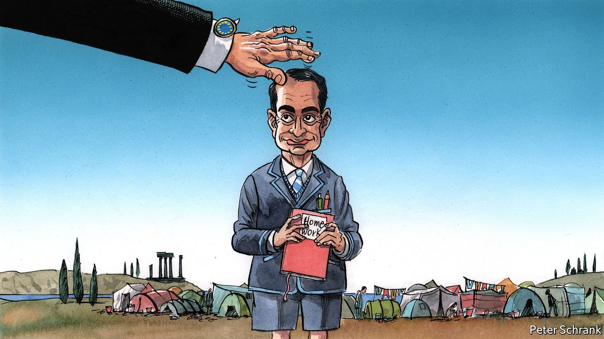

###### Charlemagne

# How Greece became Europe’s unlikely model student 

##### So long as its finances are in order, no one cares what else it does 

 

> May 22nd 2021 

BRUSSELS CAN be a patronising place. In the EU, prime ministers are sometimes treated like schoolchildren. In a favourite phrase, stern officials declare that national governments must “do their homework”. If Brussels is a classroom, then Greece has become an unlikely swot. Its handling of the pandemic has been praised. Its plans for spending a €31bn share of the EU’s €750bn ($915bn) recovery pot got a gold star from EU officials. Greek ideas such as a common covid-19 certificate are taken up at a European level. After a decade in which Greece found itself in remedial lessons, enduring three bail-out programmes and economic collapse, it is a big shift. Syriza, the leftist party that ran the country from 2015 to 2019, was the class rebel. By contrast, the government of Kyriakos Mitsotakis, the smooth centre-right prime minister since 2019, is a teacher’s pet.

Partly, the change in reputation is a question of politics. Syriza set itself up as a challenger to the EU’s current order, hoping to overhaul the club from the inside. But if the EU has a house view, it is one of the centre-right where Mr Mitsotakis’s New Democracy sits. In the technocratic world of EU politics, Mr Mitsotakis fits right in. A former management consultant, he speaks English, French, German and Davos, a dialect used by middle-aged men in snowboots at high-altitude conferences. He wears the school uniform well. Explicitly, New Democracy was elected in 2019 on a plan to overhaul Greece. Implicitly, their task was to make Greek politics boring and turn Greece into a normal European country. Syriza’s leaders saw themselves as a beginning of history; New Democracy’s leaders see their job as bringing a dark era to an end.


They are having some success. After a decade in bail-out programmes and almost leaving (or being kicked out of) the euro zone, Greece had put its finances in order long before covid-19 hit. Greek bond yields are near record lows, as the European Central Bank is no longer reluctant to buy Greek debt. In the government, self-declared nerds waving Ivy-League degrees now run the show. Its plan for spending that €31bn of EU funds came with a 1,400-page audit, longer than some countries’ entire proposals. (Years of being bludgeoned by commission officials mean Greek bureaucrats know what keeps those marking the homework happy.) While countries such as Finland rowed over the ratification of the scheme, Greece’s plan zoomed through its parliament. The teacher is worrying about other children in the class.

Dire conditions for migrants stuck on Greek islands should be a blemish on the government’s record, along with reports of “pushbacks”, when asylum seekers are illegally forced back to the territory from which they came. But the staffroom in Brussels seems content. In the minds of European politicians, pushback rules are designed to stop refugees from being mown down by border guards, not to stop dinghies from being towed back to the Turkish coast. By the same brutal logic, miserable conditions on Greek islands deter others from coming. The EU had a far bigger problem with the approach of Syriza, which initially failed to stem arrivals, than the current approach of repelling them. Last year, a young man was shot at the border as crowds of people tried to enter Greece from Turkey. Ursula von der Leyen, the European Commission’s president, hailed Greece as Europe’s shield. For a body that vaunts its rules-based order, it can be relaxed about violations if they are helpful. The flow of people has stopped. Beyond that, European leaders have few questions.

What happens outside the school gates is of no concern for the EU. Where Greece does err, it is in areas outside the EU’s remit. Inside Greece, activists and NGOs complain about a rise in police brutality after New Democracy came to power. Fellow governments were happy to stick their noses into Greek affairs during the bail-out programme. In normal times, however, they will do anything to avoid criticising the internal affairs of another member state. It is a similar story when it comes to breaking the clientelism and nepotism that have hindered Greece. Syriza promised to fix it but failed to do so. Mr Mitsotakis talks a good game on the topic, but it is difficult to take seriously from the son of a prime minister, a brother of a former foreign minister and the uncle of the current mayor of Athens. It is hard to lead the charge, when the best evidence of progress would be not leading it in the first place.

The EU can be a negligent teacher in areas where it is supposed to pay attention, too. When it comes to media freedom, Greece ranks fourth from bottom in the EU, according to an index from Reporters Without Borders. Only Malta, where a journalist’s murder brought down the previous government; Viktor Orban’s Hungary; and Bulgaria, probably the most corrupt country in the EU, rank below Greece. Earlier this year Giorgos Karaivaz, a Greek journalist, was murdered. Kostas Vaxevanis, the editor of Documento, a left-wing newspaper which has investigated corruption, now requires police protection. Glossy presentations extolling Greece’s march up various ease-of-doing-business rankings are undermined if the country drops down other rankings. The EU has consistently let such matters slide in the past, when convenient to do so. Greece is not as bad as some. But it is never a good idea for the class swot to hang out with the hoodlums behind the bike shed.

Flunking out of flunking out

As long as Greece keeps getting good grades in the areas that count, no one minds. A government that goes with the flow politically, carries out reforms without complaint and does the bloc’s dirty work on migration will always be welcome. Its flaws can be ignored. For all its talk of values, the EU is a political creature, not a moral one. It does not cast judgment on those who play along. Governments that attempt to overhaul the EU, as Syriza did, find themselves steamrollered. Those who accept the EU as it is, like New Democracy, can get on with their business without disturbance. Hand in the homework on time and no one will care. ■

