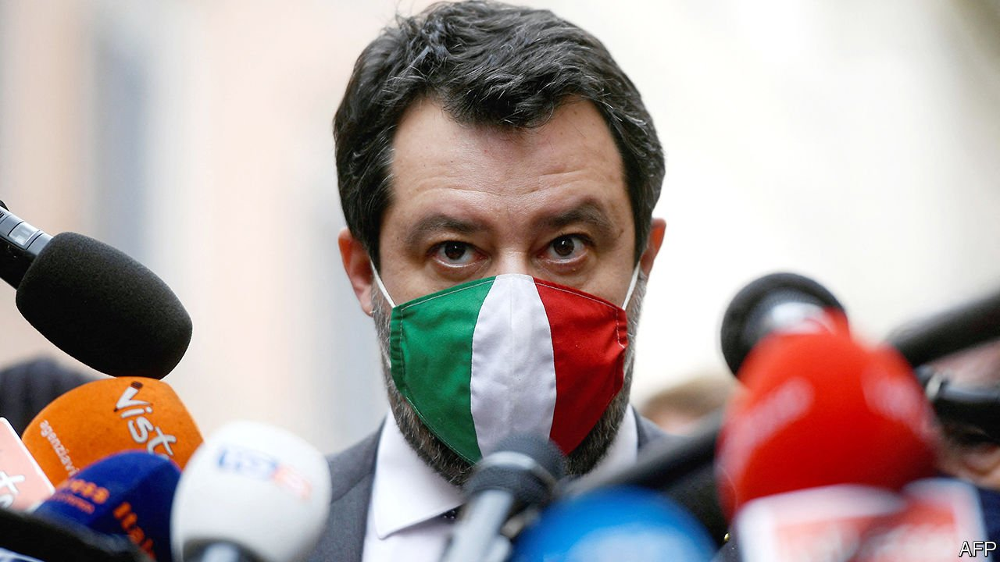
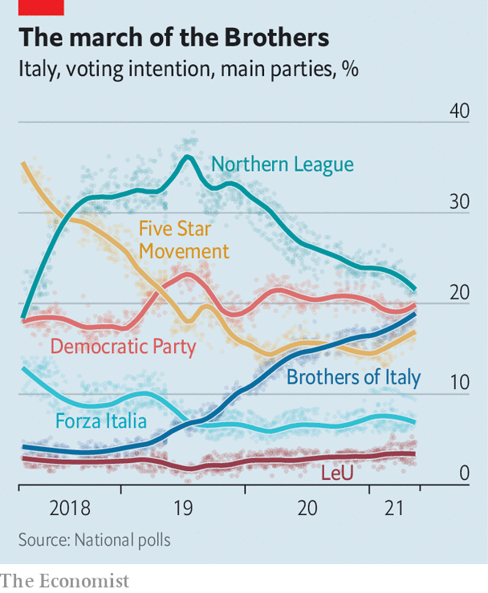

###### Waiting in the wings

# Italy’s populist right looks menacing 

##### Matteo Salvini’s Northern League could hook up with the more extreme Brothers of Italy 

 

> May 22nd 2021 

ON MAY 20TH Italy’s interior minister, Luciana Lamorgese, was due in Tunis with the EU’s commissioner for home affairs, Ylva Johansson, to investigate and discuss a humanitarian crisis that has opened deep divisions in Italy’s new government. So far this month 4,290 migrants have reached Italy’s shores, compared with 1,654 in the whole of May last year. Many set sail from Tunisia. The number of arrivals in 2021 is now more than 13,000—triple the volume in the same period last year. And the summer months, when crossing the Mediterranean is easiest, lie ahead.

All this is manna from heaven for Matteo Salvini, the leader of the populist Northern League and the politician who has suffered the most since Mario Draghi came to power in February. The League’s poll ratings have fallen since mid-2019 (see chart). That was when Mr Salvini (pictured) torpedoed an earlier coalition in which the League was allied to the maverick Five Star Movement. (He had hoped to nab the top job, but failed.) His party now has the backing of less than 22% of voters, compared with more than 37% at its peak, although that still makes it the country’s most popular party.


A resurgence in the number of people arriving illegally by boat allows Mr Salvini to play again on the fears of uncontrolled immigration that helped fuel the League’s rise to power in 2018. “With millions of Italians in difficulty, we can’t take care of thousands of [irregular migrants],” he wrote in a Facebook post on May 9th. The tactic might not work so well this time, as covid-19 and the state of the economy are the main concerns in voters’ minds; but a recovery accompanied by a surge in arrivals could quickly change that.

 


Mr Salvini has been on the back foot. One reason is that the League has two souls. Its core support is among the small-scale entrepreneurs of northern Italy. Its time-honoured demand was for secession—or, at least, greater autonomy—to reduce the cost to the north of bankrolling the southern half of the country, which the League depicted as shiftless and corrupt. After becoming leader of the party in 2013, Mr Salvini wooed a broader constituency: more Eurosceptic and blue-collar and which, at the most recent election in 2018, included millions of voters in central and even southern Italy. Among the few things the two wings of the League have in common is a shared mistrust of globalisation—and of immigration in particular.

The arrival of Mr Draghi has made it impossible for Mr Salvini to satisfy both factions. For the League’s original followers, it was unthinkable that he would miss an opportunity to influence a government charged with allocating some €200bn ($240bn) of the EU’s post-pandemic recovery funds. For the new, more populist League voters, it was just as unthinkable that he would cosy up to a former managing director of Goldman Sachs who supports both European integration and the single currency.

Mr Salvini has tried to square the circle by allowing the League to join Mr Draghi’s government without taking a job in it himself. That has left him free to heckle. Taking up cudgels on behalf of Italy’s restaurateurs, he has demanded a more rapid lifting of covid-19 restrictions. He has repeatedly attacked Mr Draghi’s health minister for his caution in this area.

Yet this ambiguous strategy has not prevented many League voters from becoming disillusioned. According to pollsters, most of those who have deserted the League have switched their support to the Brothers of Italy (FdI), the one big party that declined to join Mr Draghi’s coalition. The Brothers, who as it happens are led by a woman, Giorgia Meloni, are heirs to the neo-fascist Italian Social Movement, which wanted to revive the glories of Benito Mussolini’s Italy. Though committed to parliamentary means, the Brothers’ programme is profoundly nativist. To repel migrants, it favours a naval blockade. To obviate the need for immigrant labour in the future, it offers “the mightiest plan in the history of Italy for support of the family and the birth rate”.

The FdI would also criminalise the spreading of Islamist ideas, ban the use of foreign terms in official documents and provide state aid for Italian goods in contravention of the spirit and possibly the letter of EU law. But then Ms Meloni’s party is deeply suspicious of the EU. Its programme advocates a “rediscussion” of all the EU’s treaties and of the euro (though it carefully avoids calling for Italy actually to give up the single currency, let alone its EU membership).

The rise in support for Ms Meloni’s party has matched almost exactly the fall in support for the League. Polls suggest the FdI now commands around 18% of the vote. Those figures point to a scenario that many in the rest of Europe will find alarming. Together, the FdI and the League enjoy the support of 40% of the electorate—possibly enough for a majority in parliament after the next election. With the backing of Forza Italia, the more moderate but enfeebled party of Silvio Berlusconi, a flamboyant former prime minister, they could easily form a government.

It is thus plausible to imagine that, no sooner will Mr Draghi have put in place a plan for an economic recovery than responsibility for implementing it could pass to a stridently populist-nationalist government, infused with Euroscepticism and headed by either Mr Salvini or Ms Meloni. The two parties are in theory committed to an alliance, with whichever does best supplying the prime minister.

On May 16th Ms Meloni said: “I am preparing myself to govern the nation.” In a future nationalist coalition, the FdI would find its Eurosceptic instincts severely constrained by the need to keep the cash flowing from Brussels. Even so, the FdI could be an awkward partner. Its leaders want a constitutional amendment to give Italian law priority over European law and, in the context of support for law enforcement, a revision of “the so-called law on torture”.

Elections are due within two years. They could come much earlier if the current coalition falls apart. That could happen sooner than many expect. Mr Draghi might even precipitate a collapse, if he quits his post to run for the presidency early next year. The odds of that happening shortened this week, as the incumbent, Sergio Matarella, appeared to rule out seeking an extension. ■

