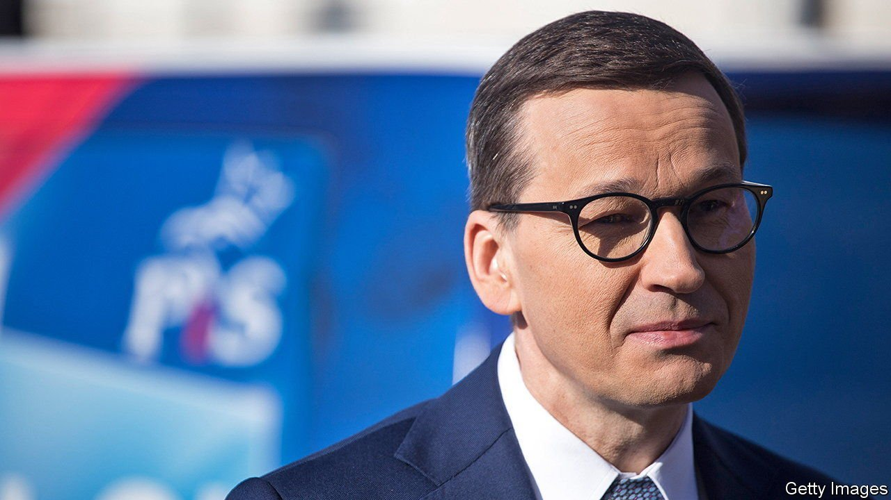
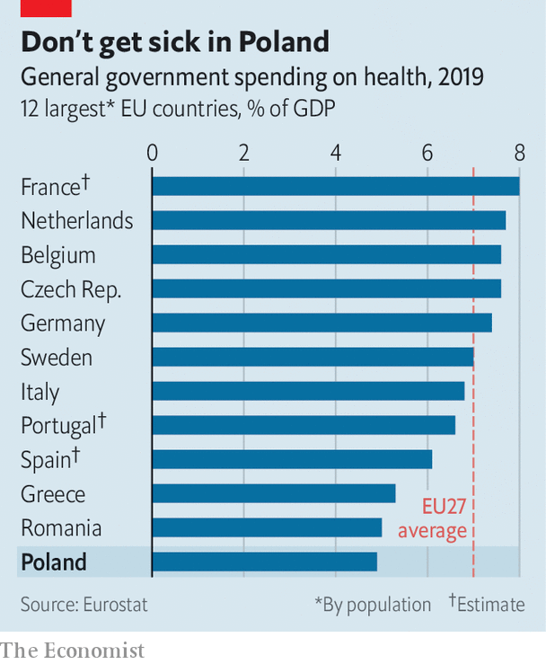

###### The PiS dividend

# Poland’s government eases coalition tensions with a spending splurge 

##### Such things tend to work 

 

> May 22nd 2021 

HANDOUTS WIN votes. Poland’s ruling party, Law and Justice (PiS), knows that from experience, having used big giveaways to help it secure victory in an election in 2019. On May 15th the populist government unveiled its long-awaited “Polish Deal”, a flurry of expensive policies encompassing health care, taxes, pensions, housing and state investment. The scheme is designed to bolster the economy as the government gradually starts to lift pandemic-related restrictions. It is a chance to please voters and distract attention from recent dramas in the ruling coalition.

Since coming to power in 2015, PiS has combined social conservatism, including hostility towards gay people and opposition to abortion, with some left-wing economic policies, including a monthly handout of 500 zloty ($135) per child, which it introduced in 2016, as well as a series of big increases in the minimum wage. The new deal presented by Mateusz Morawiecki, the prime minister, continues in this spirit, with another new payment for parents, among other goodies.


The programme’s first pillar seeks to buttress Poland’s medical system in the wake of the pandemic, which has caused over 70,000 deaths, according to official figures. Spending on health, which is below the EU average (see chart), is set to rise from the current 5% of GDP to 7% in 2027. Some of the extra cash will be spent on hiring more medical staff, after the pandemic exposed shortages.

 


The programme also includes more tangible benefits for voters. The level of earnings at which income tax kicks in will rise from 8,000 zloty a year to 30,000 zloty. The threshold for the upper band will be raised as well. From the second child onwards, new parents will get a one-off payment of 12,000 zloty per child. The package aims to “build a middle class for everyone, not for the few”, says Mr Morawiecki, a former banker.

In March unemployment stood at 6.4%. In the more rural east, which tends to vote for PiS, it was over 8%. But in its determination to bring respite, the government may overdo things. The economy was already set to grow by 4% this year and 5.4% in 2022, according to a forecast published last week by the European Commission. Even before covid-19 restrictions were eased or the Polish Deal announced, inflation was rising. It reached 4.3% in April, well above the EU average.

But whatever its economic consequences, the deal has succeeded in papering over tensions between PiS and its two junior coalition partners, the pro-business Agreement and the more socially conservative United Poland. The latter broke ranks on May 4th to vote against legislation in the lower house to allow Poland to take advantage of the EU recovery fund, because of what it saw as the unacceptable strings attached. (It still passed, with support from the left.) PiS rebranded the Polish Deal, originally portrayed as solely its initiative, as the work of the whole coalition. The party and its allies continue to lead in the polls, ahead of the centrist opposition, which remains fragmented. With a general election due to be held in 2023 at the latest, the deal seems at least as important politically as economically. ■

