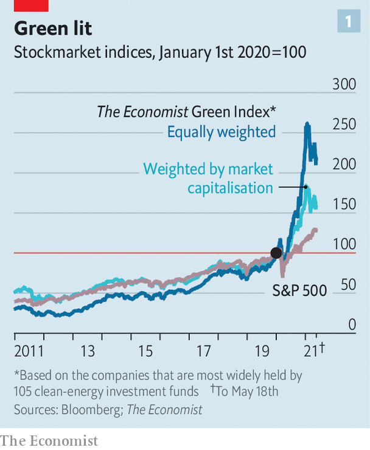
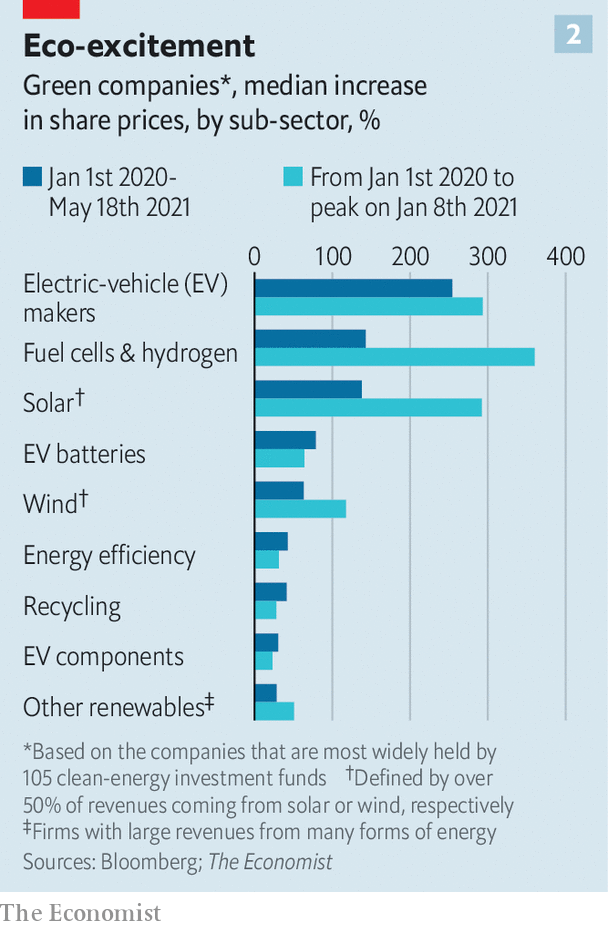

###### The green meme

# A green bubble? We dissect the investment boom 

##### Investors of all stripes are getting on board 

 

> May 20th 2021 

GREEN ASSETS are on a tear. The prices of battery metals such as lithium and cobalt have surged by about two-thirds and a third, respectively, so far this year. Copper has reached a record, partly owing to its importance for the energy transition; so too has the price of carbon in Europe.

The surge has extended to the stockmarket, too. Since January 2020 the value of Orsted, a windpower producer, is up by more than a third. The shares of SunRun, a solar firm, have trebled; those of Tesla and Nio, electric-vehicle (EV) makers, have climbed six-fold and nine-fold, respectively. Even lookalikes have gained: Tiziana Life Sciences, a biotech firm with the ticker “TLSA”, benefited from a bump last year when investors mistook it for Tesla (TSLA).


To analyse the boom The Economist has constructed a portfolio of companies that stand to benefit from the energy transition, with a total market capitalisation of $3.7trn. Since the start of 2020 the portfolio, weighted by firms’ market capitalisation, has risen by 59%, twice the increase in the S&amp;P 500, America’s main equity index (see chart 1). Even though the boom has deflated in the past few months, perhaps owing to inflation fears in America, .

 


Green stocks are no longer the preserve of niche sustainable funds. Conventional funds have piled in; stocks are also touted on online forums for day traders, such as WallStreetBets. Many investors draw comparisons between clean energy today and tech at the turn of the millennium—both in terms of the signs of froth, and the emergence of an industry with big structural effects on the economy.

Gauging the extent of the exuberance is not easy: the stockmarket indices that do exist tend to focus on isolated sectors, such as EVs or solar power. So The Economist has looked at the global listed firms that are most held by the biggest 100 or so clean-energy investment funds. Stripping out businesses only loosely related to the energy transition, such as semiconductor-makers, leaves 180-odd firms, ranging from renewable-power producers and EV-makers to energy-efficiency outfits and recyclers.

 


Since the start of 2020 our portfolio, when companies are equally weighted, has more than doubled; when firms are weighted by market capitalisation, our portfolio has jumped by more than half. The reason for that difference is that many green firms are small—their median market capitalisation is about $6bn—and the tiddlers have gone up the most. The smallest 25% of the firms have risen by an average of 152% since January 2020. Firms that derive a greater share of their revenue from green activities, such as EV-makers and fuel-cell companies, have also outperformed. The greenest 25% of firms saw their share prices rise by 110%.

What explains the surge? An obvious explanation is the rise of investing focused on  (ESG) factors. Global flows into ESG funds topped $178bn in the first quarter of this year, up from $38bn in the same quarter last year, according to Morningstar, a research firm (see chart 3). ESG funds accounted for 24% of total fund inflows so far this year, up from 11% in 2018. On average about two new ESG-focused funds are launched each day.

Many of these are indeed loading up on green stocks. Credit Suisse, a bank, tracked the holdings of 100 ESG funds over the past year. Among the five most-purchased companies were Orsted and Vestas Wind, a wind-turbine-maker. Yet only a subset of the funds, accounting for about a tenth of ESG assets under management, focused on clean-energy firms. The rest invested more widely. The top 50 holdings of the world’s 20 biggest ESG-labelled funds included only two of our green firms. Many of the top ten holdings were in fact tech companies such as Microsoft and Alibaba. (This is partly because fund managers often use ESG ratings to gauge if a firm is climate-friendly or socially upstanding, and big companies, with the resources to devote to disclosure, tend to rank more highly.)

Conventional fund managers, however, are also going green. Morningstar looked at the investors in 30 clean-energy businesses. At the end of 2020, each firm was held by 138 sustainable funds on average, up from 81 a year earlier. The number of non-ESG holders also increased, from 390 to 624. Investing in clean energy, says Jessica Alsford of Morgan Stanley, a bank, is “no longer a niche topic”.

A changing climate

The enthusiasm reflects two trends. For a start, many clean-energy firms are now more viable. The prices of some technologies have fallen dramatically, making them competitive with fossil-fuel firms. The cost of solar power has shrunk by around 80% in the past decade. That of lithium-ion batteries, which power EVs, is falling by about 20% a year. Moreover, with America, China and the EU setting “net-zero” emissions targets, investors sense that green regulation is here to stay. Pension funds, for example, which hold a lot of oil firms, have started to hedge that risk by buying clean-energy stocks, says Bruce Jenkyn-Jones of Impax, an asset manager.

The green hype has also been fuelled by financial fads. Retail investing has surged, and punters seem excited about new clean technologies. Among the 20 most popular companies on Robinhood, an app for day traders, are Tesla and Plug Power, a firm that makes hydrogen-fuel cells. Venkatesh Thallam, an independent researcher, notes that a handful of clean-energy firms feature on WallStreetBets. Green special-purpose acquisition vehicles ( SPACs), a novel way for companies to list on stockmarkets, have also proliferated. Of the 800-odd SPACs that have listed since 2019, about a tenth have focused on sustainability.

The emergence of meme stocks and SPACs raises fears of a green bubble, especially as 30% of firms in our portfolio are loss-making. To gauge the degree of frothiness The Economist has looked at two ratios: price-to-earnings (what the market thinks a company is worth relative to its earnings) and price-to-book (which compares prices to net assets).

These suggest that the degree of froth varies across green stocks. The median price-to-earnings ratio of renewable-power firms is about that of the S&amp;P 500. By contrast, EV firms have a median price-to-earnings ratio roughly twice that of the wider index. As most hydrogen and fuel-cell firms in our portfolio are not yet making money, price-to-earnings ratios cannot be calculated. But their price-to-book ratio is about 50% above the market average.

The difference in valuations is explained by variations in the maturity of both the underlying technology and the market. Wind and solar firms began to expand in the 2000s, aided by generous government subsidies. Over time the technologies improved and the subsidies shrank. The sectors also consolidated; those that survived now generate stable revenues.

By contrast, the frothier stocks are where wind and solar was a decade ago. The technology is often unproven, or the products need subsidies to be viable. And there are lots of firms competing with each other. The allure for investors is that one of them might be the next Tesla.

A few things could sap that exuberance. Inflation is a worry. Stock prices have already fallen this year upon inflation scares in America. Many green firms’ valuations are based on earnings far into the future. Higher inflation would erode that. If central banks raise interest rates, that could hurt renewable-power producers, which rely on debt for most of their financing.

Investors’ enthusiasm could also wane if some of the more speculative technologies fail. The froth has already attracted short-sellers. Nathan Anderson of Hindenburg Research, an investment firm, says fraud has become “pervasive” as money has flowed into green firms. Bosses might promise more than they can deliver or exaggerate the prowess of their technology. Hindenburg claims a string of ESG superstars have misled investors. That includes Ormat, a geothermal-power producer, and Nikola, an EV-maker. Ormat has said the claims are “inaccurate”, and Nikola has called them “false and defamatory”.

If technologies do succeed, fat returns may still not follow: falling product prices might offset demand growth. That was the case during the solar boom, says Velislava Dimitrova of Fidelity, another asset manager. Solar installations grew by 670% over the past decade, but module prices fell by over 85%. As a result, cumulative revenue growth for the industry was roughly 15%.

Still, many investors are optimistic. Few think that the energy transition will go into reverse. They argue that the prospects for the sector as a whole are promising, even if some firms end up being duds. Comparisons to the tech industry at the turn of the century abound. Like the internet, decarbonisation will lead to structural change in the global economy. Capital will have to flow towards cleaner technologies. The process will create winners and losers.

Mark Lacey of Schroders, an asset manager, notes that in the three years after 2000, many small and mid-cap tech companies went bust. Lots of green firms could meet the same fate. But it is worth remembering that, two decades after the dotcom bust, tech firms make up 38% of the market capitalisation of the S&amp;P 500. ■

For coverage related to climate change, register for The Climate Issue, our fortnightly , or visit our 

A version of this article was published online on May 17th, 2021

