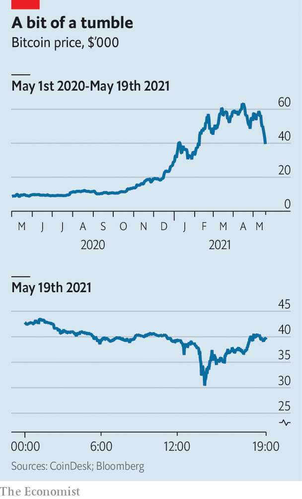

###### Bit by bit

# As bitcoin lurches, Wall Street plots its way into cryptoland 

##### To work out the fate of crypto-investing, watch what the banks do next 

 

> May 20th 2021 

CRYPTO BUFFS have had a punishing week. On May 13th Tether, which issues a “stablecoin” widely used to facilitate bitcoin trading, said that just 2.9% of its $58bn-worth of coins is backed by cash reserves, feeding doubts about its dollar peg. Elon Musk, Tesla’s boss, tweeted that the electric-car maker would not after all accept payments in bitcoin. Then on May 18th China warned financial firms against servicing cryptocurrencies. The price of bitcoin tumbled to $30,000, less than half its record high in April, before stabilising at around $39,000.

As it cratered, bitcoin dragged most other cryptocurrencies with it. Several big crypto exchanges, including Coinbase, experienced lengthy outages. Investors unable to liquidate positions felt trapped; those willing to “buy the dip” felt cheated. The latest swing might raise doubts about whether crypto markets are liquid or even reliable enough to welcome institutional investors en masse. That is why it is worth looking to Wall Street.


America’s big banks have been venturing into cryptoland. In March Morgan Stanley became the first to offer wealthy customers access to bitcoin funds. This month Goldman Sachs revived the crypto desk it had mothballed in 2017; Citigroup said it may offer crypto services. BNY Mellon and State Street are vying to administer bitcoin exchange-traded funds, currently under regulatory review in America. JPMorgan Chase, once adamant that it would steer clear unless cryptocurrencies began to be regulated, has hinted that it might start trading operations if the market expands.

 


Why are highly regulated banks wandering into the unregulated wilderness of crypto? It helps that watchdogs in America have been setting out what services banks can provide. Last year the Office of the Comptroller of the Currency said they could offer custodial services for crypto assets. The Commodity Futures Trading Commission regards bitcoin and other digital currencies as commodities, enabling banks to trade derivatives linked to them.

The main reason for banks’ enthusiasm, though, is obsessive interest from some customers. A year ago Itay Tuchman, Citigroup’s foreign-exchange chief, hardly ever fielded calls on crypto from institutional clients. Now he receives them several times a week, he says. Roman Regelman of BNY Mellon deems the craze “an opportunity, but also an imperative”. Wealthy clients are pulling money out of private banks, and retail punters out of current accounts, to bet on digital currencies through fintech firms and startups. Many would rather do everything with their banks, which, in turn, hope to reap the rewards in customer fees and data.

Perhaps the easiest service to offer is derivatives trading, as Goldman now does, providing clients with exposure to the assets without having to buy them. Then comes custody: the storage, and related book-keeping, of assets on behalf of big investors. This requires investing in technology; the few banks already selling custody subcontract tasks to specialist firms.

But it is the next level of services, where banks hold digital assets on their balance-sheets, either as collateral or by trading in spot markets, that is currently beyond reach. After a day like May 19th, when bitcoin lost nearly a third of its value in a few hours, regulators may ensure it stays that way. Even if banks do not trade directly, says Chris Zuehlke of Cumberland, a Chicago-based firm that helped Goldman execute its first big “block” trade of crypto futures on May 6th, they could still connect clients to large spot traders, acting as the shopfront but relying on the infrastructure, and balance-sheets, of others.

Banks insist that most clients expect a rollercoaster ride. But a prolonged rout could still scare off prospective converts and trigger a regulatory crackdown. Wall Street has an unrivalled ability to bring liquidity and distribution muscle to new assets. Anyone wanting to work out the fate of crypto-investing might do well to see what the banks do next. ■

A version of this article was published online on May 19th, 2021

