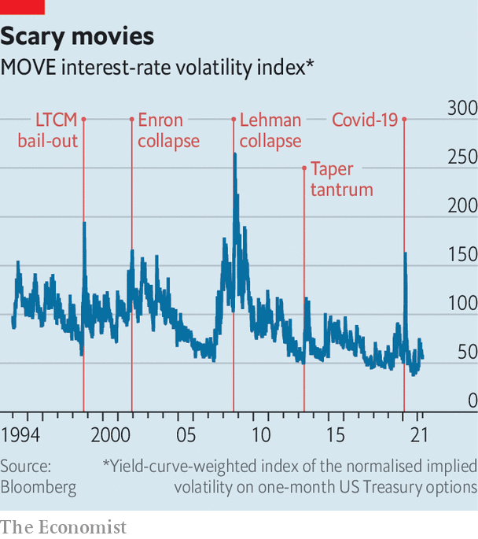

###### Buttonwood

# How to gauge investors’ fear of inflation 

##### Forget VIX. The MOVE index tracks bond-market terror 

 

> May 22nd 2021 

WHAT DO INVESTORS fear most? In the Bank of America’s long-running survey of fund managers, the tail risk that has mostly preoccupied them until recently has been the pandemic. In this month’s survey, though, inflation rose to the top of the list of worries. It is not hard to see why. High inflation, if sustained, would require central banks to act decisively to contain it. That would mean the end of the low interest rates that have underpinned the prices of an array of expensive-looking assets, from stocks and bonds to property.

Surveys are one thing. The bets investors make are another. The VIX, or volatility index, is the best-known market gauge of fear. It tracks the cost of insuring against extreme moves in American share prices and is widely used by banks and asset managers as a guide to managing risk in general. Yet the VIX does not get directly to what presently worries investors. For that, you need to consult a less-celebrated oracle—the MOVE, or Merrill Lynch Options Volatility Estimate, a market-based measure of uncertainty about interest rates. It has the stronger claim to being the true fear index. If it spikes it means bond investors have been gripped by raw terror.


The outlook for inflation is unclear. On the one hand, the form book says there is no reason to worry. For much of the past decade and more, the Federal Reserve and other central banks have consistently over-forecast inflation and under-shot their inflation targets. Jumps in inflation, such as the one recorded last month as America’s economy reopened in earnest, have usually proved transitory. On the other hand, present conditions seem fertile for inflation. The pressure on aggregate demand is fuelled not only by loose monetary policy but by hefty fiscal stimulus. In the face of this more insistent spending, businesses’ rules of thumb about which kind of workers to hire, how much to pay and how quickly to add capacity may prove faulty. Inflation might upset the form book.

If inflation is uncertain, so is the path for interest rates. Forecasts of monetary policy are reflected in the slope of the bond-yield curve and in interest-rate futures. The range of uncertainty around these expectations is embedded in options prices. A financial option is the right to buy or sell an asset at a specified price on or before a specified maturity date. Options are particularly valuable—and expensive—when investors are more uncertain or more fearful about the future. The level of market anxiety or uncertainty can thus be extracted from their prices. These are the raw material for the MOVE index, which is derived from options on two-, five-, ten- and thirty-year Treasuries.

The MOVE is expressed in basis points, explains Harley Bassman, who invented the index. If, say, interest rates are 5% and the MOVE is 100, it means that most (68%, or one standard deviation of a normal distribution) of the time interest rates are expected to lie between 4% and 6%. At present the index is in the fifties, which is low relative to its history and much lower than at times of extreme market stress (see chart). This is partly technical, says Mr Bassman. With interest rates not far from zero and the Fed seemingly disinclined to ever take them negative, the scope for volatility in Treasuries is somewhat curtailed. Another explanation is that people believe the Fed when it says it will not change its monetary-policy settings for a while. That expectation lowers the implied volatility on two-year Treasuries, which drags on the overall MOVE index.

 


Even so, the MOVE seems very likely to rise again—and perhaps sharply. The Fed will get beyond the sitting-on-hands phase. The market is betting that interest rates will rise in early 2023, after the Fed has first announced and then completed a tapering of its bond purchases. How far the MOVE will eventually move will depend on how transitory inflation looks to the bond markets and how in control of the situation the Fed seems. Many already swear by the index. A sharp rise in it is often a cue for panicky sales of the riskier sort of assets and a general repricing of individual securities, says Kevin Russell of UBS O’Connor, the hedge-fund unit of the Swiss asset manager. That is because if investors grow less certain about interest rates, they also lose confidence about where value is in the credit or equity markets.

For the rest of us, the MOVE is the best proxy for something that matters a lot given the growing fears of inflation. The advantage of a single-number gauge is simplicity. And the MOVE is now the one to watch.

