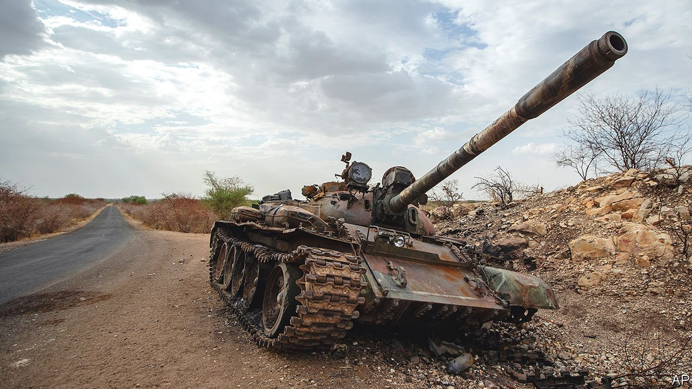

###### Bloody brothers

# Eritrea, Africa’s gulag state, is on the march 

##### President Issaias Afwerki is fanning war and undermining democracy across the region 

 

> May 22nd 2021 

IT IS AN unlikely pairing. Abiy Ahmed, Ethiopia’s prime minister, is young, charismatic and says he is committed to democracy in Africa’s second-most-populous country. Until war erupted in November in Tigray, a northern region, he was a darling of the world. In 2019 he won the Nobel peace prize for ending a war with Eritrea. Yet he is now knee-deep in blood alongside Eritrea’s president, , an ageing dictator who locks up dissidents in shipping crates in the desert.

When the two leaders met to sign a peace deal in 2018, many hoped their reconciliation would reshape the region. Abiy was liberalising Ethiopia, releasing political prisoners and freeing the press. Some thought Issaias might learn from his new friend. Outsiders rushed to encourage the thaw. The UN lifted an arms embargo (imposed because of Eritrea’s support for jihadists in Somalia). Western donors poured in cash. Eritrea’s decades of isolation seemed about to end. “Love is greater than modern weapons like tanks,” declared Abiy on his first visit to Asmara, Eritrea’s capital.


The bromance has indeed changed the region, but not in the way many had hoped. It seems that Issaias influenced Abiy, rather than vice versa. Encouraged by Issaias, and emboldened by promises of Eritrean military support, Abiy sent troops into Tigray for what he hoped would be a quick “law enforcement” operation against its rebellious ruling party which had attacked federal bases. The fighting has since turned into a bloody stalemate. Ethiopian and Eritrean troops control the cities and, intermittently, the main roads. Tigrayan rebels control much of the rest. Stuck in the middle are millions of starving civilians.

Eritrean troops, sometimes accompanied by those of the Ethiopian government and its militias, are pulling unarmed Tigrayan men from their homes, churches or buses and shooting them. Soldiers are methodically raping Tigrayan women. To cut supplies to the rebels, they are blocking food convoys and preventing farmers from planting crops. Around 4.5m of Tigray’s 6m people need food aid, says the UN.

The only winner is Issaias. His troops, who died in their tens of thousands in their unsuccessful border war with Ethiopia, are now deep inside their neighbour’s territory. They have massed troops along parts of Ethiopia’s border with Sudan, threatening to inflame a separate dispute between those two countries. More worrying is that Issaias seems to be trying to export his model of despotic rule.

He is said to have egged on a power grab by Mohamed Abdullahi Mohamed, Somalia’s president, who has stayed in office despite his term having ended in February. To back his man in Mogadishu, Issaias has trained a Praetorian guard loyal to Mr Mohamed. “Issaias is the Svengali of this affair,” says a foreign diplomat. “He’s been unyielding in pushing a centralised state and bugger having elections.”

Western governments are belatedly waking up to the horrors in Tigray. In April the European Union cancelled €100m ($122m) of aid that would have gone to Eritrea. In March it imposed financial sanctions on Eritrea’s intelligence agency. Diplomats say that wider American and EU sanctions may be imposed soon.

Few hold out much hope that sanctions will sway Issaias, whose state is already largely cut off from the world. But sanctions, or even a credible threat of them, would provide greater leverage over Abiy, who needs access to export markets and international finance if Ethiopia is to grow quickly enough to quell protests by its young and restless population. Abiy can probably be convinced to ditch Issaias if the costs of their alliance become too high. Donors should therefore press Abiy harder.

Without his new ally, Issaias would have less clout in the region. There is not much, alas, that outsiders can do to make him less cruel to his own oppressed people, though neighbours and rich countries can and should grant them asylum if they flee his gulag state. Even if Issaias cannot be persuaded to change his ways, he can be prevented from remaking the Horn of Africa in his own tyrannical image. ■

