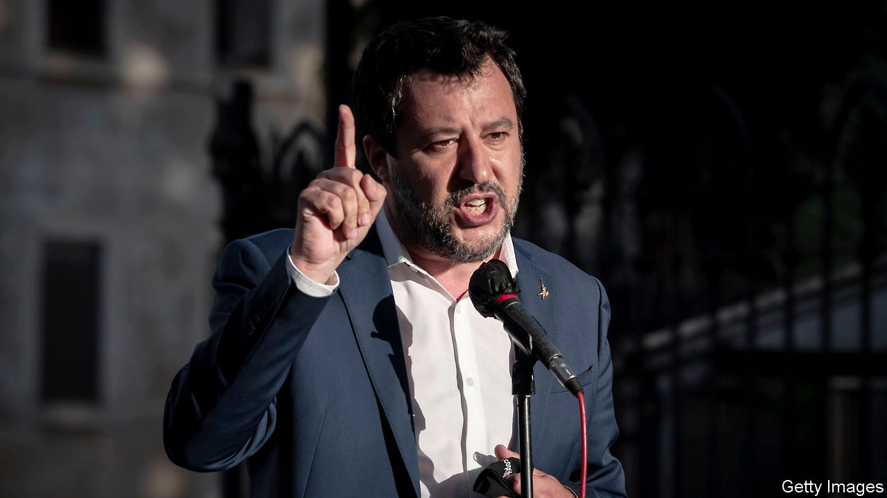

###### Forgotten but not gone

# Italy could soon get a hard-right government 

##### Worrying tremors are coming out of Europe’s most indebted economy 

 

> May 22nd 2021 

IN FEBRUARY WE and many others breathed a sigh of relief after Mario Draghi agreed to become prime minister of Italy. For had not “super Mario” saved the euro, in 2012, with his promise that he, and the European Central Bank he then headed, would do “whatever it takes” to stop the project unravelling? Those three words were enough to calm markets, bringing down interest rates on the debt of the zone’s weaker members. Over the nine years since then, those countries have saved tens of billions of euros thanks to reduced borrowing costs.

With Mr Draghi at the helm, the yield on Italian debt is currently only around 1.2 percentage points above that of Germany. The government he leads can count on a large majority of seats in parliament, and the European Commission is about to start releasing a whopping €200bn ($245bn) or so in covid-19 recovery funds, to be paid out over the next three to four years. That sum is equivalent to 12% of Italy’s annual GDP, a tidy stimulus by anyone’s standards but Joe Biden’s. The commission has been broadly satisfied by the promises Mr Draghi has made about how he will spend the money, and the reforms to Italy’s sclerotic government that he will aim to undertake. So far, then, so good.


Yet Italian politics remain unpredictable. A recent uptick in the number of migrants arriving by boat, mostly to the Italian island of , has generated alarmist headlines. Some 13,000 have arrived so far this year, triple the tally this time a year ago. That is far below the peak of 180,000 for the whole of 2016, but the sailing season has only just begun. Already, populist politicians have seized on the issue, and will milk it if numbers continue to climb. (An  to the Spanish enclave of Ceuta is a headache for the Socialist government in Spain, too.)

A tense battle is now being fought for dominance on Italy’s nationalist right. Matteo Salvini, the leader of the hard-right Northern League, finds himself in a perilous position, as his party has lost support to an even more radical outfit, the Brothers of Italy (FdI), a descendant of the Italian Social Movement founded in 1946 by ex-supporters of Benito Mussolini. Mr Salvini quit the government in 2019 in a failed attempt to trigger an early election that he might very well have won. His party is still the most popular in Italy’s fragmented political landscape, say pollsters. But Giorgia Meloni’s FdI is catching up.

The FdI is the only one of Italy’s main parties not to have backed Mr Draghi’s government, and that seems to be doing it no harm in a country where many still distrust bankers and Brussels. It may not be long before the FdI overtakes the League. In some polls it has already passed the main party of the centre-left, the Democrats, now led by Enrico Letta, a competent man who was briefly prime minister in 2013-14.

Together the League and the FdI may now have enough votes to form a government, especially if they can rope in a maverick former prime minister, Silvio Berlusconi. Both parties are nativist and suspicious of the EU, though neither advocates Italexit.

Italian MPs may not have to face the electorate for another two years; an election must take place in May 2023 at the latest. But one could come a lot sooner. Those who know him say Mr Draghi is keen to be Italy’s next president. That job comes up for grabs next February, but some hoped that the incumbent, Sergio Mattarella, might agree to stand again and make way for Mr Draghi later. This week he appeared to rule that out.

The relentless rise of Italy’s Brothers, and Mr Salvini’s need to tack to the right to match them, is a reminder that clenched-fist nationalism remains popular with many voters in the European Union. Although this has never been in doubt in Poland and Hungary, it is true in western Europe, too. Some recent polls have France’s president, Emmanuel Macron, in a virtual dead-heat with Marine Le Pen, his blood-and-soil rival, in a putative second-round match-up next year. In Spain the opposition People’s Party is seeking a deal with Vox, a hard-right newcomer, to form a government for the Madrid region.

Europe’s governments have collectively and individually struggled with the covid-19 pandemic, mishandling the early stages of vaccination and the most recent wave of infection. A season of elections is beginning, and incumbents look as if they may see some nasty surprises. One in Italy, which sits on Europe’s largest stock of debt, would be calamitous indeed. ■

