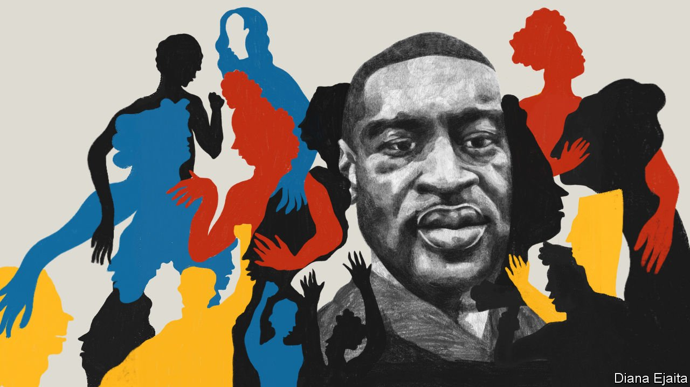

###### George Floyd’s legacy

# Race in America 

##### A year ago George Floyd’s murder gave rise to a movement to end racial disparities. How can that be done? 

 

> May 22nd 2021 

WHEN GEORGE FLOYD was killed by Derek Chauvin a year ago, the sense of injustice was tinged with despair. Why, many Americans asked, is this still happening in our country? Why, many foreigners asked, does the story of race in America never seem to change? Except this time was different. Mr Floyd’s death prompted the biggest civil-rights protests in American history. Mr Chauvin, unusually, was convicted of murder. And institutions in America and beyond looked at themselves in a different light. Something needed to change. But what exactly?

The Biden administration and the Democratic Party have made reducing racial disparities an organising principle of government. That sounds straightforward, but it is not. Despite the gains in legal and political rights made by African-Americans since the civil-rights era, measures of relative poverty and black-white segregation have barely moved for half a century. Tackling enduring injustices requires clear thinking about their causes.


Most racial disparities come about when three things collide: secular economic trends, the aftershocks of slavery and segregation and present-day bigotry and racism. The first two are usually the biggest causes of bad outcomes for African-Americans, but the third—racism today—gets most of the attention.

This is backwards. Covid-19 has killed African-Americans at higher rates than whites or Asian-Americans. The causes are still unclear, but the blame is unlikely to lie with racist doctors, nurses and insurers. Instead, for reasons that include past racism and present-day poverty, African-Americans are more likely to suffer from pre-existing conditions and to have to work outside the safety of their homes, and less likely to have health insurance.

, though it is less widespread than 30 years ago, let alone in the civil-rights era. But, since it is lodged in bigoted minds, rooting it out is largely beyond the power of any government. Poverty and the structural legacy of racism in institutions are different. Take the Biden administration’s , which looks likely to reduce child poverty by 40%. Because African-Americans are disproportionately poor, this race-neutral policy should halve the number of poor black children.

Given that the problem is racial disparities, why not target help directly at African-Americans instead? One reason is practical. People are more likely to support measures that they themselves might benefit from. The child tax credit enjoys broad backing. Were it designed to benefit only one group, support for it would plummet. Any administration that targeted policies on African-Americans alone—using, say, reparations and more affirmative action—would soon be out of power.

By contrast, policies that help all poor Americans are popular and effective. Since the Affordable Care Act in 2010, 39 states have expanded the availability of Medicaid, the health-insurance programme for low-income Americans. As a result, the share of uninsured African-Americans has fallen by 40% over a decade. A government that wanted to spend more could provide baby bonds for poor Americans and vouchers to move out of areas of concentrated poverty. A government less inclined to spend could relax zoning rules, making it easier to build apartments near good schools. None of these policies is race-based, but all of them would greatly reduce the disparity of outcomes.

These broad-based policies are not just practical, but moral too. Racial injustice is particularly searing in America because of the horrors of slavery, the violence of Reconstruction and the institutionalised racism of Jim Crow. African-Americans have had legal rights to vote, to marry whom they want and to live where they choose for just the span of a single lifetime.

Yet not all African-Americans need help. Despite the disadvantages they face, the country’s large, thriving black middle class is often overlooked in talk of race in America. Moreover, people who are not black also face prejudice and inherited disadvantages. How much better if government policy lessens Latino, Native American, Asian and white poverty, too. To deny aid to people in the name of racial justice would be perverse.

What is true of poverty is also true of police reform. Here there have been notable advances in the past year, as cities and states have trimmed “qualified immunity”, a broad defence available to police officers who kill civilians. Police killings of unarmed young men are often presented as overwhelmingly a racial issue, because police officers kill a disproportionate number of African-Americans. Even before Mr Floyd’s murder, the killings of Michael Brown in Ferguson, Freddie Gray in Baltimore, Eric Garner in New York and Breonna Taylor in Louisville rightly brought attention to this fact.

Yet police officers kill Americans of all races more often than they should. Separating the many police shootings that are justified from those that should never have happened ought to be a national priority. This would be easier if policing was understood as a civil-rights issue affecting all Americans.

A race-neutral approach will not always work. To create more diverse organisations, companies, all too often run by white people, need to pay more attention to race in hiring. Unless elite universities take positive steps, their intake will not be representative of the country. But where practical, a race-neutral approach to opening up opportunities is more likely to help America—and especially its African-American citizens.

One year on from a terrible injustice, the United States is confronting not just its past but its future, too. In the next 50 years it will be the first big, rich country where no single racial group, ethnicity or religious denomination will be in the majority. The more politicians exploit the tribal fears of some voters, the more turbulent this transition will be. The Republican Party’s enthusiasm for rewriting voting rules in states such as Arizona and Georgia shows how democracy could suffer.

Yet America also has the chance to set an example to other countries. A smooth transition is more likely if politics is not set up as a fight for resources between groups that people are born into and cannot leave. Instead, the country can make common cause to shrink enduring racial disparities while helping all Americans leave injustices behind. That must be the aim. ■

Editor’s note: Twelve months on from the killing of George Floyd, The Economist is publishing a series of articles, films, podcasts, data visualisations and guest contributions on the theme of race in America. To see them visit our 

