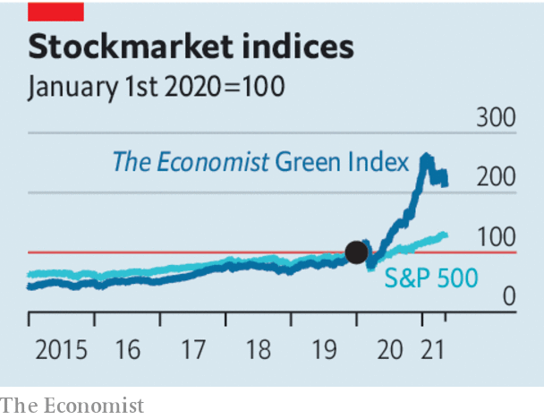

###### Hot air

# Sustainable finance is rife with greenwash. Time for more disclosure 

##### Supposedly green and cuddly funds are stuffed full of polluters and sin stocks 

 

> May 22nd 2021 

INVESTORS ARE all too familiar with the rise of Tesla. Shares in the electric-vehicle maker are now worth nearly nine times what they were at the start of 2019. But it is not an exception. As political leaders across the world start to send clearer signals about their willingness to tackle climate change, the private sector is getting enthused, too, and a green boom is under way.

Over 40 green firms have seen their share prices triple since the start of 2019. Six have outperformed Tesla. The beneficiaries include all manner of emission-sparing companies, from solar-panel firms to makers of hydrogen fuel cells.


Meanwhile many big companies in other industries have taken to boasting about their green credentials. Renewable-energy shares have paused in recent weeks, in part because investors worry about the prospect of higher interest rates, but other assets have taken off. In Europe the price of carbon has soared to a record high. The prices of metals, such as copper and lithium, that are used in electric cars, are spiking as well.

 


The boom reflects soaring demand from investors. Everyone from oil majors to day-traders on WallStreetBets is splurging on climate-friendly projects and securities. Meanwhile the asset-management industry is marketing a style of investing that purports to take into account environmental, social and governance (ESG) factors. So far this year, inflows into ESG funds accounted for about a quarter of the total, up from a tenth in 2018. On average, two new ESG funds are launched every day.

Unfortunately the boom has been accompanied by rampant “greenwashing”. This week The Economist crunches the numbers on the . On average, each of them holds investments in 17 fossil-fuel producers. Six have invested in ExxonMobil, America’s biggest oil firm. Two own stakes in Saudi Aramco, the world’s biggest oil producer. One fund holds a Chinese coal-mining company. ESG investing is hardly a champion of social virtue either. The funds we looked at invest in gambling, booze and tobacco.

Governments are starting to pay attention. Under Donald Trump, American regulators tried to hobble ESG investing, which the White House saw as a left-wing conspiracy. By contrast, President Joe Biden’s administration sees it as a potentially useful weapon to fight climate change. The Securities and Exchange Commission, Wall Street’s regulator, worries that ESG funds are misleading investors.

What should governments do? One possibility is to follow the European Union’s approach. Its latest Green Deal includes lots of new rules about sustainable finance. Underpinning them is an elaborate state-directed taxonomy which covers some 70 different activities and aims to tell investors what is green and what is not. Inevitably, the effort has run into trouble. Countries have been furiously lobbying the European Commission to ensure that their favoured source of energy is labelled as green. Poland and Romania, among others, want natural gas to be added to the green list, because they are planning to use it to replace coal.

Rather than the EU playing God, investors can decide for themselves what is green. But they need a big improvement in corporate disclosure. The current system of largely voluntary reporting is riddled with problems. Firms disclose reams of irrelevant puffery, while often failing to reveal the few things that matter. Ideally, an asset manager would be able to work out the carbon footprint of their portfolio and how it might change over time. But many firms fail to disclose their emissions rigorously and often the measures made public by individual firms overlap, leading to double-counting when you add them all up.

A better system would force companies to reveal their full carbon footprint, including emissions from the products they sell and the goods and services they buy. It would help if big polluters also revealed how they expect their footprint to change and the amount of capital expenditure that goes toward low-carbon investments. That way an investor could work out how much pollution their portfolio is responsible for today and how it might look tomorrow.

The results of such disclosure may come as a surprise. We estimate that listed firms that are not state-controlled account for only 14-32% of the world’s emissions—so green investing can be only part of the answer. About 5% of these firms account for over 80% of the total emissions. They are mostly oil producers, utilities, cement firms and mining companies. Better disclosure would also show that only a tiny number of firms are investing heavily in renewable energy or breakthrough technologies.

The combined effect would be to expose as bunk the idea that swathes of the corporate world and asset-management industry are planet-saving heroes. And it would help investors put their money into truly green firms, ensuring a better allocation of capital and a faster energy transition. ■

For more coverage of climate change, register for The Climate Issue, our fortnightly , or visit our 

