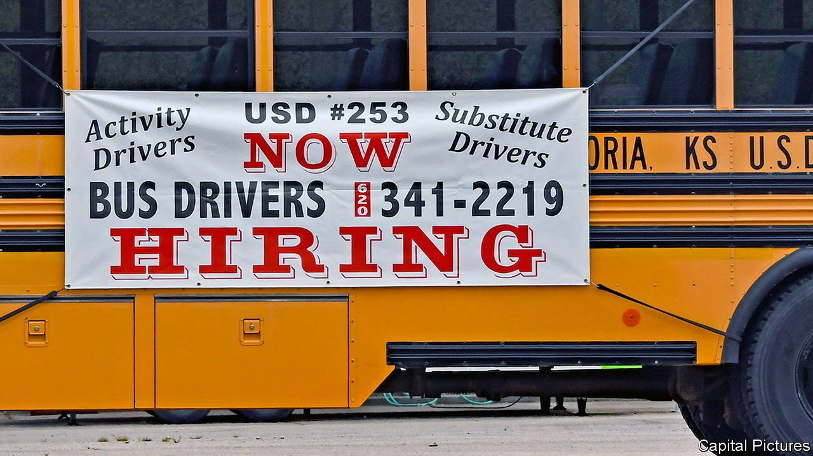
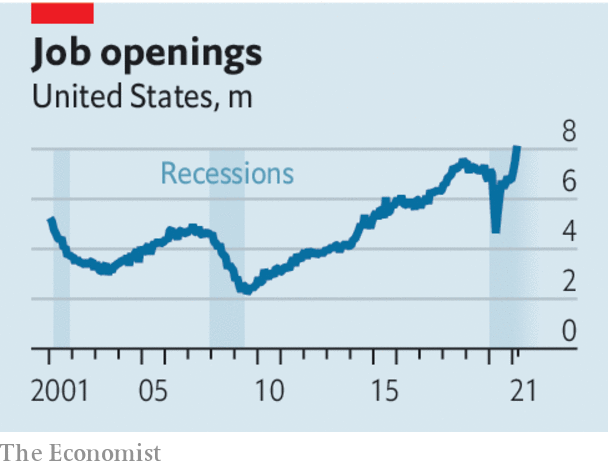

###### The curious case of the disappearing worker

# What to do about a labour crunch 

##### Across the rich world vacancies are left unfilled 

 

> May 22nd 2021 

AS RICH COUNTRIES loosen lockdowns, an economic puzzle is emerging. Businesses are voicing ever-louder concerns about labour shortages, even as millions of people remain out of work. In America a surge of spending is creating job openings, but few people seem willing to fill them. The number of vacancies, at over 8m, has never been so high.

Worker shortages are a growing problem elsewhere, too. British publicans, who opened their doors to indoor drinkers on May 17th, are searching for pint-pullers. In Australia vacancies are 40% above their pre-pandemic level. Europe has been slower to come out of its lockdown, but even there unfilled positions from Switzerland to Germany are higher than before.


Some see news of worker shortages as welcome. If human labour is still in demand, then perhaps predictions of job-killing robots were wrong. Company managers are also having to work harder to attract staff. ; England’s pubs are ditching qualification requirements; other firms are paying people just to show up for an interview. Underlying pay growth is strong, at more than 3% in America. A good thing, you might say. After a year of lockdowns, who would begrudge workers a rise?

 


That is to ignore the downsides of labour-market snarl-ups. A bidding war between employers could yet cause an inflationary spiral. And shortages ricochet around the economy. A builder that cannot find labourers will put up fewer new houses, in turn hitting decorators. Businesses that are still recovering from the crisis may face another financial blow.

High inflation and bankruptcies may never happen. But today’s worker shortages are also an enormous waste of talent. Including those on furlough schemes, we estimate that 30m fewer people in the rich world are working than before the pandemic. For so many people to be idle comes at a huge cost, not only in lost wages but also in terms of their health and dignity.

To get labour markets working better, governments should consider three P’s: payments, passports and patience. Take payments first. In America businesspeople, almost to a pinstripe, are convinced that the $300-a-week boost to unemployment insurance (UI) explains the shortages. However, pundits do not agree on whether stimulus handouts really lead people to shirk.

The evidence is hazy elsewhere, too. It might seem natural that British pot-washers would prefer to earn 80% of their salary on furlough than stand in a hot kitchen for 12 hours a day for 100% of it. However, Australia ditched its job-protection scheme in March, and shortages have worsened.

Given this uncertainty, the solution is not to slash welfare but to redesign it so as to encourage work. Arizona is reallocating some of the money used for UI, instead offering $2,000 payments to folk who move into a full-time job. The evidence on back-to-work bonuses from past recessions is encouraging.

Next is passports, which relates to immigration. Temporary border controls to stop the virus make sense, but they should not last beyond the pandemic. In New Zealand annual net migration has fallen from 92,000 to 7,000. Australia is losing migrants. Britain is also reckoning with Brexit-related immigration changes. That is why in many countries industries, such as hospitality, that rely on foreigners face the most acute shortages. Politicians must be clear that closed borders will come with a painful price tag—or change tack.

The last requirement is patience. Many people are avoiding work because of fear of contracting covid-19. These concerns should fade as more of them are vaccinated. Some industries are seeing jobs wither, even as parts of the labour market, from delivery drivers to remote yoga tutors, boom. Faced with change on such a scale, people may take longer to find new careers. A misfiring jobs market is in no one’s interest. Time and the right policies will clear the blockages. ■

