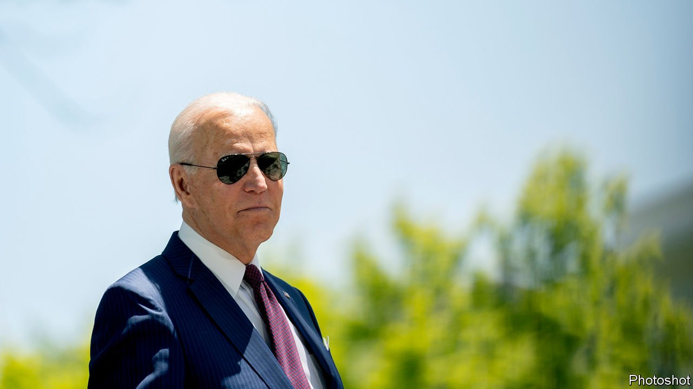
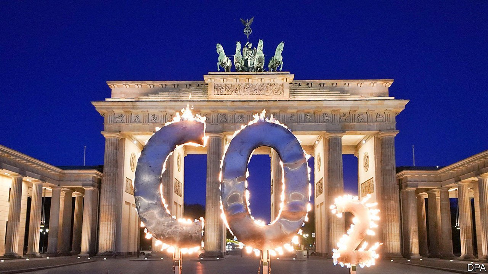
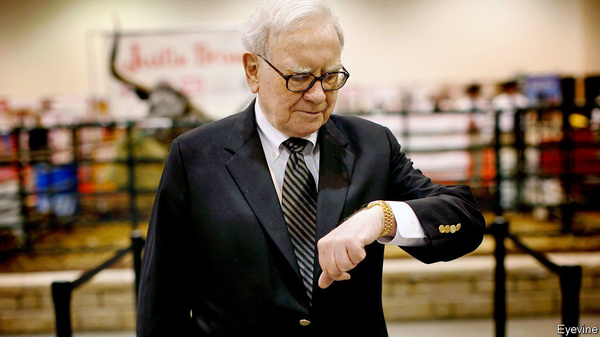
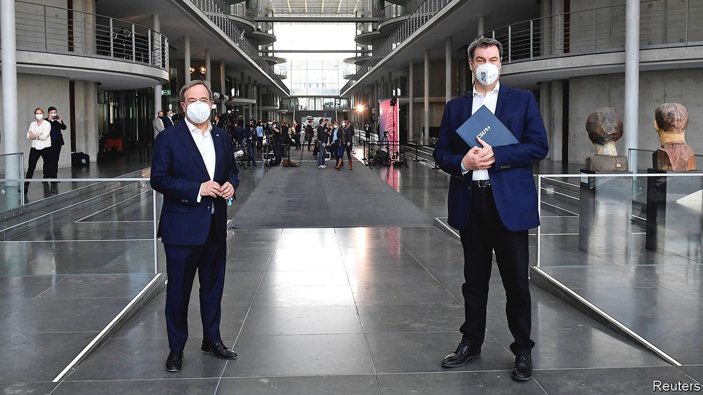

###### On tax, crime, Somaliland, energy, diplomacy, Warren Buffett, Germany

# Letters to the editor 

##### A selection of correspondence 

 

> May 22nd 2021 


A tax reform

The Economist is right to be concerned about untoward consequences of changing the capital-gains tax in America (“”, May 1st). However, there is a much simpler way to deal with the issue. Tax all income from whatever source (corporations, partnerships and so on) as “pass through” income at the same progressive rate. Eliminate the corporate tax but treat shareholders as if they were employees so a certain percentage of their income would be withheld, which could then be used as a credit against their personal taxes.


Given modern computers that should be relatively easy to calculate and would substantially increase the tax base, because there is no doubt that too much income is “forgotten” or hidden in tax havens.

MARTIN LOBEL

Chairman emeritus

Tax Analysts, publisher of Tax NotesChevy Chase, Maryland

 


Why no one robs banks

Your report on cyber-crime concluded by quoting an adviser to Europol: “Why would you walk into a bank with a sawn-off shotgun to steal £30,000 when, if you’ve got some money to invest, you can go on the dark web and start a ransomware campaign and make millions?” (“”, May 8th). That is a myth about offenders’ transferable skills. Despite Hollywood’s portrayal of them, bank robbers are mostly low-skill stick-up artists who could not switch to cyber-crime even if they wanted to. They lack the computing skills and resources that serve as barriers to entry.

Moreover, the three or four decades of declining property crime was under way years before the surge in cyber-crime. Burglary in the United States, for example, began decreasing around 1980 and has since fallen by 80%; larceny theft has plunged, too. Unfortunately it took decades to develop effective bank, household and vehicle security as crime surged in the period after the second world war. Bank robbery is now largely extinct because of those security improvements, such as bandit screens, money tracing and time-locked safes.

A similarly stilted response is now facilitating cyber-crime. The underlying reason is that the computing industry, where the technical skill to develop security is located, bears little or none of the costs of the crime opportunities that its products generate. To overcome this market failure, governments need to provide incentives to the computing industry for security development, and quickly.

GRAHAM FARRELL

Professor of crime science

University of Leeds

 


Recognising Somaliland

Somaliland does indeed deserve international recognition (“”, May 8th). It functions well, has better governance than many African states, performs effectively for its citizens, and is more consistently democratic in practice than its neighbours and a number of other African countries. For 30 years it has been a bright beacon amid the persistent Somali darkness.

The Islamists of al-Shabaab control at least a third of Somalia and nothing that the African Union (AU) or donors like Britain, the United States, or even Turkey, have done can put the country back on the road to harmony and prosperity. Somaliland, by contrast, is free of conflict, except possibly in its recurrent disagreement with semi-autonomous Puntland over border territory.

The AU resists recognising Somaliland because doing so might encourage secession elsewhere. But South Sudan seceded from Sudan without perturbing the AU and Eritrea, for different reasons, split from Ethiopia (and then warred against its larger neighbour). Now, however, recognition would acknowledge the reality and allow the AU to support states that govern on behalf of their people, not the ruling classes.

Even if the AU cannot bring itself to recognise Somaliland, the global powers should now do so on their own. Africanists in the Obama administration were ready to push for recognition but were held back by the AU. Now is the time for the Biden State Department to be bold, and speak truth to power.

ROBERT ROTBERG

President emeritus

World Peace Foundation

Lexington, Massachusetts

 


Keeping the power on

Your leader on Germany’s climate policy referred to the vulnerability of the country’s renewable energy infrastructure during “the cold, dark doldrums” without wind and sun (“”, May 8th). But that applies to other countries, including Britain.

On several windless days in the most recent winter, the UK National Grid issued warnings of inadequate electricity margins, even with demand suppressed by covid-19. As we become more reliant on electricity but our sources of supply become less reliable, what will hold the grid stable and keep the lights on? Sun, wind, batteries and interconnectors won't. Gas-fired power plants are the only proven technologies at the necessary scale.

DAVID ODLING

Altrincham, Greater Manchester

 


The personal touch

Regarding the digital future of diplomacy (“”, May 1st), one of the first casualties of the isolationism that came with the pandemic was our sense of inter-cultural differences. The technocratic, tick-the-boxes style of communication that comes with Zoom and the like may appear as a welcome increase in efficiency to a diplomat from Europe or North America.

To their counterpart from, say, the Middle East, where no interaction will be successful if not accompanied by a cup of coffee, it is an alienating, if not insulting experience. The brave new world of diplomacy will let the world grow even further apart.

JOHANNES UHL

Amman, Jordan

 


Fans of Buffett

“” for Warren Buffett, you say (May 8th). This is not the first time that the financial press has written off the legendary investor. Before the market crash in 2008 Mr Buffett was criticised for sitting on $45bn in cash, but in October that year he invested $20bn in public companies. Over the past 57 years he has repeatedly said that he buys when others are fearful; looking at the market, today’s retail investors are anything but fearful. Mr Buffett will show, once again, that he hasn’t lost his touch.

JOãO PEDRO COUTINHO

Paredes de Coura, Portugal

As a member of the loyal 40% of individual investors in Berkshire Hathaway, I feel your assessment of the current and future state of its leadership was balanced and fair (“”, May 8th). However, I take umbrage with your final sentence describing Mr Buffet: “rock star”, yes; “grizzled”, no. He is much younger than that.

JIM DUNN

Carmel Valley, California

 


Naked partisanship

I was glad to hear that Messrs Söder and Laschet have avoided “full-frontal warfare” in their contest for the Christian Democrats’ nomination for chancellor in Germany (“”, April 17th). Let us hope that they manage also to avoid trench nudity.

RALPH TRUEBLOOD

Portland, Oregon

