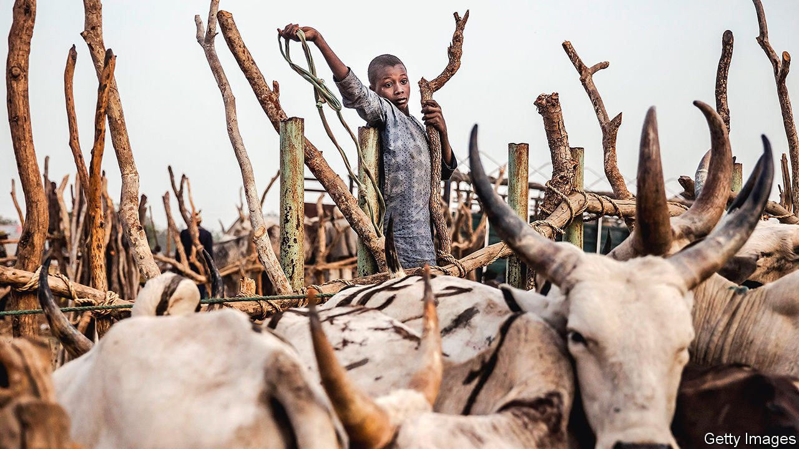

###### Cowabungle

# A Nigerian plan to reconcile farmers and herders is not working 

##### There is not enough land, money or trust 

 

> May 22nd 2021 

CHIGOZIE OBIOMA and his family moved to Benue state in 2004 for its tranquillity. Last week, however, Chigozie’s father was awoken by bomb blasts, as the army tried to dislodge an armed band of suspected cattle thieves hiding nearby. Conflict over land and cattle, which has always been common in the north of country, is spreading farther south and becoming more intense, despite a government plan intended to curb it.

For centuries Fulani nomads have herded cattle across west Africa, travelling along established routes from Nigeria to Mali. But as the region’s population has grown, there are ever more people living in their path. What is more, climate change has reduced the amount of water and grazing available along northerly routes, diverting more and more Fulani into Nigeria’s agricultural heartland to the south. When villagers try to turn the pastoralists away, violent altercations are common. Cattle rustling, a common vice, adds to the volatility. Raids and reprisals sometimes lead to villages or nomadic encampments being burned, and herders or farmers killed. In April, for instance, 83 people died in what appears to have been fighting between locals and pastoralists in three villages in Zamfara state.


The government has concluded that migratory grazing is no longer viable. Instead, it wants the pastoralists to turn to settled ranching, under a scheme called the National Livestock Transformation Plan (NLTP). It aims to create more than 100 ranches by 2028 and forge business relationships between the herders and farmers. In a recent report, the International Crisis Group called it “Nigeria’s most comprehensive strategy yet”. Unfortunately, it is not proving comprehensive enough.

The violence has fed hostility to the Fulani which will not be easily smoothed over. Azeez Olaniyan, an academic who studies the conflict, argues: “People will not be comfortable with a Fulani ranch being run in the southern area of the country where they aren’t indigenous.” This was the main objection to a similar scheme to promote ranching, which was suspended in 2019 owing to widespread opposition. Mr Olaniyan says he cannot see the difference.

The national government cannot force the plan’s adoption as it does not own the land that would be used for ranches—the states do. It has tried to encourage states to sign up by offering funding, but a third of them have not yet done so. The holdouts include several of the states that suffer most from conflict between herders and farmers, notes Idayat Hassan, whose think-tank has been helping the government explain the unpopular plan to suspicious farmers.

Worse, the government has emptied its coffers responding to covid-19. Although the NLTP is theoretically still in train, as of last month “no federal funds had been approved or released to states to implement projects,” reports the ICG. Not a single new ranch has been built in the two years since its launch.

As a result, the governors of Nigeria’s 36 states are taking matters into their own hands. Seventeen of them resolved in mid-May to ban all grazing on public land in their states. Their statement made no reference to the NLTP, which is seen as having done nothing to curb the problems associated with cattle herding.

The problems are multiplying. Benue state is known as Nigeria’s food basket; widespread conflict there could hurt the whole country. The instability also attracts other troublemakers. Although the widespread violence is typically blamed on Fulani herders, it is clear that Boko Haram, a brutal jihadist outfit, and perhaps other criminal groups, are exploiting the upheaval. Stories of rape and abduction are now commonplace—not something usually associated with conflicts between farmers and herders. Security forces are overwhelmed and understaffed. “It’s gone from bad to worse,” says Mr Olaniyan. “They have graduated from cattle rustling to human rustling.” ■

