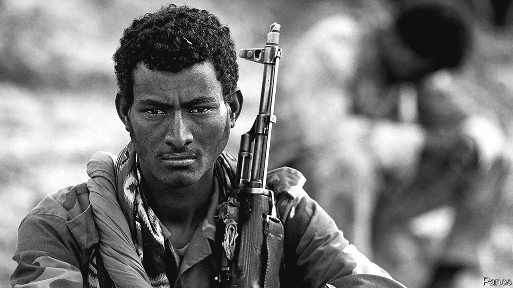
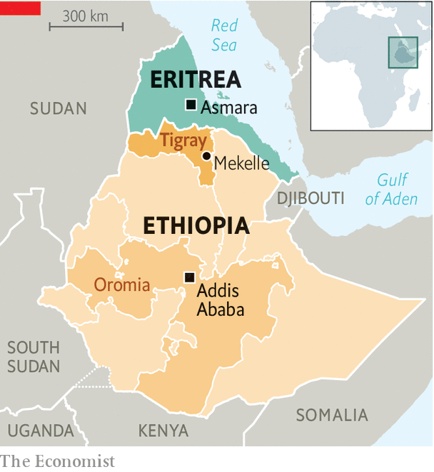

###### The would-be master of the Horn

# Eritrea’s President Issaias Afwerki bids for regional greatness 

##### But his latest gamble is risky 

 

> May 22nd 2021 

SHY AND awkward, the teenage Issaias Afwerki did not stand out. As a student in Asmara, Eritrea’s capital, the future president was known less for his bookish brilliance than for sudden flashes of temper. One day in the early 1960s his physics teacher, an American, handed him a particularly shoddy mark. Issaias walked calmly to the front of the class and slapped him in the face. An act of vindictiveness as well as self-confidence, it was characteristic of the man for the rest of his life.

It is 30 years this month since Issaias, as leader of the secessionist Eritrean People’s Liberation Front, at last succeeded in overthrowing Ethiopia’s military dictatorship. In alliance with the Tigrayan People’s Liberation Front (TPLF), a rebel movement to Eritrea’s south, Issaias, now 75, assumed power in Asmara, while his TPLF friends took up the reins in Addis Ababa, Ethiopia’s capital. Two years later Eritreans voted in a referendum to break away from Ethiopia. Issaias became the nation’s first and only president. There has never been an election.


Few African leaders have ruled their countrymen so harshly or handled their neighbours so aggressively. In 1998 Eritrea went to war with Ethiopia over a barren stretch of land worth almost nothing (pictured). In two bloody years perhaps 70,000 lives were lost. The remains of Eritrea’s fledgling democracy was crushed. A decade later Issaias invaded Djibouti, which abuts Eritrea at the mouth of the Red Sea.

Now Eritrean forces, made up of conscripts, are fighting again. This time they are in Tigray as allies of Ethiopia’s government in a catastrophic war against Issaias’s former allies, the TPLF. The Eritreans have been accused of war crimes, including massacres of civilians and mass rape.

The secretiveness of Issaias’s regime spawns endless speculation about his intentions. Some say the president’s main aim is to outmanoeuvre Ethiopia and remake the Horn of Africa in his own anti-democratic image. Though this is sometimes overstated, he is thought to wield great influence over Abiy Ahmed, Ethiopia’s prime minister, with whom he signed an opaque peace agreement in 2018 that put an end to nearly two decades of cold war between the two countries. He has also drawn close to Somalia’s authoritarian president, Mohamed Abdullahi Mohamed, better known as Farmaajo, and has hosted and trained thousands of Somali troops.

Issaias’s foreign policy has three main planks. The first is his belief that the Horn of Africa is a bear pit where there are no permanent friends. Second, the use of force is always legitimate. Third, even a tiny and impoverished country like Eritrea can, with ruthlessness and guile, punch well above its weight. Ask North Korea.

The breakdown of Issaias’s relations with his old comrades in the TPLF testifies to his belief that no ally can be trusted. Eritrea’s defeat in the border war with Ethiopia (then ruled by the TPLF) in 1998-2000 sorely embittered him. Awet Tewelde Weldemichael, an Eritrean at Queen’s University in Canada, likens Issaias to “a camel which can never sleep without settling a score”. When Abiy, an ethnic Oromo from Ethiopia’s south, took office in 2018 and sidelined the Tigrayan old guard, Issaias saw his chance. Six months ago his troops joined the fray as allies of Abiy, almost as soon as fighting broke out between Ethiopia’s federal government and the TPLF.

The destruction wrought by the Eritreans in Tigray reflects more than a desire for vengeance. It also stems from Issaias’s long-standing conviction that the TPLF threatens his country’s very existence. Butchering young Tigrayan men, as well as looting infrastructure, food and medical supplies, should—reckons Issaias—scotch any chance of this happening. By the same token, the destruction of two camps in Tigray hosting Eritrean refugees and dissidents was intended to prevent the TPLF from training and arming a potential opposition to Issaias’s regime.

Issaias’s ambitions, however, reach well beyond Tigray. “Eliminating the TPLF is about eliminating an obstacle on his path to Addis Ababa and the region,” says Seeye Abraha, a former defence minister of Ethiopia who was once high in the TPLF. Recently in Foreign Policy, an American journal, he argued that what Issaias really covets is access to Ethiopia’s wealth.

In his bid to master the Horn of Africa, he has sought to influence Abiy, who runs a much larger and more important country. Last year, with the backing of the Ethiopian and Somali pair of leaders, he set up a new regional bloc, which he hopes will replace the Intergovernmental Authority on Development, hitherto the region’s premier club, which also includes Djibouti (seat of its secretariat), Kenya, the two Sudans and Uganda. The trio of leaders is wooing South Sudan to join the new club. This particularly annoys Djibouti.

 


Even more controversial are rumours of plans to bind Ethiopia and Eritrea into some kind of union. Their armies are co-operating along Ethiopia’s shaky border with Sudan, as well as in Tigray. In March a spokesman for Ethiopia’s foreign ministry suggested that Eritrean independence had been a mistake that political integration could one day rectify. He apologised in the face of a backlash. But Issaias spoke enthusiastically about a confederation with Ethiopia after the independence referendum of 1993. Might he again contemplate such an arrangement, provided Eritrea won more clout alongside its beefier partner? “Issaias will never allow any federation with Ethiopia which does not allow him to dominate it,” says a former colleague, now in exile.

Right now, Issaias has more pressing concerns. His troops are bogged down in Tigray, though both he and Abiy agreed in March to remove them. “We see nothing that would lead us to believe there are preparations on the ground for such a withdrawal,” says a senior state department official. The American administration is threatening sanctions against Ethiopia and Eritrea. The EU has already withdrawn more than $100m in aid for Eritrea.

Issaias’s survival depends on winning his latest war. “He’s bet the house on [it],” says Dan Connell, the author of a book on Eritrea’s liberation war. “He’s thrown everything at it…He has to fight on.” ■

