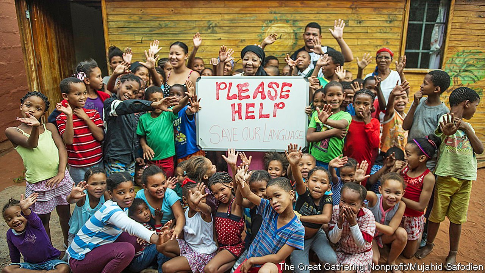

###### Clickbait

# The struggle to save a South African language with 45 click sounds 

##### Only two fluent speakers of N|uu survive. Both are in their 80s 

 

> May 22nd 2021 

TWO AND a half millennia ago the San had southern Africa to themselves, living lightly on the land as hunter-gatherers. Then came the Khoekhoen from the north-east to wrest some of the San’s hunting grounds for their cattle. The 17th-century Dutch incomers called the hunter-gatherers “Boesmans” (“Bushmen”) after their habitat, while the Khoekhoen were “Hottentots”.

The word Hottentot may mimic the click sound of the Khoekhoen’s speech. Africa is the only continent where clicks act as a kind of consonant in basic word-building sounds.


Many of southern Africa’s original click-rich languages have died out. For the complexity and repertoire of its clicks, the N|uu language of a long-scattered subgroup of the San is among humanity’s most startling creations. It has but two known surviving fluent speakers, both in their 80s. The bar after the N indicates a particular click of the tongue against the teeth. N|uu is one of just three languages known to feature a kiss-click made with both lips.

Katrina Esau is one of the surviving pair. To hear her speak N|uu is astonishing, as if two tracks are playing at once, with “normal” speech overlaid with a peppering of soft explosions.

Port Elizabeth has recently been renamed Gqeberha, a word in Xhosa (South Africa’s most widely spoken indigenous language, along with Zulu) that begins with a click. If the knack of pronouncing Gqeberha eludes many, consider that N|uu has 45 such sounds. Ms Esau has dedicated her last years to teaching it. Illiterate, she uses a schoolroom next to her home to teach people in her Northern Cape community through song, play and images. “I didn’t learn this language; I sucked it out of my mother’s breast,” says Ms Esau in “Lost Tongue”, a film about N|uu made in 2016. “But I buried it at the back of my head.”

She buried it because long ago her white employers forbade her from speaking it. It was as though this ban, as well as the extermination, scattering and assimilation of the San, struck the language dumb. It was thought extinct until the 1990s, when a N|uu speaker, Elsie Vaalbooi, appealed on the radio for speakers to come forward. A N|uu writing system has recently been developed. Esau’s granddaughter, Claudia Snyman, now teaches the written language.

Sheena Shah and Matthias Brenzinger, both linguists, collaborated with locals to render this teeming language of 114 basic units of sound with an extended version of the Latin alphabet. They hope the language’s revival may help rebuild the San’s identity.

