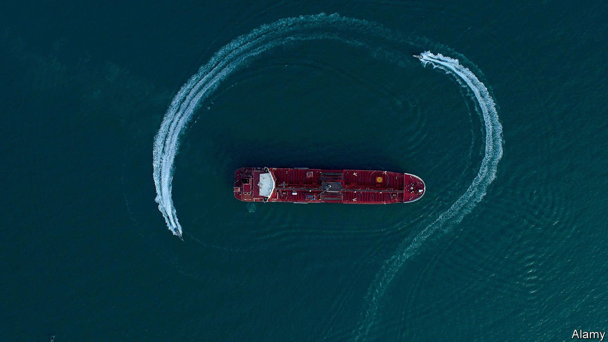

###### When the ship hits the scam

# Why vessels passing near Iran may have trouble staying on course 

##### Shipowners suspect their satnav systems are being “spoofed” 

 

> May 22nd 2021 

THE STRAIT OF HORMUZ is hard to navigate at the best of times. It is narrow, crooked, dotted with islands and, as the only way in or out of the Persian Gulf, busy. Recently, a new peril has joined the list: that satellite-navigation systems may be “spoofed” to lure vessels off course.

The world has four global-navigation satellite systems (GNSS), of which GPS is the best known. Global shipping—and much else—is almost completely reliant on them. But in 2008 an American academic named Todd Humphreys revealed that satnav systems could be fooled by sending counterfeit signals. Five years later he proved it by sending a big yacht miles out of its way, to the consternation of the FBI. An Iranian general once boasted of his forces’ prowess in this technique, which appears to have been used in 2011 to inveigle an American drone from Afghan airspace into Iran, where it was captured and put on display.


Crews of vessels passing through the Strait of Hormuz suspect that Iran is now performing much the same trick on them, to induce them to stray into Iran’s territorial waters, whereupon they are seized by the Iranian navy. That may be what happened in 2016, when two small American naval patrol boats and ten sailors were captured near a tiny Iranian island in the Gulf. If so, it was quite a coup: naval vessels tend to have equipment and procedures intended to prevent spoofing. Typically, it is commercial vessels that are most at risk.

There is some debate as to whether the Stena Impero, a tanker seized by Iran in the strait in 2019 (pictured overleaf), was a victim of spoofing. The Swedish firm that owns it, Stena Bulk, says it was captured outside Iranian waters. No evidence of spoofing has been found. But the firm’s CEO, Erik Hanell, concedes that if spoofing is stealthy, proving it is hard. Stena Bulk, he says, had been warned by spy agencies that spoofing was a risk. Dozens of ships in the strait had detected satnav anomalies in the days before the seizure, reports c4ADS, an American investigative outfit.

Whatever happened, shipowners appear to be worried about spoofing. Some instruct crew to check up on their satnavs using the old-fashioned navigation methods that preceded GPS—although not many crew members know how to do this these days. Others are investing in systems to foil spoofing. Shift5, an American firm that sells such kit, says its sales are on track to quadruple this year.

For Iran, spoofing is a cheap way of riling Western powers and giving itself leverage in international affairs. It sees the scam as “a way to mark its territory, show its determination”, says Gérard Valin, a former commander of France’s forces in the Indian Ocean, including the Gulf. But sabotaging the technology that underpins commercial shipping also has some very practical applications. Windward, an Israeli firm that tracks vessels, mostly from space, has recently detected a scam involving the transponders that allow owners (and others) to keep track of where their ships are. A tanker sails, its transponder off, from Iran to the Gulf of Oman. There, it meets a vessel that came from elsewhere, its transponder on. The second vessel then turns its transponder off just as the first starts to send out signals mimicking the second’s transponder, in what Dror Salzman of Windward calls a “handshake”. After the impostor drops off its oil, it returns, relinquishing the transponder signal to its waiting double, and disappears. For a country struggling to export its supply of oil owing to strict American sanctions, such a ruse would be invaluable. ■

