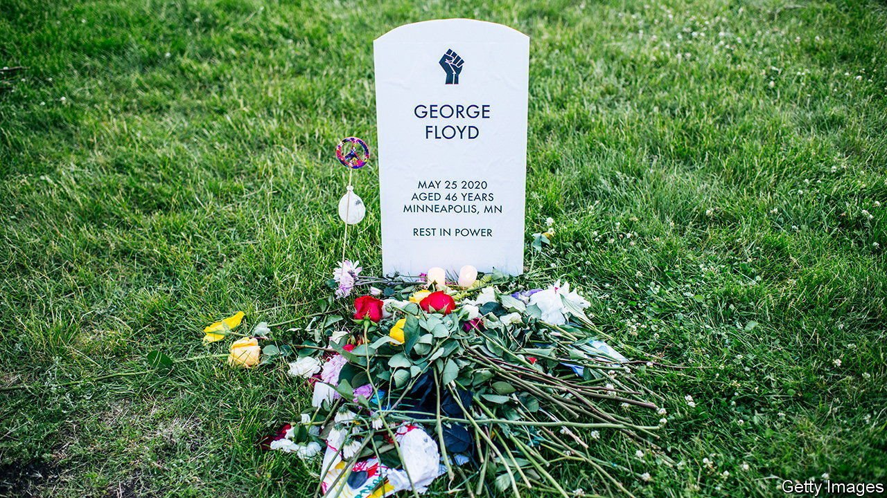

###### The future

# Overt racism may be waning in America, but its scars remain deep 

##### Americans who look different will need to figure out how to trust each other 

 

> May 22nd 2021 

WHEN AMERICA has a shock, African-Americans suffer first and most. After the financial crisis, black unemployment soared to 20%. The meagre progress to narrow the wealth gap over the previous 50 years was erased. When covid-19 struck, African-Americans died at twice the rate of Asian-Americans. The causes are a mix of history, culture and policy. Even if racism were to vanish, African-Americans would be worst hit by future disasters.

Attempts to fix persistent disadvantage can be caught by debate over whether the remedies should be race-neutral. The Obama administration pursued policies that were race-neutral but especially benefited African-Americans. To many activists this pragmatism seemed cowardly, though calls for more boldness did not seem so bright when Donald Trump won the 2016 election. Yet the Trump administration showed the value of race-neutral policies. A tight labour market and big government spending as part of the first covid-19 stimulus lifted some 10m Americans out of poverty between June 2019 and June 2020, despite much of the economy being partially closed. Though Mr Trump was never accused of fretting about urban poverty, this helped African-Americans disproportionately, because they are disproportionately poor.


Likewise, the Biden administration’s expansion of a child tax credit in its first covid-19 stimulus seems race-neutral. But it could cut child poverty among African-Americans by two-thirds, because there are so many poor black children. Before he was assassinated Martin Luther King hoped to transform the civil-rights movement into a campaign to reduce poverty. He said, “It is a cruel jest to say to a bootless man that he ought to lift himself up by his own bootstraps.” A tight labour market provides a lot of boots, which is why activists follow the Federal Reserve closely.

Alongside measures to reduce poverty, something more targeted is needed. The best chance of slowing the inheritance of disadvantage from one generation to the next is for people to move out of neighbourhoods where poverty and violence are endemic. For classical liberals, this poses a philosophical and political dilemma. Liberals favour policies that maximise individual choices, but such choices often result in more segregated schools and districts. Attempts to remedy this by building public housing in better neighbourhoods, or busing black children to better schools, have set off a backlash among white Americans. In America’s federal system they also retain disproportionate power, thanks to rural bias in the Senate and the electoral college.

What if people in areas of concentrated, multi-generational poverty were helped to move out? That happened in the 1970s when Chicago was sued for building public housing in black neighbourhoods. The city had to put more public housing in white areas, creating a natural experiment 20 years later. Among families who stayed put, 20% of children dropped out of high school and 21% went to college. Among those helped to move to a better area, 5% dropped out of high school and 54% had been to college.

The Clinton administration seized on this for housing schemes in Baltimore, Boston, Los Angeles and New York as part of a project called Moving to Opportunity. When Raj Chetty, then of Stanford, and Nathaniel Hendren and Larry Katz of Harvard, looked at the results in 2016 they found that, by their mid-20s, those who moved as children had incomes 30% higher than those who stayed. This policy has since been tried in Seattle, with promising outcomes. The cost comes in the form of a couple of thousand dollars a year of higher rent, at public expense, and $2,500 in assistance with the moves.

That is a lot of money, but Americans could pay for 6m such moves a year merely by giving up tax relief on the interest they pay on their mortgages. “There is this idea that we need ten times the Marshall Plan for everything, but these interventions are quite cheap,” says Stephanie DeLuca of Johns Hopkins University, who worked on the Seattle experiment. Allowing apartments to be built in neighbourhoods zoned for single-family houses, making them more affordable for poorer families, costs nothing.

A widespread acknowledgment of racism has created an expectation that the country will move forward. But since Americans have wrestled for more than 200 years with the effects of their government’s colour line, scepticism about the likelihood of progress is justified. America has been here before, in the middle of the 20th century, when most people assumed that the end of legal inequality between white and black Americans would be followed by a reduction in the economic sort. When such hopes are not met, they can soon curdle into pessimism and violent protest.

Moving forward

Part of the reaction to George Floyd’s death can be explained by the shock of white Americans, more politically conscious after the first black president, finding that police were still killing so many unarmed black men. Yet disbelief will not accomplish much on its own. Reducing poverty, restraining police forces and chipping away at residential segregation could. And the chances of its happening will rise if, rather than making politics about all the ways that people with different skin tones compete with each other, politicians, activists, academics and students emphasised what Americans have in common. That does not mean erasing race. As Ralph Ellison wrote, “whatever else the true American is, he is also somehow black.” But it does mean keeping a focus on poverty.

This is not just a matter of idealism. For a multiracial democracy like America, the instinct of groups to favour themselves can be destabilising. There is a well-established correlation between how homogenous a nation is in racial or ethnic terms and how much its citizens trust each other. America has grown more diverse since the 1960s, when immigration laws that explicitly favoured white Europeans were scrapped. Over the same period, Americans’ trust in one another has declined. These two developments seem likely to be related.

Breaking the link, and narrowing racial disparities, is a task for the next 30 years. In his book “The Omni-Americans”, Albert Murray wrote “American culture, even in its most rigidly segregated precincts, is patently and irrevocably composite…the so-called black and so-called white people of the United States resemble nobody else in the world so much as they resemble each other.” This is not a bad slogan for anti-racists to adopt.■

Full contents of this special report


* The future: The price of the ticket

