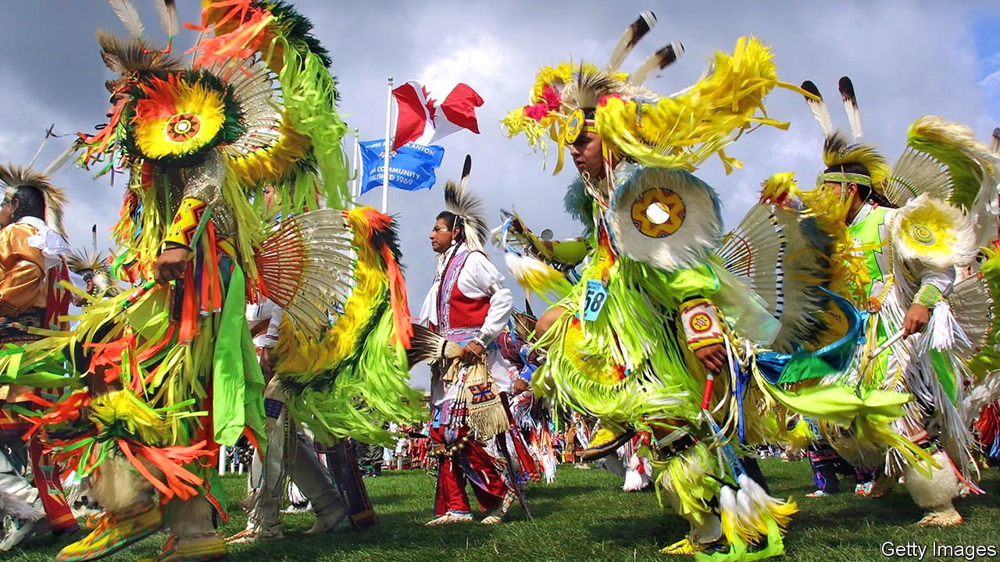

###### Reparations

# Reparations alone will not heal America’s racial divides 

##### And practical questions over how they would work remain formidable 

 

> May 22nd 2021 

Editor’s note: Twelve months on from the killing of George Floyd, The Economist is publishing a  of articles, films, podcasts, data visualisations and guest contributions on the theme of race in America. Among them is a piece offering .

DRIVE SOUTH-EAST from Minneapolis for an hour and you come to the Prairie Island Indian reservation, home to one of Minnesota’s 11 federally recognised Native American tribes. The federal government built a dam in the 1930s, flooding the place. In the 1970s it allowed the construction of a nuclear-power plant. Despite these blots, on a rainy Wednesday afternoon Prairie Island is full of visitors. People have come from Minnesota and Wisconsin to play the slot machines and blackjack and poker tables at the Treasure Island casino, operated by the tribe.

The Native American story runs through Minnesota. The largest mass-execution in American history took place at Mankato, south-west of Minneapolis, when 38 Dakota tribesmen were hanged in 1862. Today a small memorial garden in Mankato has a bench inscribed “forgive everyone everything”. Native Americans also receive reparations. In most states they take the form of land, though it is often useless for farming or property development. But federally recognised tribes are not subject to state laws against casino gambling. So Native Americans with reservations near cities have a near monopoly over a lucrative industry. Yet gambling has been only a partial success. Native Americans still have lower life expectancy and educational attainment than any other group.


The federal government has made some attempts similarly to recompense African-Americans, but these efforts were either ineffective or withdrawn after meeting too much opposition. The unpopular attempt to redistribute land in the South after the abolition of slavery was soon suspended. From the 1960s, various schemes were tried to favour minority-owned businesses in government contracting. They have not made much difference. For private businesses, reserving jobs for people of one race is illegal. Affirmative action, which gives African-Americans favourable treatment in university admissions and federal contracting, is being litigated away, mainly because it tends to discriminate against Asian-Americans.

Yet the idea of paying reparations for slavery has moved from the fringe since 1989, when John Conyers, a Michigan congressman, first introduced a reparations bill in Congress. Mr Conyers persisted in every Congress until he retired. It was not until Ta-Nehisi Coates wrote an article in the Atlantic in 2014 that the idea became more mainstream among Democrats. In the party’s 2020 primary the leading contenders all supported reparations. Since he moved into the White House, Joe Biden has announced his support for studying the issue, which looks like a case of a politician signalling support for an idea without actually having to do anything to advance it.

Even if a reparations bill passed the House, which is unlikely, it would have no chance in the Senate. The idea, which is popular among upscale Democrats, has the support of only half of African-Americans. Practical questions, such as who should receive any payment and who should be obliged to contribute, remain formidable. The political backlash against a party that made a determined push for reparations from the federal government would be fierce. This has not stopped some towns and institutions from trying. Asheville in North Carolina, Evanston in Illinois and Georgetown University have all taken steps in this direction by acknowledging a moral responsibility for slavery and segregation.

Initiatives like this may be worthy, but they will not deal with disparities in income, wealth, education and housing. The reparations movement is driven by arguments about justice, but the economic arguments for it are weak. The bulk of the black-white wealth gap is accounted for not because white Americans have inherited far more than black Americans. It is caused by African-Americans having lower incomes which, compounded over time, lead to less wealth. A one-off reparations payment would not fix that.

Full contents of this special report


* Reparations: The freedman’s bureau


