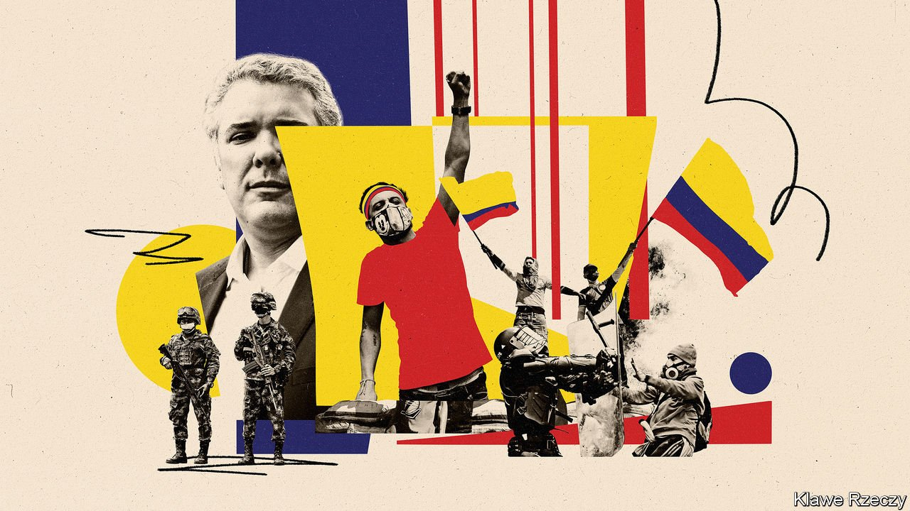

###### Writing on the wall

# The riots in Colombia hint at deep problems 

##### What started as a protest against a tax reform has become much wider 

 

> May 22nd 2021 

THE STREETS of Cali, Colombia’s third-largest city, have a dystopian feel these days. Marks of the protests which have convulsed the country for the past three weeks are visible everywhere. Several bus stations are now burnt-out shells; many petrol stations have been abandoned. The stench of rubbish and faeces fills the air. Towards the east of the city, protesters have occupied Puerto Rellena, a big crossroads, and renamed it “Puerto Resistencia” (Port of Resistance). Surrounded by bonfires and stolen cars, and with rap music blaring, they dance and light candles in honour of those hurt in confrontations with the police. “We’re here because we are tired of corruption, we are tired of struggling, we are tired of being poor,” says Blanca Cortés, a mother of two.

Cali has been hardest hit by the protests that began on April 28th in response to President Iván Duque’s proposed tax-reform bill. Despite the withdrawal of the bill on May 2nd and the resignation next day of Alberto Carrasquilla, the finance minister, people are still out on the streets.


Most protests are peaceful, but several have descended into violence, probably with the involvement of criminal groups. At least 16 people have died, according to Human Rights Watch, a pressure group, and 740 have been injured, according to government figures. Some 850 police officers have also been hurt. Roadblocks erected by the protesters across the country have led to shortages of food, medicine and vaccines at a time when Colombia is experiencing a third wave of covid-19.

The primary reason for the protests is economic. Despite decent growth since the early 2000s, inequality remains high. At the current rate of improvement, it would take 11 generations for descendants of a poor Colombian to attain the average income, estimates the OECD. The protests follow on from demonstrations in 2019, when thousands took to the streets to demand better wages and more money for higher education. The pandemic, and one of the longest lockdowns, has exacerbated these problems. Last year the economy shrank by 6% and the government’s budget deficit tripled to nearly 8% of GDP. Some 2.8m people fell into extreme poverty (earning less than 145,000 pesos a month, or $38).

Discontent with Mr Duque, who had approval ratings of 33% before the riots, has also brought people out onto the streets. The president has failed to keep his campaign promise to make Colombia safer. Voters plumped for him rather than the leftist Gustavo Petro in 2018 partly because his party, the Democratic Centre, was known as the “party of security”. But at the beginning of his term Mr Duque spent most of his time attacking the peace deal his predecessor, Juan Manuel Santos, signed in 2016 with the FARC, a Marxist guerrilla group, rather than dealing with the causes of crime.

Since then, smaller illegal armed groups—descendants from the FARC or right-wing paramilitary groups—have grown stronger. Working with Mexican gangs, they supply around 70% of the world’s cocaine. Colombia is producing more of the drug than at the height of Pablo Escobar’s reign, says Alejandro Eder, a politician who helped negotiate the peace deal. Indeed it is highly likely that the extreme violence in Cali, where around 180 gangs are based, was exacerbated by criminals who see an opportunity to create chaos.

More broadly Mr Duque has failed to see that Colombians, and especially the young, have a new set of “political values’‘, argues Andrés Mejia, a political analyst. With the FARC officially gone, they are more comfortable with left-wing politics. They also have more precarious living standards. Even before the pandemic hit, fully 28% of those between the ages of 20-24 were neither employed nor studying in a school or university. It is no surprise that most demonstrators are young, nor indeed that support for Mr Petro, Mr Duque’s left-wing former rival, is surging. He now polls at around 38% and is the frontrunner in next year’s presidential election.

The tax-reform bill would have dealt with some of these underlying economic issues, by increasing taxes on the rich so that the government could spend more on transfers to the poor. But it was seen by many as unfair. Now the protesters have a list of more than 100 grievances. Among other things, they want Mr Duque’s government to stop forcibly eradicating coca bushes, both manually and by aerial spraying. They are also demanding the introduction of a basic-income programme for 20m people that would cost the government 6% of GDP. In Cali people are furious at Jorge Iván Ospina, the city’s mayor, because he splurged public funds in a virtual version of a yearly salsa fair. Some 40% of the money was misspent or wasted, according to the body that examines public expenditure.

Mr Duque has tried to meet with the peaceful protesters, as he did in November 2019. “The most important thing is that we have to turn this into an opportunity,” he said in an interview with The Economist, adding later that “my obsession today is that we can address the needs of the youngsters”. On May 11th he announced that the poorest 50% of students, who account for 97% of those at public universities and technical schools, would get free education from the second half of the year. The government will soon start a job-subsidy scheme, in which it covers 25% of the salary of around 500,000 18-to-28-year-olds for at least a year, in order to boost employment among the young.

But so far the meetings between Mr Duque and civil-society groups, including the National Strike Committee, an alliance of trade unions and other pressure groups that convened the protests, have not persuaded people to leave the streets.

Another problem is that Mr Duque has no way to pay for these handouts, both of which were in his tax bill. On May 20th Standard &amp; Poor’s, a big credit-rating agency, downgraded Colombia’s foreign-currency debt, ending a decade in which it had enjoyed investment-grade status. This will sharply increase the costs of borrowing for the government, making it even harder to raise the money the protesters would like the government to spend.

Mr Duque’s political weakness does not help, either. His term ends in August 2022 and his party does not have a majority in the national Congress. Videos of police beating protesters have damaged Colombia’s reputation abroad. On May 13th Claudia Blum, the foreign minister, resigned amid criticism from the UN, the United States and other foreign governments over the government’s handling of the protests.

In Chile, huge protests in 2019 were appeased partly with the promise of a vote on a new constitution. By contrast, no single measure can “deactivate” Colombia’s protests, says Francisco Miranda, a political analyst. The demands are too diverse.

Meanwhile Mr Petro is trying to strike a balance between supporting the protests, as most Colombians do, and opposing things like the roadblocks, which most people object to. If he can pull that off, he may become Colombia’s first left-wing president. Even if he doesn’t, however, the past few weeks have shown how much the country has changed.■

