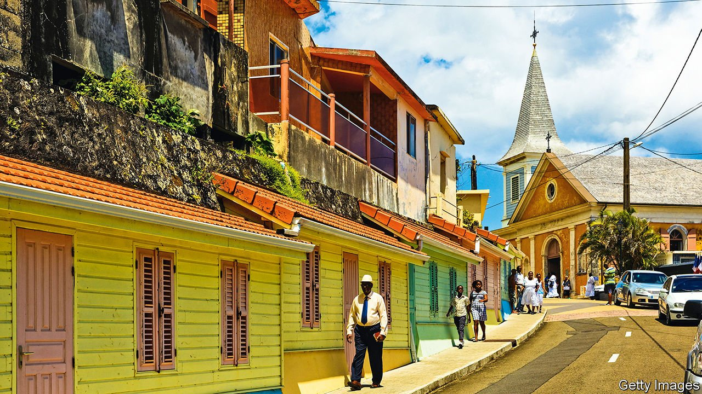
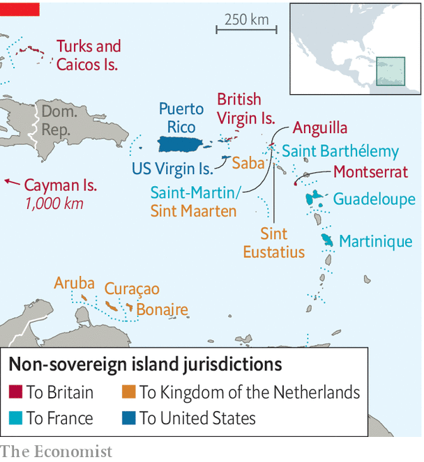

###### Head v heart

# Two Caribbean islands wrestle with their colonial powers 

##### European citizenship makes the people of Martinique and Sint Maarten richer, but not content 

 

> May 22nd 2021 

EVERY YEAR from May 25th to May 31st, the UN marks the snappily-named “International Week of Solidarity with the Peoples of Non-Self-Governing Territories”. When it comes to the Caribbean, some might not think there is much need for solidarity. For one thing, the region’s 17 non-sovereign island territories (seven of which are on the UN list) are richer and more politically stable than their 13 flag-waving neighbours: in terms of GDP per person, seven of the ten richest places in the Caribbean are non-sovereign. For another, they enjoy all the advantages of their former colonisers’ far greater geopolitical clout, powerful passports and the opportunity to move to Europe or the United States.

There are drawbacks, however, to not going it alone. Islanders have long wrestled with a head-versus-heart dilemma, in which material gains come at the cost of pride and a sense of belonging. Over the past decade, cracks in the relationships with their colonisers have been widening. Covid-19 and the Black Lives Matter protests in the United States have added to a growing sense of discontent. In recent months tensions have mounted on two islands in particular.


The first is Martinique. Like its sister island of Guadeloupe, Martinique has been a département of France since 1946. On paper it is as much a part of France as Alsace or Normandy, and far more integrated than the Caribbean’s five British Overseas Territories, the six islands affiliated with the Kingdom of the Netherlands, or the two American territories of Puerto Rico and the US Virgin Islands (see map).

 


Yet an old scandal has caused tensions to emerge. Chlordecone, a very persistent pesticide, was used in banana plantations from 1972 until 1993, long after it was banned in other parts of the world. It is linked with higher rates of cancer, and some estimate that 92% of Martinican adults have been exposed to it. In January, after a 15-year legal battle, a case for “reckless endangerment” was eventually heard in a French court. To many Martinicans’ dismay, however, it was then announced that the statute of limitations to prosecute culprits might have expired, a claim that Martinican lawyers dispute. Thousands took to the streets to protest in February.

Many blame the békés, a white minority descended from slaveholders, for the poisonings. They control vast swathes of the island’s agricultural land and factories despite accounting for a tiny part of the population. “French colonialism never really ceased,” claims Rodolphe Solbiac, a Martinican academic. The pandemic has worsened tensions. Last year activists blocked roads to an airport and attempted to stop cruise boats from bringing in tourists—and with them, the first cases of covid-19.

Martinique is not the only island struggling with a perceived lack of agency. Sint Maarten lies 440km (270 miles) to the north, and shares an island with another French territory, Saint-Martin. In 2010 it became one of four constituent countries of the Kingdom of the Netherlands (previously it was part of the Dutch Antilles). On paper the countries are equal: they have one representative each on the Kingdom’s Council, and retain control over their own domestic affairs. In reality the islands are dwarfed in size and wealth by the Netherlands. As in Puerto Rico, it is the old colonial power that has the final say.

In March, 12 of the island’s 15 MPs signed a petition to the UN accusing the Kingdom of the Netherlands of “persistent acts of racial discrimination and violations of international human-rights law”. Politicians (rather than activists) already grumbled about their “white Dutch fiscal overseers”, referring to members of a Board of Financial Supervision who monitor Sint Maarten’s public finances. The trigger for the petition was a demand that another supervisory body be created in exchange for €18m ($22m) in covid-19 relief. The new Caribbean Reform Entity will have powers to oversee budget cuts (including MP’s salaries) and introduce tax reforms.

Non-independent territories get sizeable wads of cash from their former colonisers. Following Hurricane Irma in 2017, the Netherlands distributed grants through a trust fund amounting to €550m, or about 60% of Sint Maarten’s GDP. In 2019, fiscal transfers from France to Martinique came to €2.9bn, the equivalent of almost a third of Martinique’s GDP.

Yet to many, these arrangements feel paternalistic. The petition also accused the Dutch of imposing excessively harsh austerity measures, creating a “debt trap” with its conditional loans, and of being too slow to release aid. Similar issues have plagued Puerto Rico and certain British territories. The Dutch say intervention is necessary to stop bad governance. The Sint Maarten MPs argue that their right to self-government is being trampled.

In Martinique, calls are growing for reparations for the Chlordecone scandal and for slavery, something also demanded in the Sint Maarten petition. The Sint Maarten parliament also passed a motion to “finalise the decolonisation process” (it has not specified what exactly this means). Even so, independence is unlikely. In a referendum in 2010 79% of Martinicans voted to preserve the status quo. In Sint Maarten ordinary folk are more pragmatic than their MPs (who also quietly admit they are not ready for independence). “Maybe we see things from a different perspective, the people and the politicians,” says Ellen, a 67-year-old cashier at a jewellery shop on the seafront. Because of covid-19 the tourist-dependent economy is estimated to have shrunk by a quarter, and times are tough. “If we go independent, we’re gonna be in a hole we can’t come out of.” ■

