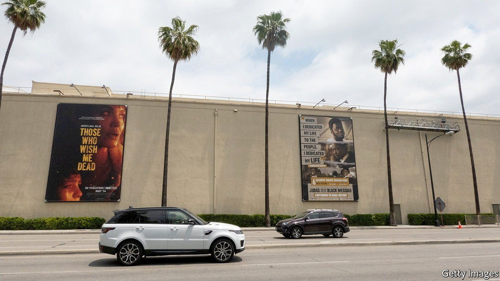
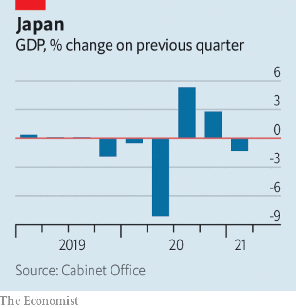

###### 

# Business this week 

#####  

 

> May 20th 2021 

In an astonishing turn, AT&amp;T decided to spin off Warner Media, a film and television company it battled to acquire just three years ago, combining the business with  Discovery, a broadcaster of factual programming. ’s brands will include HBO, CNN and numerous Discovery channels. Together the pair spent more on content last year than their rivals and will have the biggest share of American cable viewers.  AT&amp;T has now shed all its media assets, leaving it to focus back on telecoms.

A possible Bond trade


, the studio behind the James Bond franchise, for $9bn. MGM is one of the few big Hollywood film-makers not to have been swallowed up by a media conglomerate.

Also joining the rush among media companies to consolidate,  TF1 and  M6, two French broadcasters, announced their intention to merge. The pair say that the deal will protect the independence of French content against the likes of Disney and Netflix. Regulators will be concerned by the 70% share of advertising on French TV that they would control.

The International Energy Agency surprised many with its “road-map” to net zero emissions by 2050. To reach that goal, the IEA’s report said that no new oil or gas projects should be approved, and that the power generated by solar and wind should increase fourfold by 2030. Underlining the challenge, for solar that would be the equivalent of installing the world’s largest solar park nearly every day.

Almost 89% of shareholders in Shell backed the management’s plan to reach net zero carbon emissions by 2050. The company has come under pressure from green activists who say this does not go far enough and from other investors who say Shell’s strategy lacks the focus of American giants, who remain centred on oil and gas. A separate resolution submitted by Follow This, a Dutch green investor group, was supported by 30% of shareholders, passing a threshold under British company law which means Shell must now consult with them.

 


Japan’s economy shrank by 1.3% in the first quarter over the previous three months. The declaration of a second state of emergency, which urged people to stay at home, was mostly to blame. In a sign that a recovery may be under way, exports in April grew by 38% year on year. That was the fastest pace in a decade, even if it is a comparison with trade in the depths of the pandemic.

’s annual inflation rate leapt to 1.5% in April from 0.7% in March. The increase reflects a jump in consumer prices when shops re-opened in April and higher oil prices, which pushed up the cost of energy. Andrew Bailey, the governor of the Bank of England, said he was carefully watching the data and if inflation persistently rose above the bank’s 2% target he would take action, “no question about that”.

China told its banks and payment companies not to conduct transactions involving cryptocurrencies and warned investors against speculating in them, because they are disrupting the “normal economic and financial order”. The , ethereum and other cryptocurrencies plunged in response. China’s central bank is well advanced in developing its own digital currency.

Light at the end of the tunnel

Eurostar secured a bail-out from investors, mostly in loan guarantees. The rescue package was led by SNCF, the French state railway group, which is Eurostar’s majority shareholder. The British government refused to take part; it sold its 40% stake in the company in 2015. Eurostar hopes to increase the number of trains it runs between London and the continent as travel restrictions ease.

Britain’s railways, meanwhile, are to face the biggest set of reforms since privatisation in the mid-1990s. The government published a plan that would bring rail infrastructure, timetables and ticket prices back under state control, but still contract train operations to private companies. The hope is that this will lead to clearer lines of communication between the government and the private sector.

Indonesia’s two biggest startups, Gojek and Tokopedia, said they would merge, creating a platform that spans ride-hailing, digital payments and e-commerce. The combined company, GoTo, will reportedly seek to float on stockmarkets later this year, in a dual listing which could see it valued at up to $40bn.

Working 55 hours or more a week is “a serious health hazard” according to the World Health Organisation, in a first global analysis of the effects of working long hours. Working at least 55 hours is associated with higher risks of stroke and heart disease, compared with working 35-40 hours. The disease burden is significant in men, people living in East and South-East Asia, and middle-aged or older workers.

