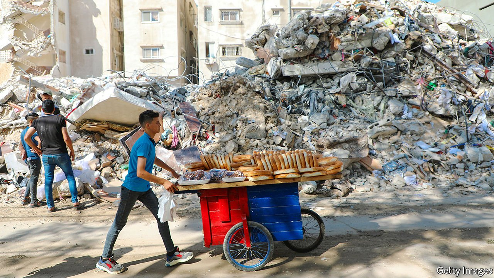
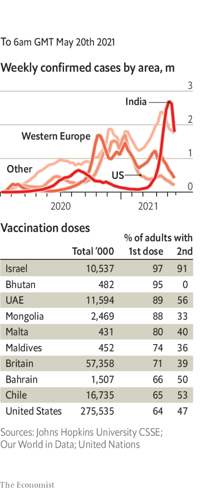

###### 

# Politics this week 

#####  

 

> May 20th 2021 

The  Israel and Gaza ebbed, as international pressure for a ceasefire grew. More than 230 people have been killed, most of them Palestinian. Israel said the toll included 150 militants. The violence spilled into the West Bank, where at least 20 Palestinians were killed in clashes with Israeli forces. The Israeli army also exchanged fire with militants in Lebanon.

Ebrahim Raisi and Ali Larijani, two leading conservative candidates, filed their papers to run in next month’s presidential election in Iran. All 300 candidates will be vetted by the theologians on the Guardian Council.


Spain deployed troops in its , on the Moroccan coast, when 8,000 migrants breached border fences. Morocco did little to stop the influx. It is upset with Spain for accepting Brahim Ghali for covid-19 treatment. Mr Ghali leads Polisario, which fights for the independence of Western Sahara, a territory claimed by Morocco.

Plans to vaccinate people against covid-19 were set back in many African countries by the halting of vaccine exports from India, as it deals with its covid crisis. The Serum Institute of India, which was expected to supply most of Africa’s doses, has made no shipments to the continent since March and is not expected to resume them before October.

Nigeria said it would pull soldiers and armed helicopters from the north-east of the country, where they are fighting the jihadists of Boko Haram, to battle separatists in the south-east instead. Some criticised the move, saying it risks turning a political problem into an insurgency.

Ethiopia delayed a national election scheduled for June 5th, citing logistical difficulties. It is the second delay to a poll that should have taken place last year.

The European Union agreed to open its borders to tourists from the rest of the world, so long as they have completed a course of covid vaccination, or come from places with a suitably low infection rate. That might be good news for British travellers, though quite what the British government’s new policy is on holidaying abroad is anybody’s guess.

A cyber-attack forced the computer system for Ireland’s health service to be shut down. The government rejected demands to pay a $20m ransom to a criminal gang, thought to be from eastern Europe. Details of patients’ records were reportedly leaked online. Micheal Martin, the prime minister, said it was a “heinous attack”.

Chileans voted for candidates to a 155-seat constitutional assembly, which will draft a new constitution to replace the Pinochet-era one currently in place. Some 64% of those who were elected are independents, broadly from the left. Right-wing parties in Chile’s coalition government failed to get many seats.

Police in Brazil searched the offices of the environment minister as part of an investigation into wood-smuggling. The supreme court ordered the suspension of the head of the environmental enforcement agency and several other officials. Under the government of Jair Bolsonaro, deforestation in the Brazilian Amazon has reached a 12-year high.

America’s Supreme Court said it would hear an appeal that may affect the degree to which states may limit . The case centres on a law in Mississippi that bans most abortions after 15 weeks of pregnancy. It will be the first such case that the court will rule on with a 6-3 conservative majority, and will be heard during its next term, which starts in October. In Texas, meanwhile, a new law banned abortion after six weeks of pregnancy.

The United States Congress passed a bill to tackle hate crimes aimed at Asian-Americans. It gained wide support among both parties.

, becoming only the second country ever to set down a rover successfully on the surface of the planet. The Chinese space agency released photographs from the mission, and said it was going well.

Cyclone Tauktae struck India, causing heavy rains, high winds and flooding along the west coast before making landfall in the state of Gujarat. At least 19 people died on land; another 26 died, and scores were missing, when a barge sank off the coast of Mumbai.

’s Supreme Court ruled that an attempt to invalidate an election last month was unlawful. That could end the 22-year run of Tuilaepa Sailele Malielegaoi as prime minister and clear the way for Fiame Naomi Mata’afa to become the Pacific island nation’s first female head of government.

Cases of covid-19 continued to spread across Asia, from Nepal, which has been hit by India’s surge, to Taiwan, which has had few cases so far. New infections are mounting in Thailand, Malaysia and elsewhere in South-East Asia.

In Taiwan Tsai Ing-wen, the president, urged people to stop panic buying and stay calm, after new restrictions came into force to curb an outbreak of locally transmitted cases. Masks have to be worn everywhere and shops must keep customers’ contact details.

Coronavirus briefs

 


 recorded 4,529 deaths for May 19th, the most of any country during the pandemic. Recorded cases fell, although infections are thought to be surging in the hinterland.

 said that people who are fully vaccinated no longer need to wear a mask in most situations. Some health professionals criticised the CDC for causing confusion. States decide on mask mandates. Maryland and Virginia immediately ended the requirement to mask up; California and New Jersey are delaying their dates to go maskless.

An easing of lockdown measures in France allowed bars and restaurants to offer outside dining and non-essential shops to open. New York City also returned to a sense of normality as many businesses were allowed to reopen. And the unlocking of pubs and restaurants for inside drinking and eating made for good cheer in England.

