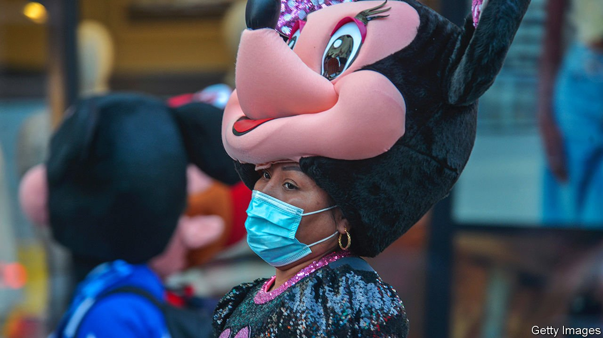

###### America unmasked

# Having taken criticism for being overcautious, the CDC tries the opposite 

##### Meanwhile, America’s vaccination rate is plateauing at a low level 

 

> May 22nd 2021 

PERHAPS THE Centres for Disease Control and Prevention (CDC) intended to create an incentive for people to get jabbed when it rolled back mask requirements for vaccinated Americans. The announcement was welcomed by those eager to return to normalcy. But with daily vaccination rates slowing, despite ample supply of vaccine, does the guidance risk making herd immunity a more distant prospect?

Inoculated Americans no longer need to wear masks indoors or to physically distance except on public transport and when required to do so by federal, state, local or private regulations. Before the announcement, public-health officials had been critical of the CDC’s extreme caution. Just two weeks before, the CDC made an announcement that only vaccinated Americans could go outdoors without masks. Many saw this as unnecessarily timid: studies suggest the unvaccinated would probably be safe while outside and unmasked. Evidence for outdoor transmission is slim. And outdoor dining had been available in most places throughout the pandemic, which requires unmasking regardless of vaccination status.


The latest announcement therefore came as a surprise. The CDC’s job is to provide scientific recommendations, but in this case it made a decision that influenced policy without warning, catching city mayors, state health officials and business owners unawares. “The White House covid team should have been directing this, not the CDC,” argues Dr Leana Wen, a former health commissioner for Baltimore, who calls the decision “a major blunder” and “an unforced error.” Dr Howard Koh, a former health commissioner for Massachusetts, is less pessimistic. He thinks that the statement underscored the effectiveness of the vaccines in preventing disease and death. The CDC is giving a public signal that “the end of our public-health marathon is in sight,” Dr Koh reckons.

Whatever the wisdom of the announcement, it has probably created a disincentive for holdouts to get the jab. Vaccination rates have slowed and only 38% of Americans are fully vaccinated. Many state and local governments planned to use dropping mask requirements as a carrot for vaccination. Before the change in guidance, Minnesota’s state government had announced that mask requirements would be removed by July 1st, or once 70% of the eligible population was vaccinated. But amid prodding from Republican state legislators after the statement from the CDC, masks are now no longer required in Minnesota regardless of vaccination status, except for child-care settings and schools.

Maryland’s state government also removed its mask guidance, reneguing on its plan to take off the masks once vaccination reached 70%. Several other states, including New York, Virginia, Kentucky and Michigan have also ended mask requirements for vaccinated Americans, though none has outlined procedures for determining vaccination status. By implementing a policy for vaccinated people without guidance on how to check for vaccination status, the CDC has essentially removed masks for everyone.

That means state and local governments will have to get more creative. New Orleans’s health department teamed up with Cajun Seafood, a local seafood market, to offer a pound of free boiled crayfish with a jab. Maine is giving away free fishing or hunting licenses. Younger West Virginians can get a $100 savings bond if they get a vaccination. In Buffalo, a city in upstate New York, a “Shot and a chaser” pop-up vaccination site is offering free beer. The site vaccinated more people in one day than the other sites in the county combined did in a week.

Dr Koh is still optimistic that the country will reach herd immunity, despite the CDC’s zigzags. As for the latest criticism of the agency, he thinks people will soon get comfortable with the policy. “Change, even positive change, can be unsettling. I think that’s where we are right now.”■

