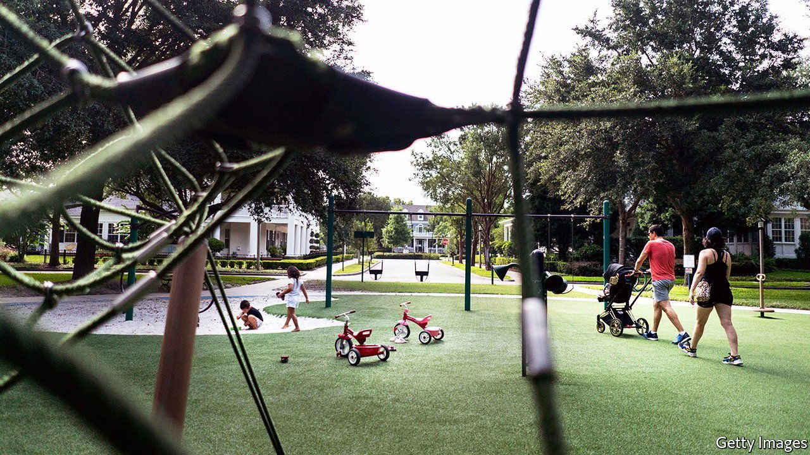

###### Joe se transforme

# Joe Biden wants to Europeanise the American welfare state 

##### His plans are ambitious, thoughtful and risky 

 

> May 20th 2021 

WHAT A DIFFERENCE 25 years can make. In 1996, then-Senator Joe Biden was gushing about the vote he would soon cast in support of sharp reductions in cash payments for single mothers. “The culture of welfare must be replaced with the culture of work,” he said on the floor of the Senate. “The culture of dependence must be replaced with the culture of self-sufficiency and personal responsibility.”

These days, President Joe Biden is proposing an ambitious reweaving of the American safety-net, which the White House estimates will cost $1.8trn. The American Families Plan contains components of a European welfare state that have long been missing in the country: a child allowance, paid family leave, universal pre-school, subsidised child care and free community college. It contains no reference to work requirements. Now that Mr Biden is president, his analysis of the problem has changed. “There’s millions of women out of work today not because they’re not qualified for the jobs they have, but they can’t take care of their children and do their job,” he has said.


The president’s opinions have followed those of his party: where the party goes, the man follows. So how did Democrats go from Clintonism—which implicitly conceded the Reaganite idea that too much government assistance is a very bad thing—to its present-day relish for deficit-financed expansions of the safety-net? Many factors are at work. They include general worries about inequality; a changed academic consensus among economists; a leftward shift reflected in the Democratic presidential primaries; the Republican Party’s abandonment of fiscal responsibility under Donald Trump; and the recent spending bonanza prompted by covid-19.

Data for Progress, a polling outfit, finds that the vast majority of Democratic voters endorse deficit spending on universal pre-school, clean-energy research, a health-insurance public option and a child allowance. More surprising is their finding that majorities of Republican voters support the same suite of policies (except for health insurance, on which they are exactly split).

However it happened, the break in philosophy, epitomised in the president’s own transformation, is here. According to this approach, reducing poverty is no longer just about aid targeted at the poor, which remains only tepidly popular. Poverty reduction is a side-benefit of programmes that aim to help middle-class Americans as well. This would bring America more in line with the rest of the developed world. Average government spending on benefits such as child allowances, family leave and early education is 2.1% of GDP in the OECD club of mostly rich countries. In America, it is just 0.6%. The recommendations of the Biden plan could do a lot of good for American families, particularly if its excesses were curtailed.

Start with the most important bits. At present, one in six American children live in poverty by the government’s own measure. International comparisons, using a measure called relative poverty, suggest that the American rate is  in the rich world. It is caused by flimsy support for the youngest (the elderly, meanwhile, receive Social Security and Medicare). A generous child allowance is the main anti-poverty tool in most rich countries—and one America lacks. One such scheme was created this year as part of the covid-19 relief bill that the president signed in March. It will pay most families $3,000 per year per child ($3,600 for young children) and is expected to halve the poverty rate soon after its payments begin in July. A simultaneous boost to the earned-income tax credit, which tops up the wages of low-paid workers, would also reduce poverty among childless adults (while reducing disincentives to work).

Under the terms of the law, the child-allowance payments will last for only one year. The president’s plan proposes to extend these payments until 2025. Some Democrats think they should simply be made permanent rather than risking difficult concessions in a future when Republicans hold one chamber of Congress or the White House. “That’s the real downside risk: the possibility that we could end up having to agree to a bunch of regressive tax policies in order to extend what is a very progressive and popular tax policy,” says Michael Bennet, a Democratic senator from Colorado who has championed proposals of this sort since 2017. If the payments lapsed, child-poverty rates would probably shoot up again.

The administration’s decision to set an expiry date for the most important portion of its families package illustrates a quirk of Bidenism. The president wants to pursue a progressive wish-list while also nodding towards fiscal moderation. His team is already stretching the maths to suggest that its plans in this area could all be paid for by taxes on corporations and the wealthy. Recent number-crunching by the Penn Wharton Budget Model thinks the administration would still be several hundred billion dollars short. Making the child-allowance permanent would have been even harder to match with tax increases, particularly if they applied only to the rich.

The families plan resembles policy platforms of Mr Biden’s Democratic challengers, cobbled together and funded at a fraction of their originally proposed cost. Among this set of rival ideas are Mr Bennet’s child-benefits plan, Kirsten Gillibrand’s paid family-leave proposal and Elizabeth Warren’s massive subsidies for child-care centres. Republicans claim that all this is evidence of a Trojan-horse presidency of creeping socialism. But it is worth noting that Mr Biden’s proposed spending, grand as it seems, is approximately  of that laid out by Ms Warren in her primary campaign.

A half-strength cocktail can still induce a buzz. “In pretty much every respect, it really is just catching us up to what our peer countries have done for quite some time. On paid family leave, that dates back to Bismarck in Germany,” says Jane Waldfogel, an influential scholar on child wellbeing at Columbia University. Only America and Papua New Guinea lack a paid maternity-leave programme, notes Ms Waldfogel. Mr Biden aims to rectify that by setting up a federal scheme that would guarantee 12 weeks of leave. The federal compensation for time taken off would cost $225bn over the coming decade.

States that have implemented paid family leave on their own initiative, like California, suggest that what works in the rest of the developed world would take well in America, too. Infant health, maternal health and rates of breastfeeding all increase with the implementation of such a programme, says Maya Rossin-Slater, an economist at Stanford University. Ms Rossin-Slater’s own studies of the Californian example have shown a positive effect on new mothers taking up jobs, though other studies have found a reduction in employment. “I like to say that paid family leave is not a silver bullet for solving gender-equity issues,” Ms Rossin-Slater points out.

A kinder kindergarten

A similar amount, about $200bn, is proposed to create universal pre-school for children aged three and four. This was a policy goal of Democrats even before Barack Obama pitched it, unsuccessfully, in his second term (at a more modest cost of ). Advocates often cite the impressive long-run results from two experiments conducted 50 years ago, the Perry Preschool Project and the Abecedarian Early Intervention Project, which brought remarkable improvements to education levels, employment and family lives. The question, however, is whether high-quality pre-school can be scaled up. States such as Oklahoma, which implemented universal pre-school programmes decades ago, provide more up-to-date evidence. These, too, register positive effects on middle-school performance years later. Poorer pupils benefit the most from these programmes, scholars agree, but the results depend on the quality of the schooling.

Other components are shakier. Take the generous subsidies proposed for child-care centres, under which families in rich states could receive tens of thousands of dollars in federal payments. According to the proposal, the cost of care at such centres would be capped at 7% of household income, for families making as much as 150% of the median household income in a given state. The paradox of child care in America is that it is ruinously expensive, almost $15,000 for an infant looked after in a centre, while child-care workers make $12.24 per hour. Mr Biden thinks that this market failure can be rectified by an enormous infusion of cash. But it seems more likely that, if the federal government is paying for much of it, such child care would become even more expensive.

Discussion of efficient spending may now be seen as gauche in Democratic circles, but the question of quality matters as well. Done poorly, child care can have long-run negative effects rather than positive ones. The province of Quebec implemented a heavily subsidised universal child-care programme. A review of the results by three economists found that children had worse behaviour and social skills as a result; their parents, though they worked more, were less caring and reported worse health. Reviewing the evidence 11 years later, the same trio found that the negative effects had persisted and that “cohorts with increased child-care access had worse health, lower life satisfaction, and higher crime rates later in life”.

This ought not to be fatal to the aspiration of universal child care in America. A brief experiment with the idea during the second world war seemed to benefit children later, for instance. But it is a cautionary tale about the quality of public services that Democrats seem reluctant to grapple with. For all the expense of formal child care in America, only one in ten providers are considered high quality.

A similar problem may confront Mr Biden’s proposal to make community college free for two years. Generous subsidies and loan provision with little attention to quality resulted in the growth of shoddy for-profit colleges (remember Trump University?). The Obama administration spent years drafting regulations to rectify that problem. With a newly advertised $109bn pot of money, ensuring that students actually enroll in degree programmes that provide gainful employment will be all the more important. Mr Biden’s approach is at least admirably restrained in comparison with the ideas coming from the party’s left wing, which endorses a highly regressive programme of universal student-debt cancellation and heavy subsidies for four-year colleges favoured by the rich.

If Mr Biden does manage to create a durable new welfare policy, one characterised more by its benefits for the middle class than by aggressive means-testing, he could create a better safety-net. Beyond the political challenge of actually getting it passed in Congress, however, lies the need to prove that the new approach is economically sound. If employment drops, opponents will fret, as Paul Ryan, a former Republican speaker of the House, once did, that the net has become “a hammock that lulls able-bodied people into complacency and dependency.” Already, Republicans are arguing that too-generous unemployment benefits are stalling the recovery. If inflation spikes, Mr Biden will be attacked for spending too much and overheating the economy.

Meanwhile, progressives in his party will forever think he did not go far enough. Nonetheless, they may also step back and consider their luck. After half a century in Washington, the final role Mr Biden wants to play is as the author of the biggest experiment in social policy since the 1960s.■

For more coverage of Joe Biden’s presidency, visit our dedicated 

A version of this article was published online on May 17th, 2021

