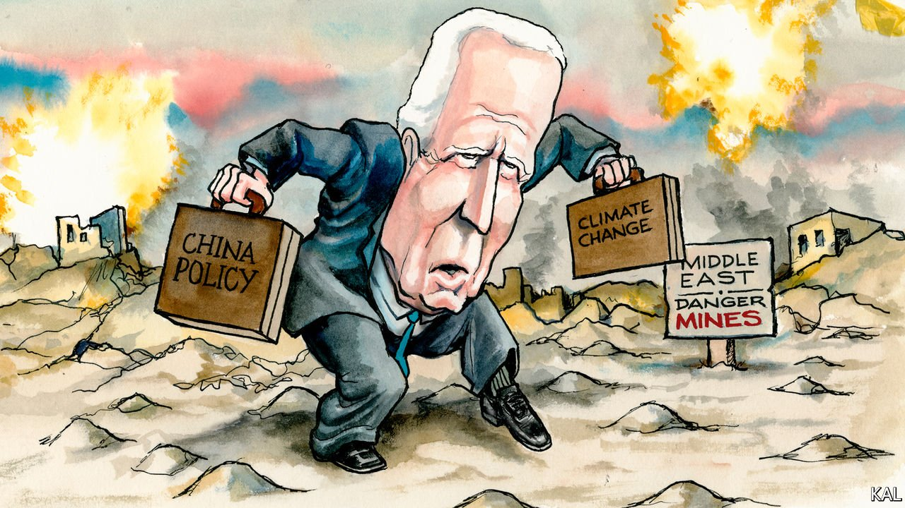

###### Lexington

# Joe’s modest Middle East medicine 

##### The Biden administration 

 

> May 22nd 2021 

DONALD TRUMP TRIED to be as different from Barack Obama as possible. But on the Middle East he ended up in the same place. In their different ways, both men tried and failed to reduce America’s commitments in the region. Joe Biden has the same aim—and has emphasised his alternative priorities, China and the climate, even more clearly than his predecessors did. The current violence between Israelis and Palestinians, the worst since 2014, is an early test of his prospects of succeeding where they fell short.

It will not be, as some progressives claim, by ditching the Palestinians as Mr Trump did. In the first weeks of his presidency Mr Biden restored $250m of aid to them that his predecessor had cut, promised to reopen the de facto American consulate for Palestinians in Jerusalem that Mr Trump had closed and restated his support for a Palestinian state, on which the Republican president was ambivalent. Yet Mr Biden shares the consensus view that no resolution is possible under today’s Israeli and Palestinian leadership. And as he previously signalled in Afghanistan, he has little time for a losing cause.


That sets him apart from Mr Obama. By his second term Mr Biden’s Democratic predecessor also believed that a resolution to the Israeli-Palestinian conflict was less possible and less important to regional stability than he had once thought. Yet he suffered his more hopeful secretary of state, John Kerry, to launch a round of peace diplomacy anyhow; just as Mr Obama had previously been swayed to overcome his scepticism and intervene in Libya and double down in Afghanistan. Mr Biden, no fan of those efforts at the time and a witness to the failures they became, already appears unswayable. He has set his stall out to be the first president not to launch a Middle East peace initiative since Gerald Ford. In the Washington, DC, jargon: “He is not interested in a Nobel prize.”

This attitude helps explain the administration’s slowness to respond to the tensions in East Jerusalem this month, after protests against the anticipated court-ordered eviction of six Palestinian families turned violent. It took three days for Jake Sullivan, the national security adviser, to discuss the escalating conflict with his Israeli counterpart, by which time it had already become a heated international issue. It was a flat-footed response, revealing the tension inherent in “deprioritising” a volatile region of persistent geopolitical and domestic significance. It is a strategy that requires the close attention and nimble diplomacy that America’s generally reserves for its highest priorities.

It is also a strategy supportive of the status quo, as has been apparent in the administration’s delicate subsequent handling of Israel after it returned Hamas’s rockets with salvoes of missiles into Gaza. Left-wing Democrats such as Representative Rashida Tlaib urged Mr Biden to raise the heat on Israel’s prime minister, Binyamin Netanyahu. To the contrary, the administration has not explicitly called for a ceasefire or allowed the UN Security Council to do so, both of which Mr Obama might well have done. Besides Mr Biden’s longstanding commitment to the Jewish state’s security—as a rare Democratic Zionist—this also reflects the administration’s reluctance to involve itself in the crisis more than it must.

Aggravating as it has been to Ms Tlaib, and to around a quarter of congressional Democrats overall, the administration considers its quiet diplomacy to be the most practical way to stop the Israelis going too far. It reasons that the Obama administration’s imprecations against Mr Netanyahu did not improve him. Better, it thinks, to store up leverage with the Israeli leader by supporting him early in the crisis in order to try to curtail it later on. Similarly, the administration considers the growing antipathy towards Israel among progressives to be primarily another source of potential leverage for it to use against Mr Netanyahu.

That seems a reasonable calculation. In an otherwise drearily familiar conflict, the pro-Palestinian shift among Democrats is novel and, for Israel, ominous. It may augur a hostile future president and the Middle East becoming an even more partisan issue than Mr Trump made it. The willingness of some pro-Israel Democrats, such as Senator Robert Menendez, to join their colleagues in criticising Israel’s use of force in Gaza underlines that. But provided the conflict does not drag on, the pressure on Mr Biden from his party looks insufficient to change his low-key tactics. A pro-Israel resolution would still sail through Congress.

Given its ambition to restore the Iran nuclear agreement, the administration may be more concerned about how its efforts are received in the region. The Iranians and their proxies will view them as a test of its diplomatic mettle. Israel, Saudi Arabia and other potential spoilers of the Iran negotiation are meanwhile appraising Mr Biden’s willingness to stand by traditional allies—a quality they doubted in Mr Obama.

War and crisis management

On both measures, the administration’s early efforts in the Middle East appear, after their slow start, to be going satisfactorily. As Lexington went to press, the conflict in Gaza seemed on course to end in days not, as in 2014, weeks. That would be in accordance with Mr Biden’s reported “private” advice to Mr Netanyahu. It would also be in line with America’s advice to the Palestinians, conducted through Egypt, another ally Mr Obama was considered to have gone wobbly on. As an early proof of Mr Biden’s theory that America can achieve more by traditional statecraft than unilateralism, he could not ask for much more.

Such progress is inevitably fragile. The stability of the Middle East is determined far more by local circumstances than American action, which is another fact guiding Mr Biden’s non-committal approach. Yet the corollary is that America has little control over when the locals turn what is now a second-order issue for America into a first-order one, as they have this month. That persistent reality should keep Mr Biden on his toes.■

For more coverage of Joe Biden’s presidency, visit our dedicated 

