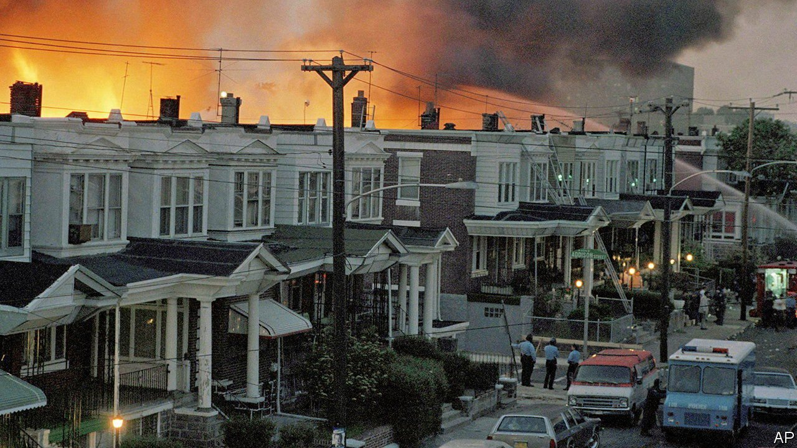

###### Moving on

# Philadelphia reckons with the day its police force bombed a house 

##### 36 years later, the aftershocks are still being felt 

 

> May 20th 2021 

ON MAY 13TH 1985, 500 police officers surrounded a row house in West Philadelphia. Inside, members of MOVE, an eccentric black liberation and back-to-nature religious group, barricaded the doors and windows. The police and members of MOVE exchanged fire. Police officers fired thousands of rounds of ammunition as well as tear-gas into the house. Then the police department dropped an explosive onto the house from a helicopter, knowing there were children inside. The subsequent fire destroyed more than 60 neighbouring houses, leaving 250 people homeless. The police commissioner ordered the fire department to “let it burn”. Eleven people died, including five children. A special investigation commission in 1986 called the bombing “reckless, ill-conceived” and “unconscionable”.

Though this episode is perhaps not as well-known as it should be, the aftershocks of it are still being felt. On the 36th anniversary of the bombing, which fell last week, Thomas Farley, Philadelphia’s health commissioner, resigned after Jim Kenney, Philadelphia’s mayor, found out that he had ordered the remains of one or more victims, which were still in the city’s possession, to be cremated and discarded. He had not contacted family members, who had thought the bodies were buried decades ago. The mayor said Dr Farley’s actions “lacked empathy”. The next day Mr Kenney said that the remains had in fact been discovered by the medical examiner’s staff. Apparently an underling disobeyed the order; City Hall has promised an investigation.


This followed a discovery last month by Abdul-Aliy Muhammad, who wrote in the Philadelphia Inquirer that University of Pennsylvania and Princeton University anthropologists had been using the bones of an unidentified victim of the MOVE bombing in classes. They were also used in an online course offered by Princeton called “Real Bones: Adventures in Forensic Anthropology”. The universities have apologised and say they will reunite the remains with the family. “I could not have imagined that 36 years later they would be displaying our family as if they’re some dinosaur relics that they dug up,” Mike Africa junior told Billy Penn, a local news website. Mr Africa was a child in 1985, and not at home the day his house was bombed.

The MOVE bombing was largely forgotten. Richard Kent Evans, author of “MOVE: An American Religion”, speculates that “it was forgotten because it is unthinkable”. Last year the city council issued a formal apology for the events 36 years ago. For Mr Africa, the family’s spokesperson, not enough has changed since 1985. The city is still very segregated. Many African-Americans are still poor. He described the treatment of the remains as “immoral. It’s horrific. It’s insensitive. It’s racist.”

