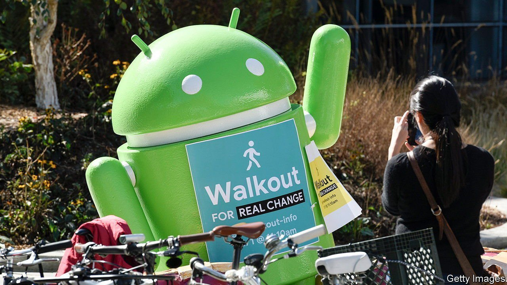

###### Woke at work

# Why tech firms are trying to run away from politics—and failing 

##### As other firms become more political, some Silicon Valley companies are heading in the opposite direction 

 

> May 22nd 2021 

WHEN AT WORK, steer clear of politics. This rule, generally accepted around the world, does not apply in techland. Employees bring their “whole self to work”, including their political beliefs. Internal online forums are full of heated debates about social issues, ranging from sexual harassment to police brutality. Some firms have started to push back. Facebook, Google and Shopify discourage political debates on their internal message boards. Basecamp, a small but culturally influential maker of web software, recently caused a stir when it declared itself a politics-free zone, as Coinbase, a cryptocurrency exchange, had a few months earlier.

Last week even Apple, otherwise famously focused on its products, got caught up in the debate. It fired a well-known new staff member, Antonio García Martínez, after employees circulated a petition highlighting the supposedly misogynistic tone of a book he penned in 2016 mocking life in Silicon Valley. And last week Alphabet, Google’s parent, had to deal with another internal petition circulating among employees, this one calling on the firm’s leadership to make a statement “recognising the violence in Palestine and Israel”.


Digital technology has always had a political bent, starting with firms such as Apple, which have their roots in the 1960s counterculture. Technological shifts have tended to be framed in political terms, as was the case with open-source software, which initially had an anti-capitalist impetus. More recently, to attract top employees, tech firms have felt obliged to offer plenty of perks, such as free food, but also “work that aligns with personal values”, says Jennifer Kim, a noted startup adviser. Such expectations also explain why bosses of big tech firms pipe up on issues ranging from immigration to misinformation.

But lately the pendulum has started to swing back. One reason is that more than in other sectors, discussions in tech firms mostly take place over Slack and other corporate communication services—not ideal forums in which to advance nuanced arguments. This has been a problem in large tech firms particularly, which is why Google and Facebook now have moderators to keep internal online debates from getting out of hand.

Stir in defensive management and hyper-critical workers, and it is easy to see why some firms have blown up. That seems to have been the case with Basecamp, whose two founders were hitherto mostly known for their books about a saner startup life. After a series of internal conflicts, Jason Fried, one founder, wrote a memo banning political debates on Basecamp’s systems. “It’s a major distraction. It saps our energy, and redirects our dialogue towards dark places,” he argued.

But even if they wanted to, most tech firms can only go so far in pushing back. Coinbase and Basecamp, which each lost 60 employees after their bosses changed the rules, have apparently been inundated with applications from people wanting to work for politics-free firms. Yet the pool of such workers appears to be limited: according to a new Harris poll commissioned by Paradigm, a diversity consultancy, more than two-thirds of adults in America want to be able to discuss racial-justice issues at work. For better or for worse, workers in tech will be talking politics for a long time to come. ■

