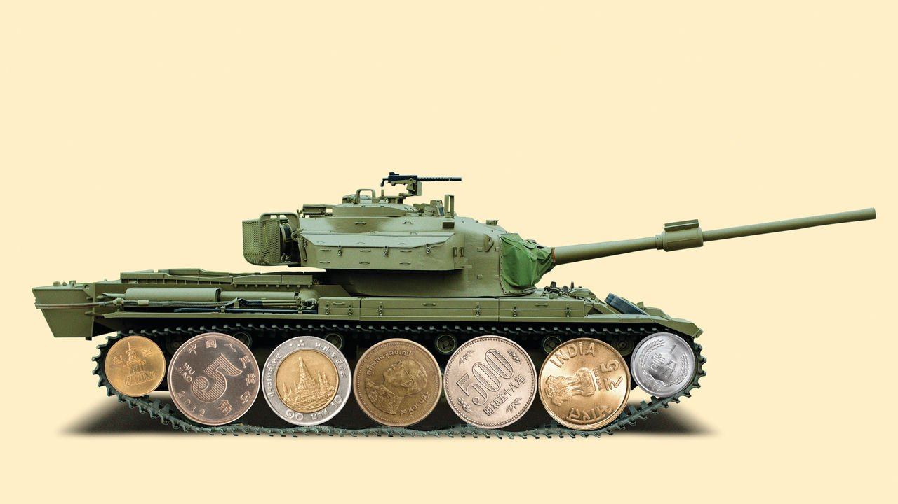

###### Quaking money-makers

# Asian investors have doubts about Myanmar’s military regime 

##### Unlike during previous periods of army rule, many are pulling out 

 

> May 27th 2021 

WHEN TANKS rumbled into Naypyidaw, Myanmar’s capital, on February 1st, the man who sent them there, Min Aung Hlaing, the commander-in-chief of the armed forces, tried to offer the public reassurance. Though the civilian leadership had been supplanted by men in fatigues, the coup, he suggested, would be good for the economy.

It was not an absurd claim: the previous military-backed government, in power from 2011 to 2016, was considered more solicitous and efficient by many businessmen than the democratically elected one that followed it. And although previous stints of military rule had seen America and other Western countries impose sanctions, many Asian investors had ignored them and piled into what had seemed a promising market. Some 90% of the total stock of foreign investment in Myanmar comes from other Asian countries. If businesses around the region could be persuaded to keep funnelling money to the country, the general’s boosterism could conceivably prove correct. But the initial evidence suggests they are not quite as gung-ho as they used to be.


In response to the coup, several firms are cutting ties with two big conglomerates owned by the army. Lim Kaling, a prominent Singaporean businessman, has said he will sell his stake in a tobacco joint venture with one of the conglomerates, Myanma Economic Holdings Limited (MEHL). Kirin, a Japanese brewer, has said that if it cannot find a partner to buy MEHL’s stake in its joint venture in Myanmar, it will have to consider leaving the country. The Asian Development Bank has suspended new grants and loans while Japan, Myanmar’s biggest donor in 2019, has put new aid projects on hold.

Many other Asian firms are packing their bags, although relatively few tie their move explicitly to the coup. Some 11% of the more than 180 Japanese firms surveyed in April by a group of foreign chambers of commerce said they had terminated their operations in Myanmar. The country has become an . Internet shutdowns, staff shortages and random violence meted out by the security forces have forced many workplaces to close. More than two-thirds of the firms surveyed said they had curtailed their activities; income had declined for nearly half.

Many of these companies are staying put, nonetheless. In fact, the junta insists that Myanmar will attract $5.8bn in foreign investment this year. That may be fanciful, but several of the countries that are the biggest sources of investment are not themselves democracies, including China, Thailand and Vietnam. Companies from these places would not necessarily be put off by the coup alone.

Some firms draw a distinction between doing business with the government and with the Tatmadaw, as the armed forces are known, even though the two are now one and the same. The Korea Land and Housing Corporation is a South Korean government agency that formed a joint venture with the construction ministry in 2019 to build a new industrial park near Yangon, the commercial capital. Kwak Hwan-gun, who runs the agency’s operations in Myanmar, rejects the idea that, owing to the coup, the state’s share of any profits will flow to the army. “I don’t know where you heard that the military benefits from this but it’s totally fake news,” he insists. By the same token, Kang Ho-bin of Sun&amp;L, a South Korean firm that has a transport business with RT, a state-owned firm, insists that some government departments have managed to evade the generals’ clutches.

Some businesses take their cue from their home government. For decades the Japanese authorities have argued that economic and diplomatic engagement can nudge the generals in the right direction. State agencies and investment firms have forked out billions of dollars of grants and loans to support Japanese businesses venturing into Myanmar. Some Japanese diplomats admit that the coup shows that the government needs to think again. Yet Japan frets that if it abandons its projects, China will swoop in, says Kitaoka Shinichi, the president of Japan International Cooperation Agency, the state aid agency.

Debate about how exactly businesses should respond rages in South Korea too. Some firms argue that withdrawing altogether would hurt ordinary Burmese. Posco International, an affiliate of Posco, a South Korean steelmaker, has operated an offshore gasfield in Burmese waters in a consortium with Myanmar’s state oil and gas company since 2013. The National Unity Government ( NUG), a government-in-exile composed of MPs unseated by the coup, has asked Posco International and other foreign energy firms to suspend payments to the government until democracy is restored. Oil and gas is the single biggest source of revenue to the state. But Posco International argues that halting production would turn off the lights for many ordinary Burmese. Two-fifths of the country’s power came from gas in 2019—although just 20% of the gas from Posco’s business is for domestic consumption.

There are no easy answers. The NUG suggests that gas companies should press on with production but should forward any money owed to the government to an escrow account, to be handed over when democracy is restored. Total, a French energy company, has said that would put their local employees at risk of prosecution and reprisals from the security forces. But on May 26th Total and Chevron, an American energy company, said they were suspending dividend payments to a Burmese pipeline company in which the state oil and gas group has a 15% stake. (They are still paying taxes for extracting gas.) Some lawmakers in America, meanwhile, want to take such decisions out of energy companies’ hands by making it difficult for them to do business in Myanmar, wherever they are from. Far from creating an economic boom, the coup could result in an implosion. ■

