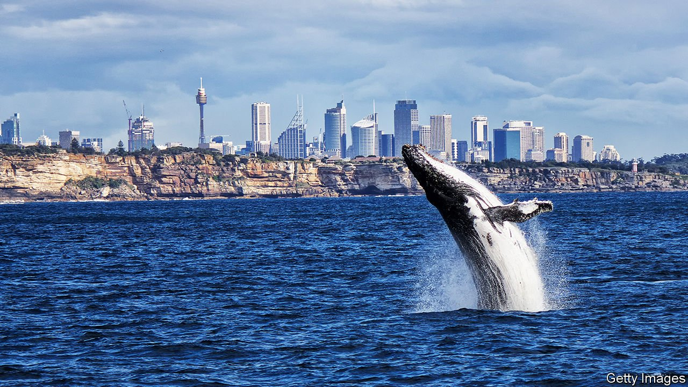

###### Humpback comeback

# Australian whales are breeding like rabbits 

##### Officials may remove humpbacks from a list of threatened species 

 

> May 27th 2021 

LOOK OUT from a clifftop in Sydney around this time of year, and you may witness one of nature’s great migrations. Between May and November some 40,000 humpback whales commute along Australia’s eastern coast. It is a highway from their feeding grounds in Antarctica to the Great Barrier Reef, where their calves are born.

They were once much harder to spot. Europeans started slaughtering whales for their oil and bone soon after arriving in Australia, and did not stop for nearly two centuries. By the time hunting humpbacks was banned in the 1960s, there were scarcely 200 left in eastern Australia. Another population, off the continent’s west coast, had dwindled to about 800.


Fortunately humpbacks are “the rabbits of the ocean”, says Olaf Meynecke of Griffith University. They have bred prolifically since people stopped butchering them. Lately the number swimming near Australia has risen by more than 10% a year. Joshua Smith of Murdoch University says this rate of growth is “almost biologically implausible”. The creatures may now be as numerous as they were before commercial whaling.

The federal government thinks it is time to remove humpback whales from Australia’s list of threatened animals. “No other whale species has recovered as strongly,” notes the environment department. Threatened creatures get extra funding and attention, and there is only so much of that. The government says that even if they are “delisted” whales will still be guarded by an environmental law that protects migratory species.

Whale-watchers worry that this is too hasty. Lots of threats are “about to bear down on these beautifully recovered populations”, says Wally Franklin of the Oceania Project, an NGO which studies them. Humpbacks get caught in nets and struck by boats. Oceans are growing noisier and more polluted. So far this does not seem to have curbed their numbers. But scientists worry about climate change, which threatens the krill the whales feed on. They say the government should promise to monitor their populations, in case a crash comes.

Compared with other Australian creatures, however, the whale looks lucky. By one estimate Australia is flattening a stadium-sized area of forest and bushland every two minutes, threatening creatures such as the koala. Three billion animals were killed by enormous bushfires 18 months ago. All told, Australia is losing mammals faster than any other country, says the World Wildlife Fund, a charity. Not many get a comeback like the humpback.

