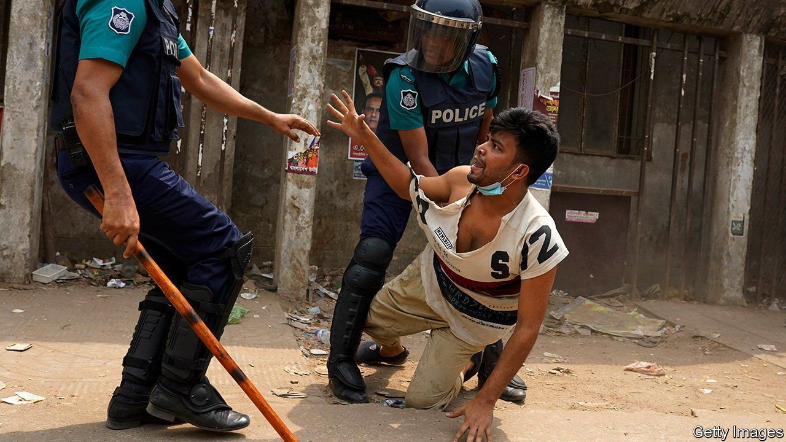

###### Back in line

# Bangladesh’s government cracks down on a big Islamist group 

##### It had spent most of the past decade courting it 

 

> May 29th 2021 

THE MOOD was supposed to be jubilant when Narendra Modi, India’s prime minister, visited Dhaka at the end of March to celebrate Bangladesh’s 50th birthday. Instead 13 people died in clashes with police after thousands took to the streets to denounce Mr Modi, whose treatment of Muslims at home is unsurprisingly unpopular among Bangladesh’s Muslim majority. Authorities have since arrested hundreds of supporters of Hefazat-e-Islam, the Islamist movement behind the demonstrations. The crackdown marks a change in strategy for Bangladesh’s ruling party, the Awami League. It had spent most of the past decade courting this puritanical group.

Hefazat-e-Islam, which means “Protectors of Islam”, formed in 2010 after Islamic teachers from the city of Chattogram (formerly Chittagong) united against plans to make inheritance laws more favourable to women. Before then the job of promoting Islam in politics had largely fallen to religious parties such as Jamaat-e-Islami and its mainstream ally, the Bangladesh Nationalist Party. This changed after Sheikh Hasina Wazed, Bangladesh’s prime minister, took power for a second time in 2009. Her government dragged senior members of Jamaat—who in 1971 had supported Pakistan during the conflict that led to Bangladesh’s independence—through a war-crimes tribunal.


Hefazat’s influence increased enormously in 2013, when judges on that tribunal declined to sentence a high-ranking member of Jamaat to death. Hefazat’s leadership decided that some of the Bangladeshis who protested against this verdict had insulted Islam. Hundreds of thousands of Hefazat’s supporters marched on the capital to demand the hanging of atheist bloggers and the introduction of a new law on blasphemy. Instead of sending them packing, the government rushed to placate the mob. It brought charges against several writers accused of upsetting religious folk. It also set up a panel to police commentary on Islam.

The episode helped forge an unofficial alliance between Sheikh Hasina’s government and Hefazat. Appearing to rub along with the group has lent the prime minister some credibility among the very religious (her father, Sheikh Mujibur Rahman, founded the Awami League as a secular party). Ali Riaz of Illinois State University says that indulging Hefazat has allowed the League to signal that “we’re against Jamaat, but not against Islam”.

The government has adopted some of Hefazat’s rhetoric and granted many of its demands. In 2015, when a string of atheist writers were murdered in the street, Awami League politicians implied that they had deserved it. Two years later the government revised school textbooks to remove poems and stories written by people whom Hefazat accused of promoting secularism. Authorities also declared that degrees handed out in Islamic schools were to be considered equivalent to masters qualifications from public universities, making those who received them eligible for good government jobs.

The unlikely partnership has brought about a swift Islamisation of Bangladeshi society, says Mr Riaz. More children are schooled in madrassas. Religious leaders are growing less tolerant of interpretations of Islam that differ from their own. Not long ago few people discussed which school of Islamic jurisprudence they belonged to, let alone which sub-movement, says Mr Riaz. That has changed.

Attacks on religious minorities are growing more common, according to an American government report that was published in May. Earlier this year a mob ransacked a Hindu village in Sylhet, in north-eastern Bangladesh. The gang included supporters of Hefazat and members of the Awami League’s youth wing.

Lately Hefazat had come to believe that it was “indispensable” to the government, says Niaz Asadullah of the University of Malaya. Yet drumming up demonstrations against Mr Modi now seems to have been a miscalculation. The group’s leaders appear to recognise that Sheikh Hasina, whose rule has become increasingly authoritarian, has always had the upper hand. Instead of encouraging supporters to protest against the arrests of its members, Hefazat’s chief, Junayed Babunagari, has merely called on the government to release all those in custody.

Unlike the crackdowns which Sheikh Hasina has launched against other rivals, the goal on this occasion is probably not to eviscerate Hefazat but instead to bring it to heel. Factions keen to repair ties with the government are already gaining prominence within it. The incident has demonstrated that Hefazat can be tamed, says Mr Riaz. “But the ethos it has created is not going to go away.”■

