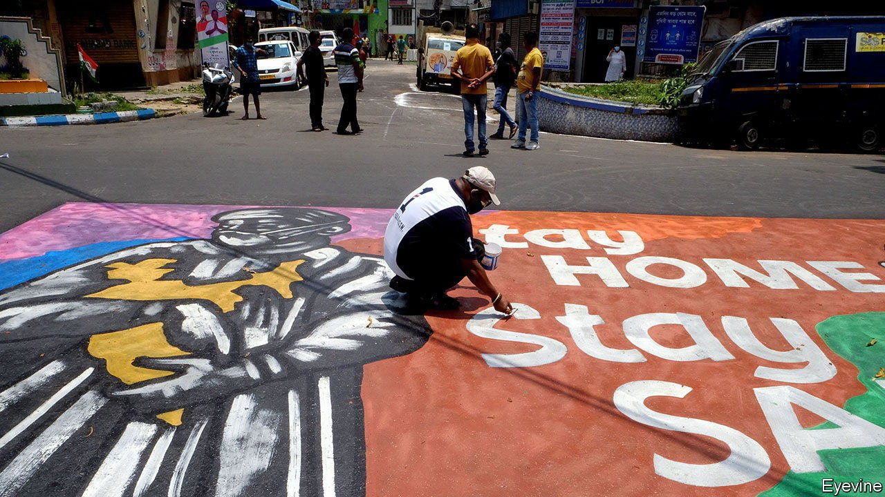
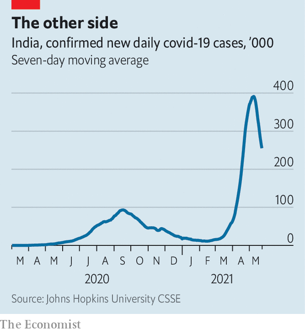

###### The other side

# India’s covid-19 crisis is beginning to ease 

##### But its vaccination programme is stumbling 

 

> May 24th 2021 

IN LATE MAY India passed two sad milestones in the struggle against covid-19. The official number of deaths from the pandemic crossed 300,000. Daily fatalities topped a record 4,500. Sadder still was the certainty that on both counts the true toll was many multiples higher. Across vast stretches of the country’s interior there is little testing for the virus, and therefore few “official” cases or deaths. Epidemiologists agree that a full tally would put India far ahead of America and Brazil in the dismal rivalry for the country with the most people killed by covid-19.

Yet even India’s faulty government numbers now give reason for hope. The parts of the country where counting is fairly reliable show a clear trend. The virus’s vicious second wave is rolling back almost as fast as it rolled in. In early May India was recording some 400,000 new cases a day. This has now fallen below 250,000. The daily number of new cases in Mumbai, the country’s commercial capital and one of the first places to see a surge, is about an eighth of its peak. In Delhi, the hard-hit capital, the share of covid-19 tests proving positive in April reached a frightening 36%. This has tumbled below 2%. The corresponding national “positivity rate”, heavily weighted towards cities where more tests are performed, has fallen from 24% to less than 10%.

 


In the main cities at least, the desperate fight to get oxygen to gasping patients has been won. Daily demand for liquid medical oxygen (LMO), which reached some 9,000 tonnes—three times the demand during India’s first peak in September—has now begun to drop, according to a government task-force.


Jokers point to another indicator of improving fortunes. Leaders whose visibility faded as the tragedy mounted have suddenly grown less camera-shy. “You know cases are going down because...Modi has reappeared,” jested one tweet, referring to the prime minister, Narendra Modi, who recently appeared to choke with emotion during a televised Zoom call with doctors in his parliamentary constituency.

But if panic is beginning to recede, the crisis is far from over. The wave started in the west of the country, broadly speaking, and has still not finished sweeping eastwards. Infections in Chennai, capital of Tamil Nadu in the far south, are only just beginning to peak. “We can’t really be sanguine because it’s like an agglomeration of peaks,” says Ambarish Satwik, a surgeon in one of Delhi’s biggest hospitals. “It’s going to move centrifugally from cities to villages, so it’ll drive on for a bit.”

Across India’s poor, crowded Gangetic plain, where doctors and statistics are most sparse, anecdotal evidence suggests that the grim reaper has come, snatched lives in every village and mostly then marched on again. It has left whole communities emotionally and economically shattered. A team of reporters from Dainik Bhaskar, a Hindi-language daily, counted more than 2,000 corpses hastily disposed of along a 1,100km stretch of the Ganges.

The victims are not only the very poor. A teachers’ union in Uttar Pradesh, India’s most populous state, says no fewer than 1,621 out of the 800,000 teachers who work in its public schools died in the past month. At a recent conclave of state-owned banks, which employ more than half a million people, managers said that around one in five staff had contracted covid, and that more had died of the illness in the past six weeks than in the preceding year of the pandemic.

The wave has left scars. While India’s poorest, perennially battered by droughts, floods and capricious governments, among other plagues, have been forced to bear the calamity with stoicism, its middle class has been made to feel vulnerable as never before. Even the most privileged found themselves locked out of overwhelmed hospitals, or obliged to queue for vaccines along with hoi polloi. Their suffering continues. On social media, urban Indians are no longer messaging desperate pleas for oxygen, or for drugs that were widely and wrongly prescribed for covid-19. Now the demand is for medicine to fight mucormycosis or “”, a deadly infection that has particularly afflicted diabetics who were too liberally dosed with steroids during treatment.

Public frustration over the scale of the tragedy might have been soothed if the government’s vaunted campaign to vaccinate Indians had been a success. Instead it has failed spectacularly. During the height of the surge in infections the number of people receiving shots did not rise to meet the threat, but instead withered from 3.5m a day to barely 1.5m because the government had failed to plan properly or to secure enough vaccine. Millions of Indians who received a first dose now wonder when or whether they will receive a second. Many millions more—some 89% of India’s 1.4bn people—have received no dose at all. Their wait may be long: the IMF predicts that by the end of this year fewer than 35% of adults will have received a jab.

The government, belying its own talk of determination to secure more vaccines, still will not license proven foreign ones such as those of Pfizer-BioNTech and Moderna. Bureaucrats refuse to waive indemnity clauses, as dozens of other countries have done, leaving the companies to face the risk of endless, costly litigation in India’s overburdened courts.

In cities, where more people are able to get a jab, the vaccination campaign may have helped bend the current wave. But the main cause of the decline in numbers, aside from the virus’s own natural trajectory, has been the imposition of tough local lockdowns. Mr Modi’s government, wary of hurting India’s badly wounded economy even more, had delayed these measures as long as possible. But in the end it was strict curfews, enforced by public fear of the rampaging disease as much as police muscle, that have saved most lives.■

Dig deeper

All our stories relating to the pandemic and the vaccines can be found on our . You can also listen to , our podcast on the race between injections and infections, and find trackers showing ,  and the virus’s spread across  and .

A version of this article was published online on May 24th, 2021

