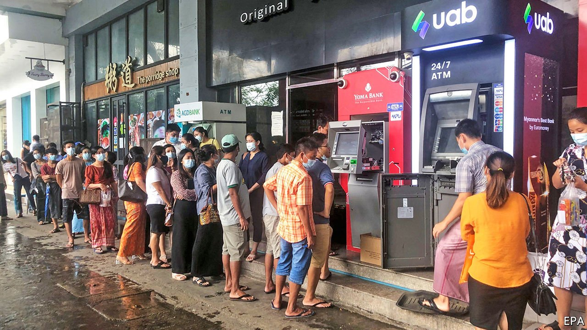

###### General disorder

# Myanmar’s generals struggle to restart its stalled economy 

##### Businesses are caught between striking workers and the army 

 

> May 27th 2021 

IN MID-JANUARY Thaung Tun, who was then Myanmar’s minister of investment, promised local and foreign business folk a swift recovery from damage wrought by covid-19. Plans for whizzier internet and renewable energy, he said, would bring opportunities they could once “only have dreamed of”. Two weeks later the army launched a coup, bundling Mr Thaung Tun and other members of Aung San Suu Kyi’s cabinet into detention. Some analysts now think the economy could shrink by as much as 20% this year.

Business-friendly technocrats of the type who once advised Thein Sein, the retired general who served as president until 2016, hold little clout in the new regime. The army has shut companies it believes are harbouring opponents, including many media firms, while also trying to force businesses it deems essential to stay open. The army is frightened by rolling strikes that have been organised in protest against the coup and the hundreds of killings its soldiers have carried out while putting down demonstrations. In March authorities in Yangon, the commercial capital, briefly detained branch managers from supermarkets across the city so they could remind them to stay on the job.


Four months after the takeover long queues continue to form at cash machines, which frequently run out of banknotes. People wait past dusk to get money, even though being out after dark increases the risk of running into trouble with soldiers patrolling the streets. In May an official from the central bank said that frightened citizens trying to withdraw their savings were in fact aiming to “disturb the country and create mistrust”. The junta has asked banks to send it CD-ROMs containing records of all deposits and withdrawals.

The army had earlier threatened to fine or nationalise banks that did not get striking employees back to their posts. Quite a few have now returned. But the persistent threat of violence from security forces means many workers are frightened to be out and about for long. A Burmese employee of a South Korean bank was killed in Yangon on March 31st after soldiers fired on a company van that was taking her home after her shift.

Internet restrictions are making online commerce difficult. The junta started blocking all mobile internet in mid-March, in an effort to stymie demonstrations. In recent weeks it has started allowing access to selected online services, though social-media sites remain off limits. Investors were once keen on Myanmar’s digital economy, which grew particularly swiftly during lockdowns imposed to control the spread of covid-19. They had previously piled money into local firms such as Frontiir, an internet service provider. Not any more. Telenor, a Norwegian mobile operator that began rolling out its service in Myanmar almost a decade ago, has written off the full value of its business in the country, at a cost of $782m.

Restaurants and shops in the posher bits of Yangon have reopened, but customers remain sparse. A fruit-merchant in the city’s Chinatown says that although it is getting much easier than it was to transport produce around the country, “there are far fewer buyers than before”. A foreigner who runs a consumer-goods business in the city says he has yet to restart operations since deciding to down tools in February, in part because of worries about the safety of staff. “We are waiting to see what happens in the coming months, but it is hard to be optimistic.”

Activists would like more businesses to take a stand against the regime. On May 12th Tom Andrews, the UN’s rapporteur on human rights in Myanmar, said companies “should exert the maximum leverage on the military”. More than 200 firms, local and foreign, have backed a joint statement calling for democracy and the rule of law. But the army has a history of violence against the staff of businesses that upset it, says an executive at a big foreign company. “Even as part of what appears to be civil dialogue with authorities, in official letters and phone calls, the threats are there: ‘or else there will be consequences’.” ■

