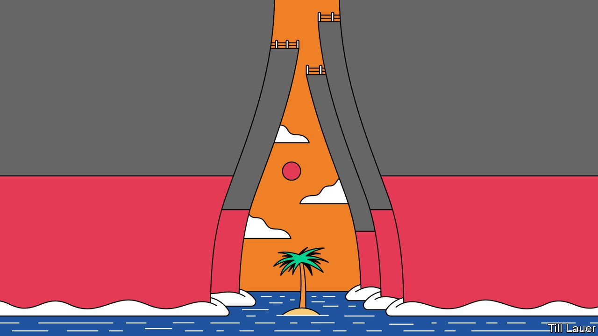

###### Banyan

# The Philippines is repairing its relationship with America 

##### Tilting towards China has not done it much good 

 

> May 29th 2021 

THE DISCOVERY in March of 200-odd Chinese vessels around a reef in the “exclusive economic zone” that extends 200 nautical miles from the Philippines’ shores has brought near-daily protests from its foreign and defence ministries. Whitsun Reef, which the government calls the Julian Felipe Reef, is one of many that make up the Spratly Islands in the middle of the South China Sea. It is three times closer to the Philippines than to China, which lays wild and unsupported claim to nearly the whole sea.

The swarming of Whitsun, led by “grey zone” militia vessels masquerading as fishing trawlers, is the latest move in China’s expanding occupation of contested specks in the South China Sea. This time, most of the Philippine government appears determined not simply to roll over. As the defence secretary, Delfin Lorenzana, put it: “While we acknow ledge that China’s military capability is more advanced than ours, this does not deter us from defending our national interest, and our dignity as a people, with all that we have.” The foreign secretary, Teodoro “Teddy Boy” Locsin, who has a notorious trigger thumb on Twitter, went further. “China, my friend,” he wrote, “how politely can I put it? Let me see… O…GET THE FUCK OUT.”


Strikingly, the member of government most reluctant to criticise China is the president, Rodrigo Duterte. After Mr Locsin’s outburst, the coarse-talking Mr Duterte declared that, within his cabinet, only he had a licence to curse. He also found ways to praise China, including for the supply of much-needed vaccines against covid-19.

On paper, says Julius Trajano, a political analyst, the president is the chief architect of foreign policy in the Philippines. After he took office in 2016, Mr Duterte tilted strongly towards the great power to the north. He refused to press a ruling in the Philippines’ favour from an international tribunal, which rubbished China’s sweeping claims in the South China Sea. On his first trip to Beijing as president to meet his counterpart, Xi Jinping, he declared that it was “time to say goodbye” to the United States. For good measure he announced a military “separation” from the Philippines’ ally and former colonial power.

At the time, Mr Duterte was quick to boast of the fruits of his pro-China tilt: promises of big investments in the Philippines’ decrepit infrastructure as part of China’s Belt and Road Initiative (BRI); the return of Filipino fishermen to the waters around Scarborough Shoal, into which China had muscled in 2012; and the prospect of Chinese help in exploring for hydrocarbons in Philippine waters. Yet, says Jay Batongbacal of the University of the Philippines, it has nearly all come to naught. BRI projects are either small (a couple of bridges in Manila, the capital) or controversial (dams in nature reserves). Fishermen say they are frightened to return to Scarborough Shoal, given past rammings by Chinese vessels. Maritime tensions preventing exploration for oil and gas, Mr Batongbacal argues, have influenced energy policy, leading to an overemphasis on coal. A flood of Chinese nationals to Manila’s offshore gambling industry has brought a host of social problems in its wake.

Mr Duterte’s insistence that relations remain good is motivated by hopes of deliveries of Chinese vaccines, on which his legacy now rests (he steps down next year). To date, supplies have been paltry. And despite the pandemic’s ravages—more than 20,000 dead—Filipinos are sceptical of Chinese jabs.

The president must realise that his tilt towards China has been a failure. The reverse of the coin is a renewed tilt towards America. A year ago Mr Duterte announced the cancellation of the bilateral Visiting Forces Agreement (VFA), which enables American troops to be deployed in the Philippines. Yet twice since then he has granted an extension allowing the VFA to continue, while Mr Lorenzana and Mr Locsin argue for its permanent retention. Meanwhile, Mr Duterte has at last begun to champion the arbitral ruling against China’s claims, including to Scarborough Shoal.

The Philippines is repairing its relationship with America. In reality, it was never sundered—foreign and security ties run deep. Still, the administration of President Joe Biden has signalled support. It has increased joint military exercises and has made clear that its mutual-defence treaty covers coming to the Philippines’ aid, even in the event of an attack by China’s unofficial militias. China may have won Whitsun Reef. But it has lost the Philippines.

